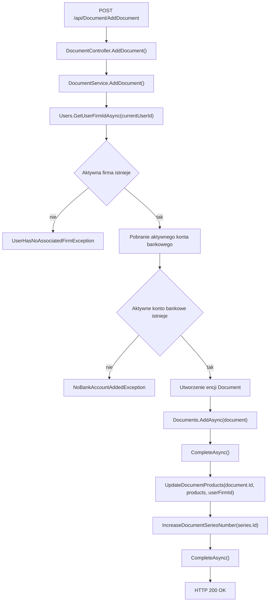

# Wystawienie nowej faktury — Przegląd procesu

## Cel

Proces zapisuje nowy dokument faktury dla aktywnej firmy zalogowanego użytkownika. Proces tworzy rekord `Document`, zapisuje pozycje dokumentu jako `DocumentProduct`, tworzy nowe produkty dla pozycji bez identyfikatora i zwiększa bieżący numer użytej serii dokumentów.

---

## Diagram przepływu

---

## Warunki wejściowe

| Warunek | Źródło w kodzie | Skutek |
|---|---|---|
| Żądanie posiada token JWT użytkownika z rolą `User` | `[Authorize(Roles = "User")]` | Kontroler dopuszcza wykonanie endpointu. |
| Użytkownik ma aktywną relację `UserFirm` | `Users.GetUserFirmIdAsync(...)` | Dokument otrzymuje `UserFirmId`. |
| Aktywna firma ma aktywne konto bankowe | `BankAccounts.Query().Where(ba => ba.UserFirmId == userFirmId && ba.IsActive)` | Konto jest przypisane do dokumentu. |
| Żądanie zawiera klienta | `documentRequestDto.Client.Id` | Identyfikator klienta trafia do `Document.ClientId`. |
| Żądanie zawiera serię dokumentu | `documentRequestDto.DocumentSeries` | Numer dokumentu i typ dokumentu są ustalane na podstawie serii. |
| Żądanie zawiera pozycje dokumentu | `documentRequestDto.Products` | Pozycje są zapisywane w `DocumentProducts`. |

---

## Wynik procesu

| Wynik | Opis |
|---|---|
| Sukces | API zwraca `200 OK` z obiektem `DocumentRequestDto` otrzymanym w żądaniu. |
| Zapis dokumentu | W bazie powstaje rekord `Document`. |
| Zapis pozycji | W bazie powstają rekordy `DocumentProduct` dla pozycji dokumentu. |
| Aktualizacja sum | Encja `Document` otrzymuje wartości `UnitPrice` i `TotalPrice`. |
| Aktualizacja serii | `DocumentSeries.CurrentNumber` zwiększa się o `1`, jeżeli w żądaniu podano serię. |

---

## Uwagi wynikające z kodu

- `DocumentNumber` powstaje przez konkatenację `DocumentSeries.SeriesName` i `DocumentSeries.CurrentNumber.ToString("D4")`.
- `DocumentStatusId` jest ustawiany na `DocumentStatusEnum.Unpaid`.
- `DocumentTypeId` jest pobierany z `DocumentSeries.DocumentType.Id`.
- Kontroler zwraca `documentRequestDto`, nie DTO uzupełnione o identyfikator utworzonego dokumentu.
- DTO nie zawiera atrybutów walidacyjnych. [UWAGA: walidacja pól wejściowych nie jest widoczna w DTO — WYMAGA WERYFIKACJI Z ZESPOŁEM]
