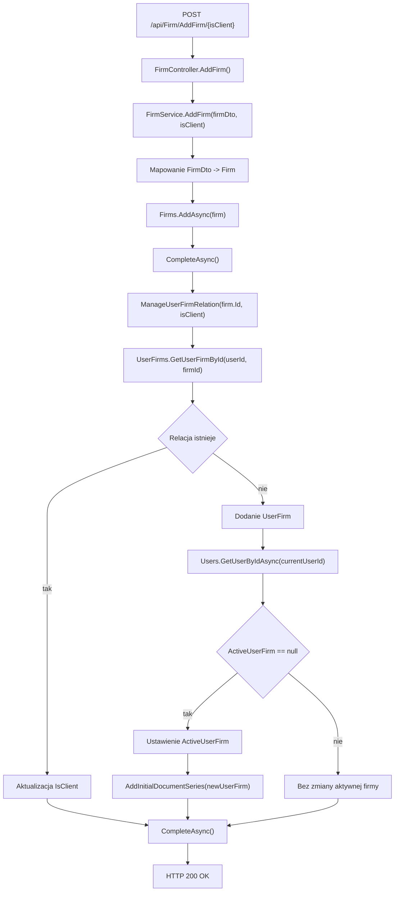

# Dodanie firmy — Przegląd procesu

## Cel

Proces zapisuje nową firmę i łączy ją z zalogowanym użytkownikiem przez encję `UserFirm`. Parametr trasy `isClient` określa wartość flagi `UserFirm.IsClient`. Jeżeli użytkownik nie ma aktywnej firmy, proces ustawia nową relację jako `User.ActiveUserFirm` i tworzy początkowe serie dokumentów.

---

## Diagram przepływu

---

## Warunki wejściowe

| Warunek | Źródło w kodzie | Skutek |
|---|---|---|
| Żądanie posiada token JWT użytkownika z rolą `User` | `[Authorize(Roles = "User")]` | Kontroler dopuszcza wykonanie endpointu. |
| Body zawiera `FirmDto` | Parametr `[FromBody] FirmDto firmDto` | Dane są mapowane na encję `Firm`. |
| Trasa zawiera `isClient` | Parametr `bool isClient` | Wartość trafia do `UserFirm.IsClient`. |
| Identyfikator użytkownika jest odczytywany z kontekstu HTTP | `IUserService.GetCurrentUserId()` | Relacja `UserFirm` jest przypisywana do użytkownika. |

---

## Wynik procesu

| Wynik | Opis |
|---|---|
| Sukces | API zwraca `200 OK` z `FirmDto`, w którym `Id` jest ustawione na identyfikator nowej encji `Firm`. |
| Zapis firmy | W bazie powstaje rekord `Firm`. |
| Zapis relacji | W bazie powstaje lub aktualizuje się rekord `UserFirm`. |
| Pierwsza firma użytkownika | Jeżeli `User.ActiveUserFirm` jest `null`, relacja staje się aktywną firmą użytkownika. |
| Serie początkowe | Dla pierwszej aktywnej firmy tworzone są serie dla `Factura`, `Factura Storno` i `Factura Proforma`. |

---

## Uwagi wynikające z kodu

- `AddFirm()` zapisuje firmę przed utworzeniem relacji `UserFirm`.
- Proces nie sprawdza unikalności `Cui`.
- Proces nie sprawdza, czy użytkownik dodał już firmę o tych samych danych.
- Dla pierwszej firmy użytkownika metoda `AddInitialDocumentSeries()` tworzy trzy początkowe serie dokumentów.
- Jeżeli pierwsza dodana firma ma `isClient = true`, kod nadal może ustawić ją jako `ActiveUserFirm`. [UWAGA: ustawienie aktywnej firmy nie zależy od wartości `isClient` — WYMAGA WERYFIKACJI Z ZESPOŁEM]
