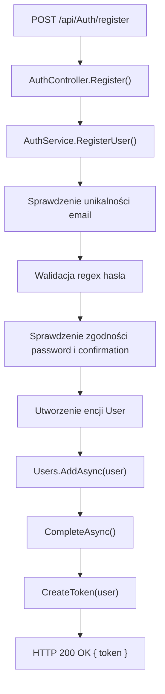

# Rejestracja użytkownika — Przegląd procesu

## Cel

Proces tworzy nowego użytkownika w bazie danych, zapisuje hasło jako hash `BCrypt` i zwraca token JWT.

---

## Diagram przepływu

---

## Warunki wejściowe

| Warunek | Źródło | Skutek |
|---|---|---|
| Brak istniejącego użytkownika z danym adresem e-mail | `_unitOfWork.Users.Query().FirstOrDefaultAsync(u => u.Email == userDto.Email)` | Tworzenie użytkownika jest kontynuowane. |
| Hasło spełnia wzorzec regex | `passwordRules.IsMatch(userDto.Password)` | Tworzenie użytkownika jest kontynuowane. |
| `Password` i `PasswordConfirmation` mają taką samą wartość | `userDto.Password == userDto.PasswordConfirmation` | Tworzenie użytkownika jest kontynuowane. |

---

## Wynik procesu

| Wynik | Opis |
|---|---|
| Sukces | API zwraca `200 OK` i obiekt `{ token }`. |
| Zapis danych | W bazie powstaje rekord `User` z hashem hasła i rolą `User`. |
| Token | JWT zawiera claimy `userId`, `firstName`, `lastName`, `email`, rolę `User` i czas wygaśnięcia 10 minut. |
