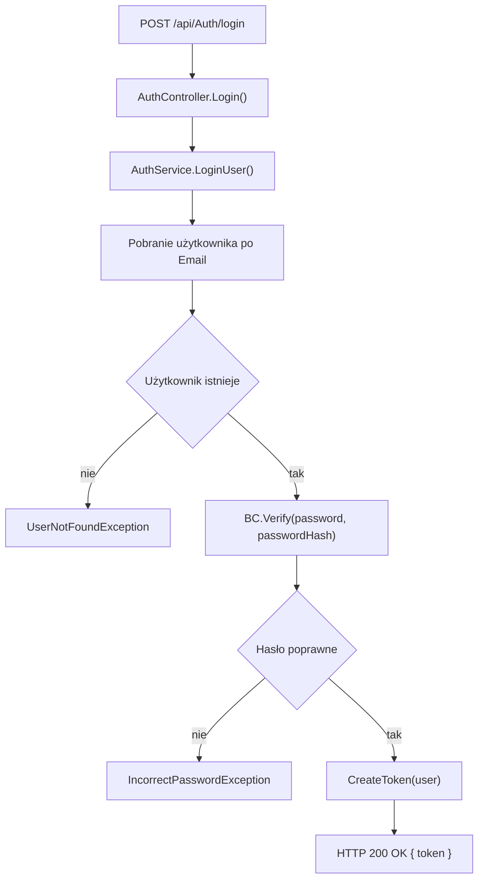

# Logowanie użytkownika — Przegląd procesu

## Cel

Proces weryfikuje dane logowania użytkownika i zwraca token JWT dla poprawnych poświadczeń.

---

## Diagram przepływu

---

## Warunki wejściowe

| Warunek | Źródło | Skutek |
|---|---|---|
| Użytkownik istnieje dla wskazanego `Email` | `_unitOfWork.Users.Query().FirstOrDefaultAsync(...)` | Weryfikacja hasła jest kontynuowana. |
| Hasło zgadza się z hashem | `BC.Verify(userDto.Password, user.PasswordHash)` | Token JWT jest generowany. |

---

## Wynik procesu

| Wynik | Opis |
|---|---|
| Sukces | `200 OK` z obiektem `{ token }`. |
| Błąd użytkownika | `400 Bad Request` dla braku użytkownika lub błędnego hasła. |
