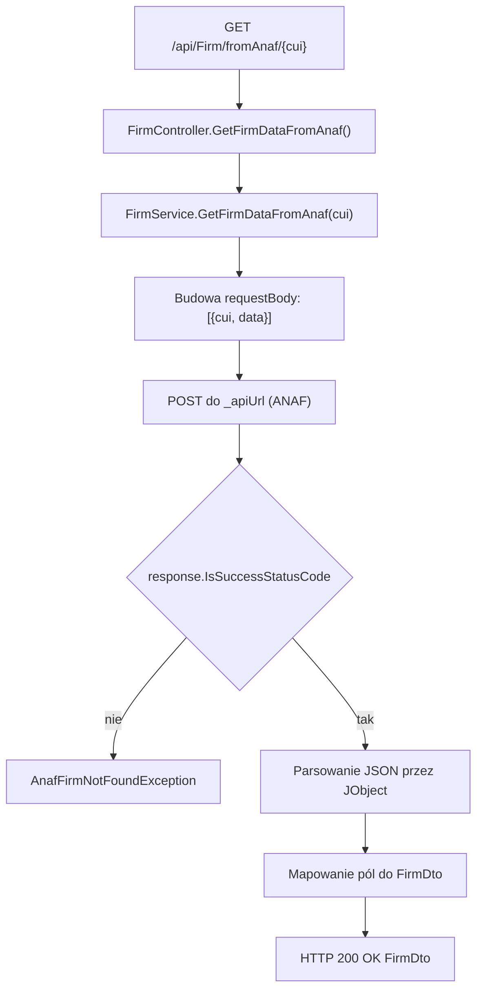

# Pobranie firmy z ANAF — Przegląd procesu

## Cel

Proces pobiera dane firmy z zewnętrznego API ANAF na podstawie identyfikatora `cui` i mapuje odpowiedź JSON do `FirmDto`.

---

## Diagram przepływu

---

## Warunki wejściowe

| Warunek | Źródło | Skutek |
|---|---|---|
| Użytkownik ma token JWT z rolą `User` | Atrybut kontrolera `Authorize` | Dostęp do endpointu jest dozwolony. |
| Konfiguracja `AppSettings:AnafApiUrl` istnieje | Konstruktor `FirmService` | Serwis może wykonać zapytanie HTTP do ANAF. |
| ANAF zwraca status sukcesu | `response.IsSuccessStatusCode` | Serwis parsuje payload JSON. |

---

## Wynik procesu

| Wynik | Opis |
|---|---|
| Sukces | `200 OK` i `FirmDto` z danymi pobranymi z ANAF. |
| Błąd ANAF | `404 Not Found` i komunikat z `AnafFirmNotFoundException`. |
