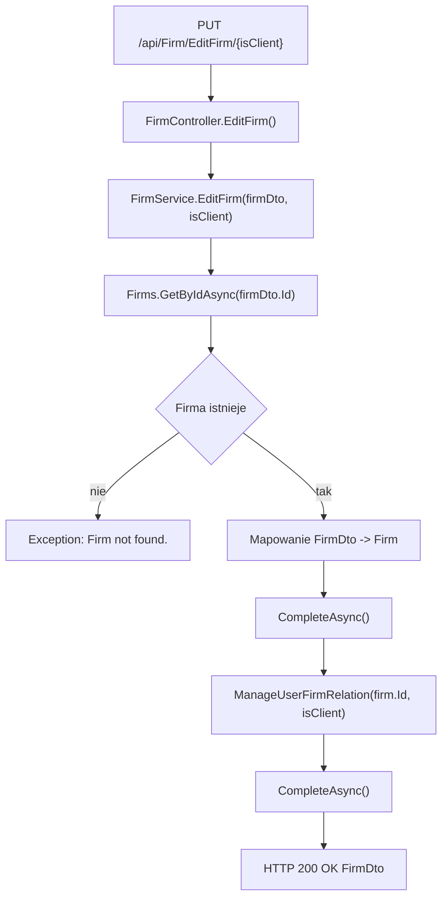

# Edycja firmy — Przegląd procesu

## Cel

Proces aktualizuje dane istniejącej firmy oraz aktualizuje flagę `IsClient` w relacji `UserFirm` dla zalogowanego użytkownika.

---

## Diagram przepływu

---

## Wynik procesu

| Wynik | Opis |
|---|---|
| Sukces | `200 OK` i `FirmDto` po aktualizacji. |
| Błąd | `500 Internal Server Error` dla `Exception("Firm not found.")` i innych nieobsłużonych błędów. |
