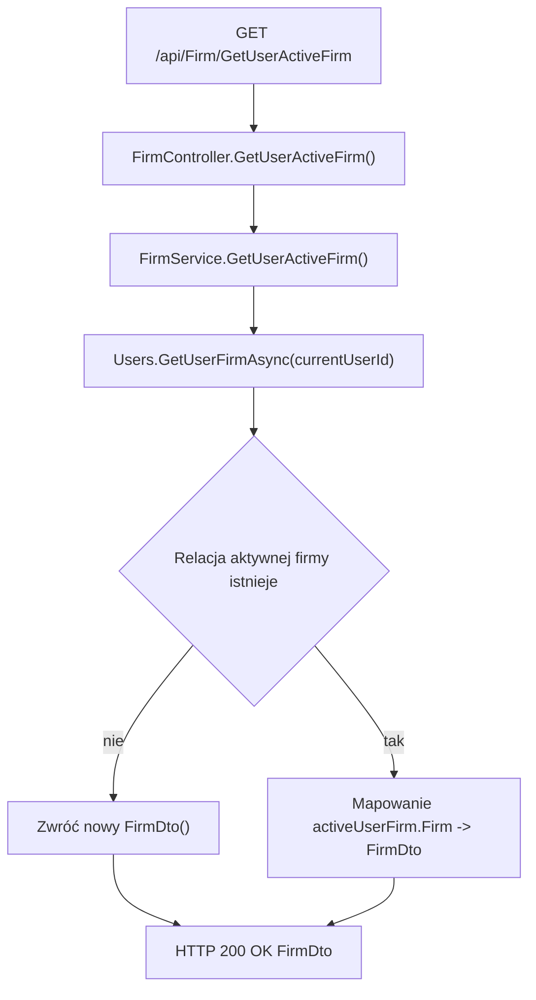

# Pobranie aktywnej firmy użytkownika — Przegląd procesu

## Cel

Proces zwraca dane aktywnej firmy zalogowanego użytkownika na podstawie relacji `User.ActiveUserFirm`.

---

## Diagram przepływu

```mermaid
flowchart TD
  A["GET /api/Firm/GetUserActiveFirm"] --> B["FirmController.GetUserActiveFirm()"]
  B --> C["FirmService.GetUserActiveFirm()"]
  C --> D["Users.GetUserFirmAsync(currentUserId)"]
  D --> E{"Relacja aktywnej firmy istnieje"}
  E -->|nie| F["Zwróć nowy FirmDto()"]
  E -->|tak| G["Mapowanie activeUserFirm.Firm -> FirmDto"]
  F --> H["HTTP 200 OK FirmDto"]
  G --> H
```
