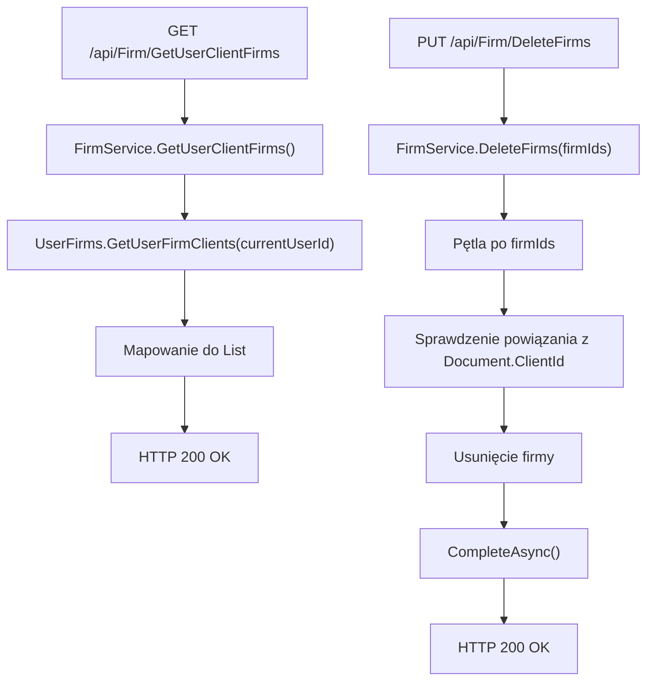

# Zarządzanie firmami-klientami — Przegląd procesu

## Cel

Proces udostępnia listę firm-klientów użytkownika oraz usuwa wskazane firmy-klientów, jeżeli nie są powiązane z dokumentami.

---

## Diagram

