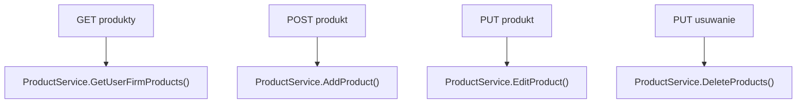

# Zarządzanie produktami — Przegląd procesu

## Cel

Proces obsługuje listowanie produktów aktywnej firmy użytkownika oraz operacje dodania, edycji i usunięcia produktów.

---

## Diagram

---

## Wynik procesu

| Operacja | Wynik sukcesu |
|---|---|
| Pobranie listy | `200 OK` i `ICollection<ProductDto>` |
| Dodanie | `200 OK` i `ProductDto` |
| Edycja | `200 OK` i `ProductDto` |
| Usunięcie | `200 OK` |
