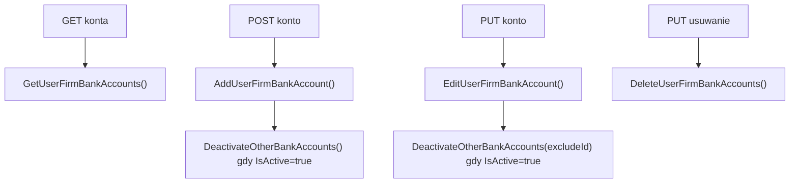

# Zarządzanie kontami bankowymi — Przegląd procesu

## Cel

Proces obsługuje listowanie, dodawanie, edycję i usuwanie kont bankowych aktywnej firmy użytkownika. Logika gwarantuje, że aktywne konto (`IsActive = true`) dezaktywuje pozostałe konta tej samej firmy.

---

## Diagram

