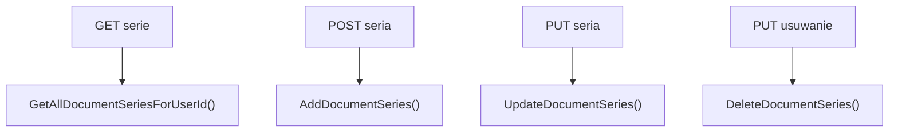

# Zarządzanie seriami dokumentów — Przegląd procesu

## Cel

Proces obsługuje listowanie, dodawanie, aktualizację i usuwanie serii dokumentów aktywnej firmy użytkownika.

---

## Diagram

---

## Uwagi

- `AddDocumentSeries` w kontrolerze ma lokalny `try/catch` i zwraca `BadRequest(ex.Message)`.
- Pozostałe metody kontrolera opierają się na `ExceptionMiddleware`.
