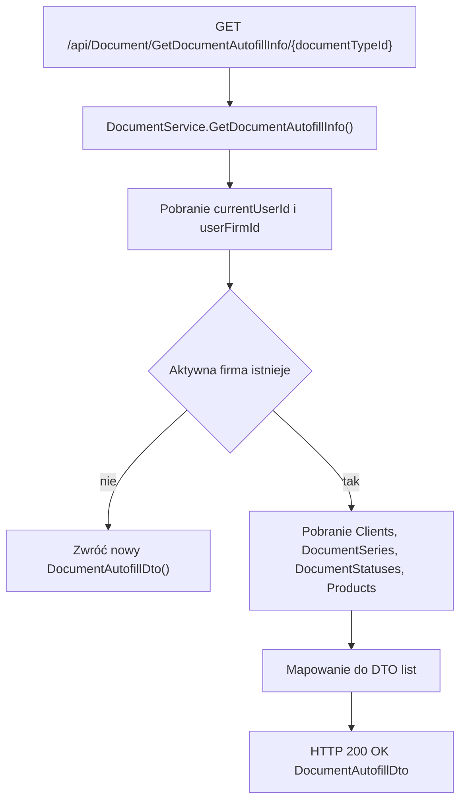

# Dane autouzupełniania dokumentu — Przegląd procesu

## Cel

Proces zwraca zestaw danych potrzebnych do wypełnienia formularza dokumentu: klientów, serie dokumentów, statusy dokumentu i produkty aktywnej firmy.

---

## Diagram

