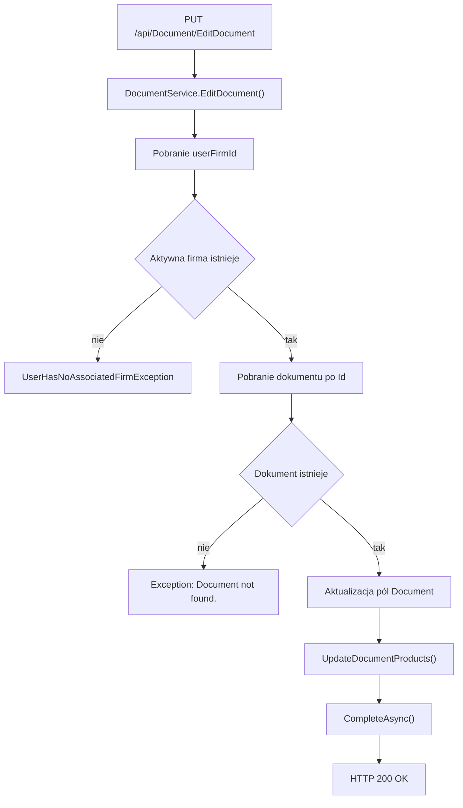

# Edycja dokumentu — Przegląd procesu

## Cel

Proces aktualizuje istniejący dokument i jego pozycje, w tym status dokumentu, klienta, typ dokumentu, daty oraz sumy.

---

## Diagram

```mermaid
flowchart TD
  A["PUT /api/Document/EditDocument"] --> B["DocumentService.EditDocument()"]
  B --> C["Pobranie userFirmId"]
  C --> D{"Aktywna firma istnieje"}
  D -->|nie| E["UserHasNoAssociatedFirmException"]
  D -->|tak| F["Pobranie dokumentu po Id"]
  F --> G{"Dokument istnieje"}
  G -->|nie| H["Exception: Document not found."]
  G -->|tak| I["Aktualizacja pól Document"]
  I --> J["UpdateDocumentProducts()"]
  J --> K["CompleteAsync()"]
  K --> L["HTTP 200 OK"]
```
