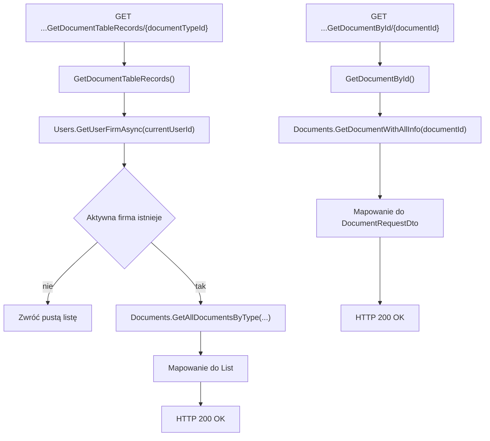

# Lista i szczegóły dokumentów — Przegląd procesu

## Cel

Proces pobiera listę dokumentów wybranego typu dla aktywnej firmy użytkownika oraz pobiera szczegóły pojedynczego dokumentu po identyfikatorze.

---

## Diagram

