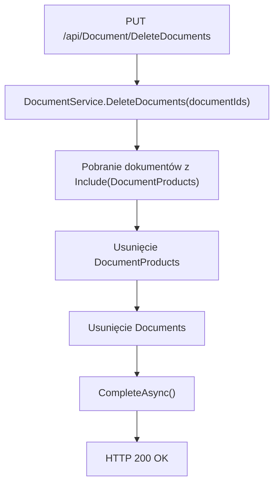

# Usuwanie dokumentów — Przegląd procesu

## Cel

Proces usuwa wskazane dokumenty i ich pozycje (`DocumentProducts`) dla listy identyfikatorów przekazanej w body.

---

## Diagram

```mermaid
flowchart TD
  A["PUT /api/Document/DeleteDocuments"] --> B["DocumentService.DeleteDocuments(documentIds)"]
  B --> C["Pobranie dokumentów z Include(DocumentProducts)"]
  C --> D["Usunięcie DocumentProducts"]
  D --> E["Usunięcie Documents"]
  E --> F["CompleteAsync()"]
  F --> G["HTTP 200 OK"]
```
