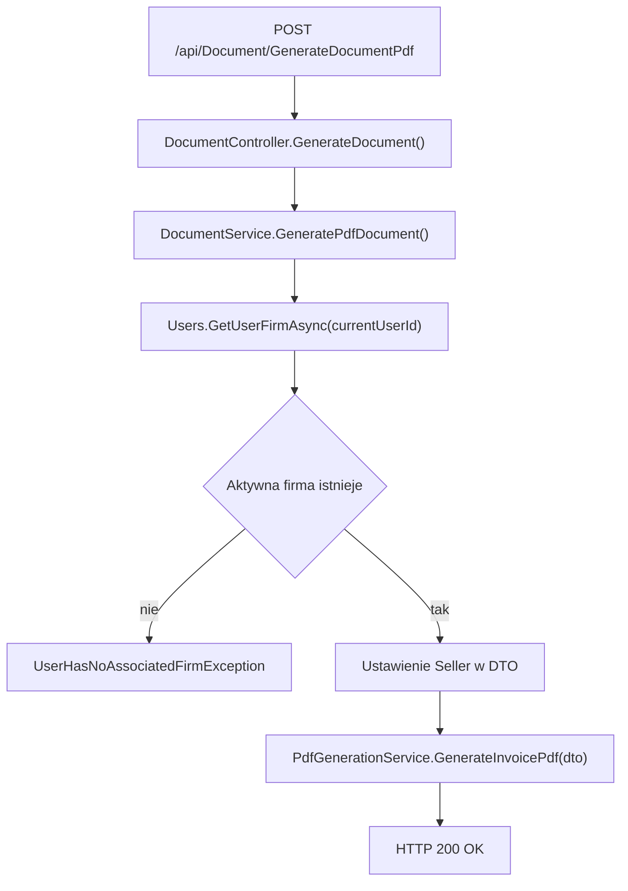

# Generowanie dokumentu PDF — Przegląd procesu

## Cel

Proces generuje plik PDF dokumentu na podstawie `DocumentRequestDto` i zapisuje go na dysku po stronie API.

---

## Diagram

```mermaid
flowchart TD
  A["POST /api/Document/GenerateDocumentPdf"] --> B["DocumentController.GenerateDocument()"]
  B --> C["DocumentService.GeneratePdfDocument()"]
  C --> D["Users.GetUserFirmAsync(currentUserId)"]
  D --> E{"Aktywna firma istnieje"}
  E -->|nie| F["UserHasNoAssociatedFirmException"]
  E -->|tak| G["Ustawienie Seller w DTO"]
  G --> H["PdfGenerationService.GenerateInvoicePdf(dto)"]
  H --> I["HTTP 200 OK"]
```
