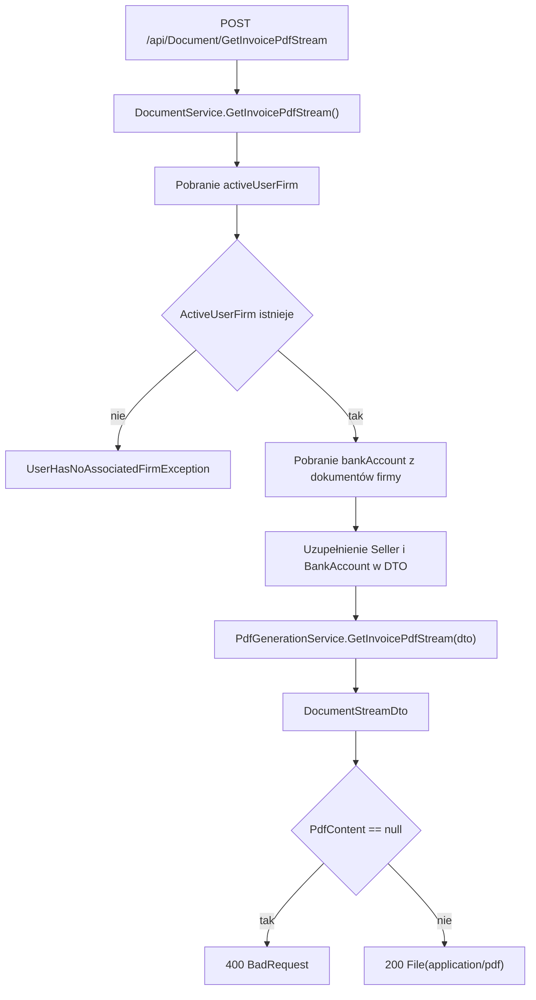

# Pobranie strumienia PDF faktury — Przegląd procesu

## Cel

Proces generuje strumień PDF dokumentu i zwraca go jako plik `application/pdf` w odpowiedzi HTTP.

---

## Diagram

```mermaid
flowchart TD
  A["POST /api/Document/GetInvoicePdfStream"] --> B["DocumentService.GetInvoicePdfStream()"]
  B --> C["Pobranie activeUserFirm"]
  C --> D{"ActiveUserFirm istnieje"}
  D -->|nie| E["UserHasNoAssociatedFirmException"]
  D -->|tak| F["Pobranie bankAccount z dokumentów firmy"]
  F --> G["Uzupełnienie Seller i BankAccount w DTO"]
  G --> H["PdfGenerationService.GetInvoicePdfStream(dto)"]
  H --> I["DocumentStreamDto"]
  I --> J{"PdfContent == null"}
  J -->|tak| K["400 BadRequest"]
  J -->|nie| L["200 File(application/pdf)"]
```
