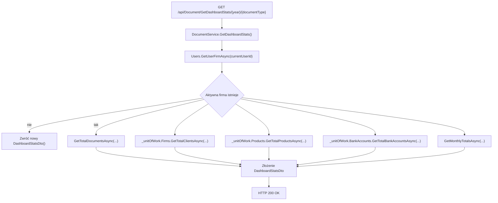

# Statystyki dashboardu — Przegląd procesu

## Cel

Proces zwraca agregaty statystyczne dashboardu dla podanego roku i typu dokumentu: liczbę dokumentów, klientów, produktów, kont bankowych oraz miesięczne sumy.

---

## Diagram

