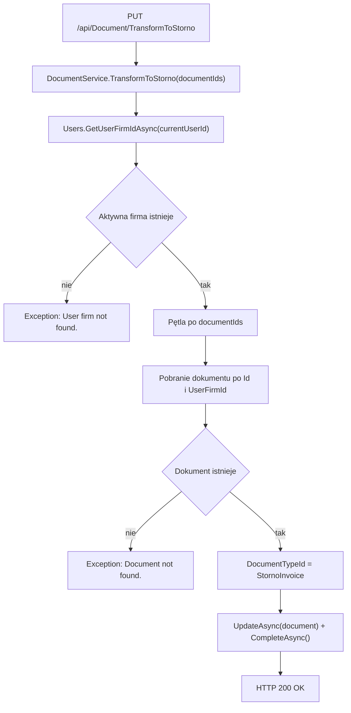

# Transformacja faktury do storna — Przegląd procesu

## Cel

Proces zmienia typ wskazanych dokumentów na `StornoInvoice` dla aktywnej firmy zalogowanego użytkownika.

---

## Diagram

```mermaid
flowchart TD
  A["PUT /api/Document/TransformToStorno"] --> B["DocumentService.TransformToStorno(documentIds)"]
  B --> C["Users.GetUserFirmIdAsync(currentUserId)"]
  C --> D{"Aktywna firma istnieje"}
  D -->|nie| E["Exception: User firm not found."]
  D -->|tak| F["Pętla po documentIds"]
  F --> G["Pobranie dokumentu po Id i UserFirmId"]
  G --> H{"Dokument istnieje"}
  H -->|nie| I["Exception: Document not found."]
  H -->|tak| J["DocumentTypeId = StornoInvoice"]
  J --> K["UpdateAsync(document) + CompleteAsync()"]
  K --> L["HTTP 200 OK"]
```
