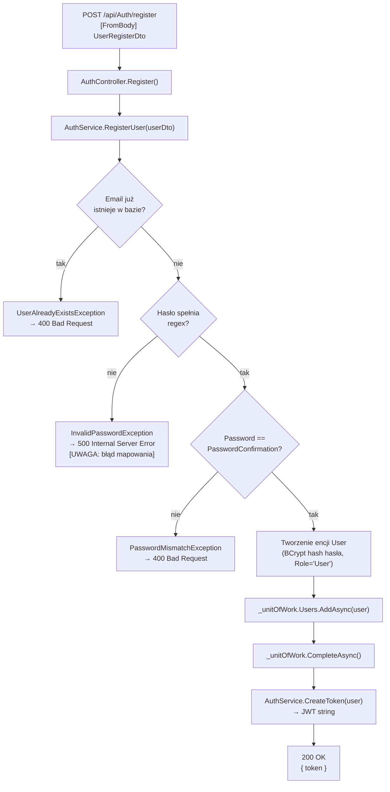

# RegisterUser — Przegląd procesu

## Cel biznesowy

Proces tworzy nowe konto użytkownika w systemie InvoiceJet. Przyjmuje dane osobowe oraz hasło, sprawdza unikalność adresu e-mail i siłę hasła, a następnie zapisuje użytkownika w bazie danych. Po pomyślnym zapisie natychmiast wystawia token JWT — użytkownik jest zalogowany od razu po rejestracji bez dodatkowego wywołania logowania.

## Aktorzy i wyzwalacz

| Element | Wartość |
|---|---|
| Aktor (rola) | Anonimowy użytkownik (brak wymaganego tokenu JWT) |
| Wyzwalacz | Wysłanie formularza rejestracji z danymi nowego konta |

## Diagram przepływu

## Warunki wejściowe

| Warunek | Źródło w kodzie | Skutek naruszenia |
|---|---|---|
| E-mail nie istnieje w tabeli `User` | `AuthService.cs › AuthService.RegisterUser` — LINQ query | `UserAlreadyExistsException` → 400 |
| Hasło spełnia regex: ≥8 znaków, duża litera, mała litera, cyfra, znak specjalny z `@$!%*?&` | `AuthService.cs › AuthService.RegisterUser` — `Regex(@"^(?=.*[a-z])(?=.*[A-Z])(?=.*\d)(?=.*[@$!%*?&])...")` | `InvalidPasswordException` → **500** |
| `Password == PasswordConfirmation` | `AuthService.cs › AuthService.RegisterUser` | `PasswordMismatchException` → 400 |
| Brak atrybutów `[Required]` na `UserRegisterDto` | `UserRegisterDto.cs` | brak walidacji DTO — null pola → potencjalny NullReferenceException → 500 |

## Reguły biznesowe

| Reguła | Podstawa w kodzie |
|---|---|
| Każdy adres e-mail może być zarejestrowany tylko raz | `AuthService.cs › AuthService.RegisterUser` — sprawdzenie przed zapisem; brak unikalnego indeksu DB na kolumnie `Email` |
| Hasło jest przechowywane jako hash BCrypt, nigdy w postaci jawnej | `AuthService.cs › AuthService.RegisterUser` — `BC.HashPassword(userDto.Password)` |
| Każdy użytkownik otrzymuje rolę `"User"` — rola jest przypisywana statycznie | `AuthService.cs › AuthService.RegisterUser` — `Role = "User"` (hardcoded) |
| Token JWT jest wystawiany natychmiast po rejestracji | `AuthService.cs › AuthService.RegisterUser` — `CreateToken(user)` po `CompleteAsync()` |

## Wynik procesu

| Wynik | Opis |
|---|---|
| Sukces | `200 OK`, body: `{ "token": "<jwt>" }` — JWT ważny 10 minut |
| Skutek w bazie | Nowy rekord w tabeli `User` (Id=Guid, Email, FirstName, LastName, PasswordHash, Role="User", ActiveUserFirmId=NULL) |
| Błąd — duplikat e-mail | `400 Bad Request`, body: `{ "message": "User with email <email> already exists." }` |
| Błąd — słabe hasło | `500 Internal Server Error`, body: `{ "message": "Password must be at least 8 characters long..." }` |
| Błąd — hasła niezgodne | `400 Bad Request`, body: `{ "message": "Password confirmation doesn't match." }` |

## Uwagi wynikające z kodu

- [UWAGA: `InvalidPasswordException` nie jest jawnie mapowany w `ExceptionMiddleware` (sprawdź `ExceptionMiddleware.cs` — brakuje `catch (InvalidPasswordException ...)`). Błąd słabego hasła zwraca `500 Internal Server Error` zamiast `400 Bad Request` — WYMAGA WERYFIKACJI Z ZESPOŁEM]
- [UWAGA: kolumna `User.Email` nie ma unikalnego indeksu w bazie danych (snapshot: brak `HasIndex("Email").IsUnique()`). Unikalność jest egzekwowana wyłącznie przez sprawdzenie w aplikacji — możliwy wyścig przy równoległych rejestracjach — WYMAGA WERYFIKACJI Z ZESPOŁEM]
- [UWAGA: `UserRegisterDto.Id` (pole `Guid?`) jest obecne w DTO, ale nie jest używane przez `AuthService.RegisterUser`. Id użytkownika jest generowane przez bazę danych — WYMAGA WERYFIKACJI Z ZESPOŁEM czy pole `Id` w DTO jest celowe]
- [UWAGA: brak atrybutów `[Required]` na polach `UserRegisterDto`. Jeżeli klient wyśle `null` w polu `Email` lub `Password`, serwis może rzucić `NullReferenceException` → `500` — WYMAGA WERYFIKACJI Z ZESPOŁEM]
