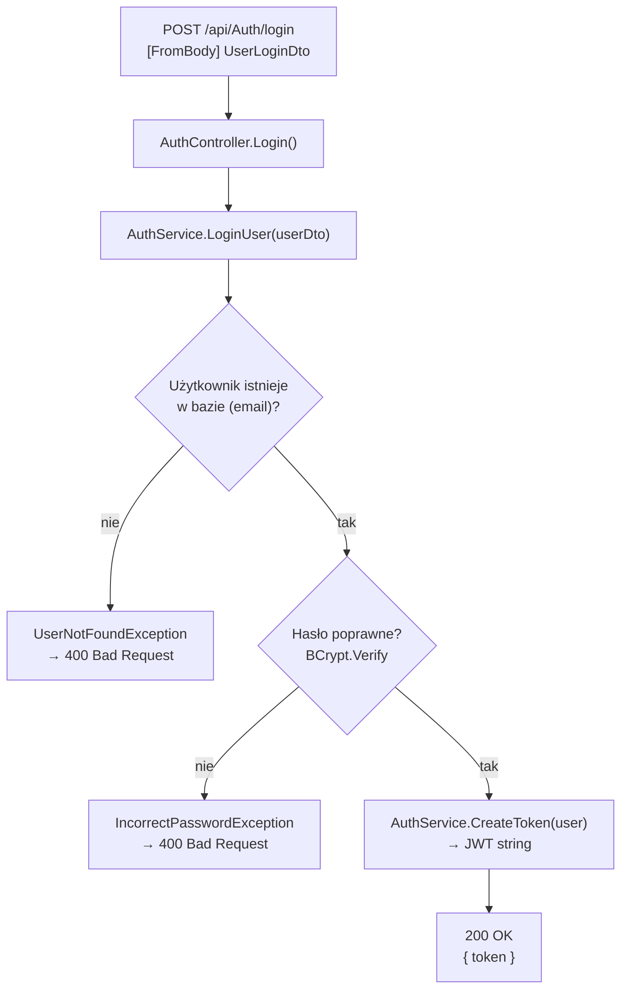

# LoginUser — Przegląd procesu

## Cel biznesowy

Proces umożliwia zarejestrowanemu użytkownikowi zalogowanie się do systemu InvoiceJet. Przyjmuje adres e-mail i hasło, weryfikuje poprawność danych względem zapisów w bazie danych, a następnie wystawia token JWT. Token jest następnie dołączany przez klienta do każdego kolejnego żądania wymagającego autoryzacji. Logowanie nie tworzy żadnych nowych rekordów w bazie — działa wyłącznie jako mechanizm uwierzytelniania.

## Aktorzy i wyzwalacz

| Element | Wartość |
|---|---|
| Aktor (rola) | Anonimowy użytkownik (brak wymaganego tokenu JWT) |
| Wyzwalacz | Wysłanie formularza logowania z e-mailem i hasłem |

## Diagram przepływu

## Warunki wejściowe

| Warunek | Źródło w kodzie | Skutek naruszenia |
|---|---|---|
| Użytkownik z podanym e-mailem istnieje w tabeli `User` | `AuthService.cs › AuthService.LoginUser` — LINQ query | `UserNotFoundException` → 400 |
| Hasło pasuje do BCrypt hash z bazy | `AuthService.cs › AuthService.LoginUser` — `BC.Verify(userDto.Password, user.PasswordHash)` | `IncorrectPasswordException` → 400 |

## Reguły biznesowe

| Reguła | Podstawa w kodzie |
|---|---|
| Logowanie nie modyfikuje żadnych danych w bazie | `AuthService.cs › AuthService.LoginUser` — brak `AddAsync`/`UpdateAsync`/`CompleteAsync` |
| Token JWT jest wystawiany tylko po pomyślnej weryfikacji hasła | `AuthService.cs › AuthService.LoginUser` — `CreateToken(user)` po `BC.Verify` |
| Weryfikacja hasła odbywa się przez BCrypt (porównanie z hashem z DB) | `AuthService.cs › AuthService.LoginUser` — `BC.Verify(userDto.Password, user.PasswordHash)` |

## Wynik procesu

| Wynik | Opis |
|---|---|
| Sukces | `200 OK`, body: `{ "token": "<jwt>" }` — JWT ważny 10 minut |
| Skutek w bazie | brak — żadne rekordy nie są tworzone ani modyfikowane |
| Błąd — nieznany e-mail | `400 Bad Request`, body: `{ "message": "User with email <email> not found." }` |
| Błąd — złe hasło | `400 Bad Request`, body: `{ "message": "Password is incorrect." }` |

## Uwagi wynikające z kodu

- [UWAGA: W `AuthService.LoginUser` warunek sprawdzający istnienie użytkownika to `user == null || user.Email != userDto.Email`. Drugi człon (`user.Email != userDto.Email`) jest zawsze fałszywy, ponieważ zapytanie LINQ już filtruje po `Email == userDto.Email`. Jest to martwy kod — WYMAGA WERYFIKACJI Z ZESPOŁEM]
- Brak ograniczenia liczby prób logowania (rate limiting) — endpoint publiczny bez throttlingu.
- Proces nie rozróżnia „nie ma użytkownika" od „złe hasło" w odpowiedzi na e-mail — oba błędy (WAL-01 i WAL-02) zwracają 400, ale z różnymi komunikatami, co może ujawniać informację o istnieniu konta.
