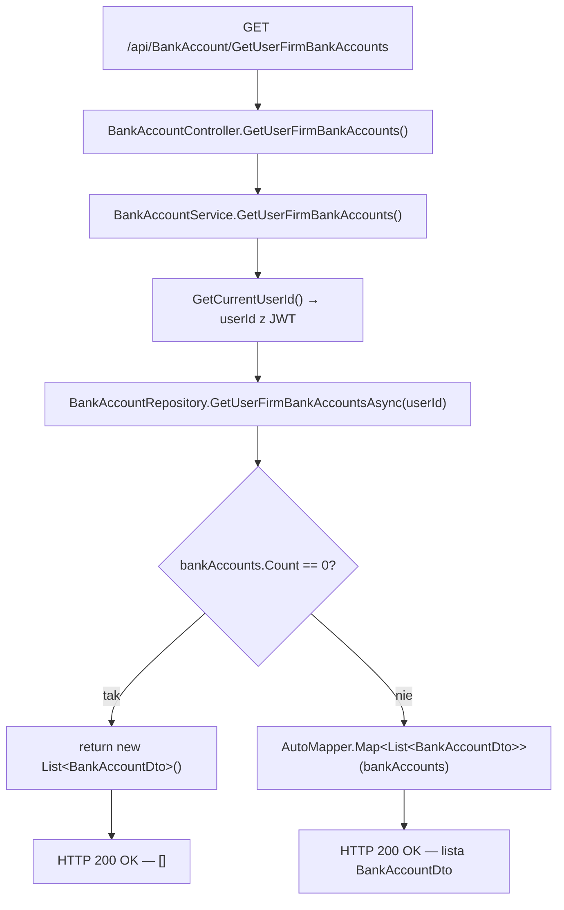
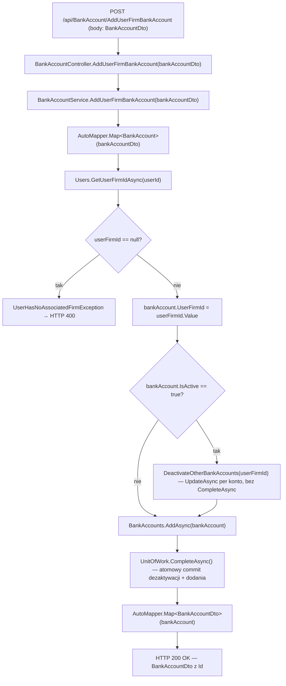
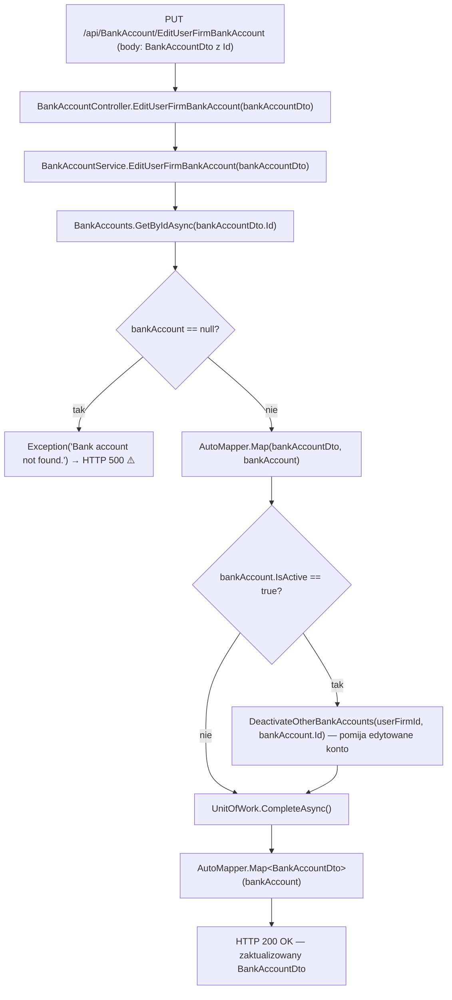
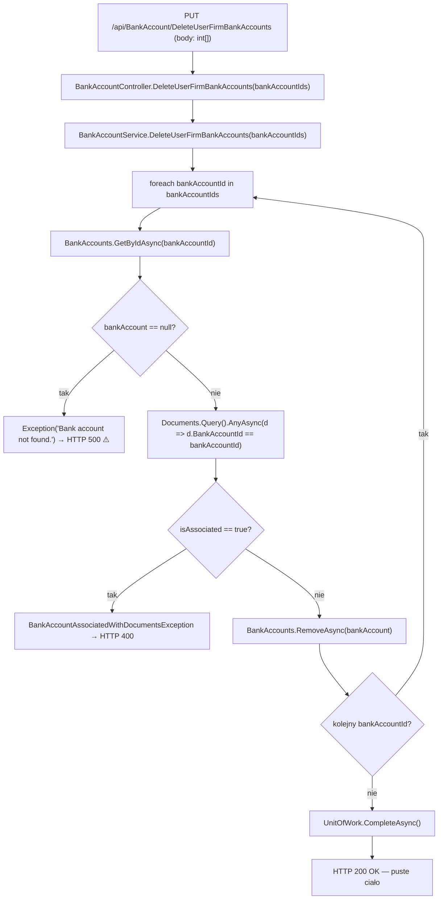

# ManageBankAccounts — Przegląd procesu

## Cel biznesowy

Proces `P-10` umożliwia zalogowanemu użytkownikowi zarządzanie kontami bankowymi przypisanymi do jego aktywnej firmy. Obejmuje cztery operacje: odczyt listy kont bankowych, dodanie nowego konta, edycję danych istniejącego konta oraz usunięcie jednego lub wielu kont z weryfikacją powiązań z wystawionymi dokumentami. Konta są izolowane per firma — użytkownik widzi i modyfikuje wyłącznie konta aktywnej firmy identyfikowanej przez `User.ActiveUserFirmId`. Kluczową regułą biznesową jest wymóg, aby tylko jedno konto per firma miało status aktywny (`IsActive = true`) — serwis automatycznie dezaktywuje pozostałe konta przy dodaniu lub edycji konta aktywnego.

---

## Aktorzy i wyzwalacz

| Element | Wartość |
|---|---|
| Aktor (rola) | `"User"` (rola z JWT claim `role`) |
| Wyzwalacz | Akcja użytkownika w widoku zarządzania kontami bankowymi (żądanie HTTP do API) |
| Tożsamość | `IUserService.GetCurrentUserId()` — odczyt `userId` z JWT claim z `HttpContext` |

---

## Diagram przepływu

### Endpoint A — GET /api/BankAccount/GetUserFirmBankAccounts

### Endpoint B — POST /api/BankAccount/AddUserFirmBankAccount

### Endpoint C — PUT /api/BankAccount/EditUserFirmBankAccount

### Endpoint D — PUT /api/BankAccount/DeleteUserFirmBankAccounts

---

## Warunki wejściowe

| Warunek | Źródło w kodzie | Skutek |
|---|---|---|
| Ważny token JWT z rolą `"User"` | `[Authorize(Roles = "User")]` na klasie `BankAccountController` | Brak → `401 Unauthorized`; zła rola → `403 Forbidden` |
| Użytkownik musi mieć aktywną firmę (AddUserFirmBankAccount) | `BankAccountService.cs › BankAccountService.AddUserFirmBankAccount` — `GetUserFirmIdAsync(userId) != null` | Brak → `UserHasNoAssociatedFirmException` → `400` |
| Konto o danym `Id` musi istnieć (EditUserFirmBankAccount) | `BankAccountService.cs › BankAccountService.EditUserFirmBankAccount` — `GetByIdAsync(bankAccountDto.Id) != null` | Brak → `Exception("Bank account not found.")` → `500` ⚠️ |
| Każde konto z tablicy musi istnieć (DeleteUserFirmBankAccounts) | `BankAccountService.cs › BankAccountService.DeleteUserFirmBankAccounts` — `GetByIdAsync(bankAccountId) != null` (per iteracja) | Brak → `Exception("Bank account not found.")` → `500` ⚠️ |
| Konto nie powiązane z dokumentem (DeleteUserFirmBankAccounts) | `BankAccountService.cs › BankAccountService.DeleteUserFirmBankAccounts` — `Documents.Query().AnyAsync(d => d.BankAccountId == bankAccountId)` | Powiązane → `BankAccountAssociatedWithDocumentsException` → `400` |

---

## Reguły biznesowe

| Reguła | Podstawa w kodzie |
|---|---|
| Konta widoczne i modyfikowalne tylko w obrębie aktywnej firmy użytkownika | `BankAccountRepository.cs › BankAccountRepository.GetUserFirmBankAccountsAsync` — filtr: `ba.UserFirm.UserId == userId && ba.UserFirm.User.ActiveUserFirmId == ba.UserFirmId` |
| Tylko jedno konto per firma może być aktywne (`IsActive = true`) — przy Add/Edit aktywnego konta dezaktywowane są wszystkie pozostałe | `BankAccountService.cs › BankAccountService.DeactivateOtherBankAccounts` — `account.IsActive = false; UpdateAsync(account)` |
| Dezaktywacja innych kont i zapis nowego/edytowanego konta są atomowe — jeden `CompleteAsync()` po wszystkich operacjach | `BankAccountService.cs` — `CompleteAsync()` poza `DeactivateOtherBankAccounts` i po `AddAsync`/`_mapper.Map` |
| Konto nie może być usunięte, jeśli było użyte na co najmniej jednej fakturze | `BankAccountService.cs › BankAccountService.DeleteUserFirmBankAccounts` — `Documents.Query().AnyAsync(d => d.BankAccountId == bankAccountId)` |
| `UserFirmId` konta ustawiany przez serwis — pole nie istnieje w `BankAccountDto` | `BankAccountService.cs › BankAccountService.AddUserFirmBankAccount` — `bankAccount.UserFirmId = userFirmId.Value` |
| Przy edycji `UserFirmId` pozostaje bez zmian — mapowanie DTO→encja nie dotyka tego pola | `BankAccountService.cs › BankAccountService.EditUserFirmBankAccount` — `_mapper.Map(bankAccountDto, bankAccount)` (brak `UserFirmId` w DTO) |

---

## Wynik procesu

| Endpoint | Wynik sukcesu | Skutek w bazie | Główne błędy |
|---|---|---|---|
| GET GetUserFirmBankAccounts | `200 OK` — `ICollection<BankAccountDto>` (lub `[]`) | brak zmian (read-only) | `401`, `403` |
| POST AddUserFirmBankAccount | `200 OK` — `BankAccountDto` z nadanym `Id` | nowy rekord `BankAccount`; ewentualna dezaktywacja innych kont (`IsActive = false`) | `400` (WAL-01), `401`, `403` |
| PUT EditUserFirmBankAccount | `200 OK` — zaktualizowany `BankAccountDto` | UPDATE rekordu `BankAccount`; ewentualna dezaktywacja innych kont | `500` (WAL-02 ⚠️), `401`, `403` |
| PUT DeleteUserFirmBankAccounts | `200 OK` — puste ciało | DELETE rekordów `BankAccount` (batch atomowy) | `400` (WAL-04), `500` (WAL-03 ⚠️), `401`, `403` |

---

## Uwagi wynikające z kodu

- [UWAGA: Generyczny `Exception("Bank account not found.")` (WAL-02 EditUserFirmBankAccount, WAL-03 DeleteUserFirmBankAccounts) trafia do catch-all w `ExceptionMiddleware.cs` → `500 Internal Server Error` zamiast `400`/`404`. Brak dedykowanego `BankAccountNotFoundException`. — WYMAGA WERYFIKACJI Z ZESPOŁEM]
- [UWAGA: `EditUserFirmBankAccount` i `DeleteUserFirmBankAccounts` nie weryfikują, czy konto należy do aktywnej firmy bieżącego użytkownika. `GetByIdAsync(id)` zwraca dowolne konto z DB — możliwa edycja/usunięcie konta innego użytkownika. Brak ownership check. — WYMAGA WERYFIKACJI Z ZESPOŁEM]
- [UWAGA: `DeleteUserFirmBankAccounts` używa metody HTTP `PUT` do usuwania — niezgodność z konwencją REST. Kotwica: `BankAccountController.cs` — `[HttpPut("DeleteUserFirmBankAccounts")]`. — WYMAGA WERYFIKACJI Z ZESPOŁEM]
- [UWAGA: Relacja `Document → BankAccount` ma `OnDelete(DeleteBehavior.Cascade)` w snapshosie — usunięcie konta na poziomie DB usunęłoby powiązane dokumenty. Serwis blokuje to przez WAL-04, ale kaskada istnieje jako ryzyko przy bezpośrednich operacjach DB. — WYMAGA WERYFIKACJI Z ZESPOŁEM]
- [UWAGA: Parametr `bankAccountIds` w `DeleteUserFirmBankAccounts` pobierany jest z body `[FromBody]`, podczas gdy analogiczny `productIds` w `DeleteProducts` (P-09) jest w query string. Niespójność API między kontrolerami. — WYMAGA WERYFIKACJI Z ZESPOŁEM]
