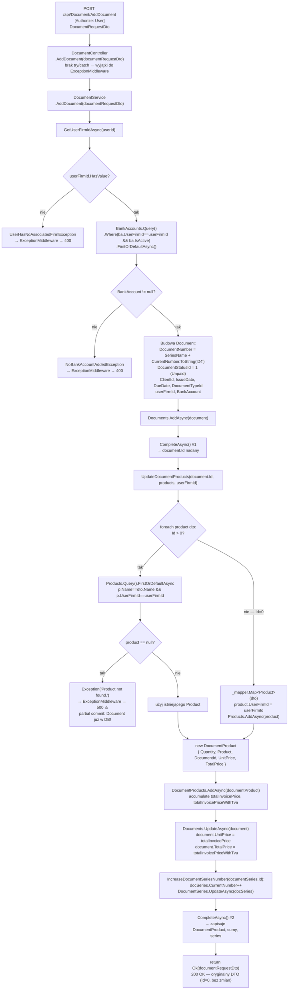

# AddDocument — Przegląd procesu

## Cel biznesowy

Proces `P-12` realizuje wystawienie nowego dokumentu (faktury, faktury proforma lub faktury storno) w ramach aktywnej firmy zalogowanego użytkownika. Proces tworzy rekord `Document` z automatycznie wygenerowanym numerem (`SeriesName + CurrentNumber` z wybranej serii), przypisuje aktywne konto bankowe firmy, zapisuje pozycje dokumentu jako `DocumentProduct` (tworząc nowe produkty jeśli potrzeba), a na koniec inkrementuje licznik serii numeracyjnej. Nowy dokument otrzymuje status `Unpaid` (Id=1).

## Aktorzy i wyzwalacz

| Element | Wartość |
|---|---|
| Aktor (rola) | `User` (wymagane JWT z rolą `"User"`) |
| Wyzwalacz | Zapis formularza wystawienia faktury w UI Angular |

---

## Diagram przepływu

---

## Warunki wejściowe

| Warunek | Źródło w kodzie | Skutek |
|---|---|---|
| Użytkownik ma aktywny token JWT z rolą `"User"` | `[Authorize(Roles = "User")]` na klasie `DocumentController` | brak tokenu → `401`; błędna rola → `403` |
| Użytkownik ma aktywną firmę | `DocumentService.cs › DocumentService.AddDocument` — `GetUserFirmIdAsync` | brak firmy → `UserHasNoAssociatedFirmException` → `400` |
| Aktywna firma ma co najmniej jedno konto bankowe z `IsActive=true` | `DocumentService.cs › DocumentService.AddDocument` — `BankAccounts.Query().Where(IsActive)` | brak konta → `NoBankAccountAddedException` → `400` |
| Produkty z `Id > 0` muszą istnieć w DB dla tej firmy (wg `Name+UserFirmId`) | `DocumentService.cs › DocumentService.UpdateDocumentProducts` | brak produktu → `Exception("Product not found.")` → `500` ⚠️ |

---

## Reguły biznesowe

| Reguła | Podstawa w kodzie |
|---|---|
| `DocumentNumber = SeriesName + CurrentNumber.ToString("D4")` (zero-padding do 4 cyfr) | `DocumentService.cs › DocumentService.AddDocument` — `documentRequestDto.DocumentSeries?.SeriesName + documentRequestDto.DocumentSeries?.CurrentNumber.ToString("D4")` |
| Nowy dokument zawsze ma status `Unpaid` (`DocumentStatusId = 1`) | `DocumentService.cs › DocumentService.AddDocument` — `DocumentStatusId = (int)DocumentStatusEnum.Unpaid` |
| BankAccount dobierany automatycznie (pierwsze aktywne konto firmy) | `DocumentService.cs › DocumentService.AddDocument` — `BankAccounts.Query().Where(ba.IsActive).FirstOrDefaultAsync()` |
| Po wystawieniu faktury inkrementowany jest `DocumentSeries.CurrentNumber` | `DocumentService.cs › DocumentService.IncreaseDocumentSeriesNumber` — `docSeries!.CurrentNumber++` |
| Produkty z `Id=0` tworzone są jako nowe rekordy `Product` powiązane z firmą | `DocumentService.cs › DocumentService.UpdateDocumentProducts` — `_mapper.Map<Product>(dto); product.UserFirmId = userFirmId; Products.AddAsync(product)` |
| `Document.UnitPrice` = suma `(UnitPrice * Quantity)` wszystkich pozycji; `Document.TotalPrice` = suma `TotalPrice` | `DocumentService.cs › DocumentService.UpdateDocumentProducts` — akumulacja `totalInvoicePrice`, `totalInvoicePriceWithTva` |

---

## Wynik procesu

| Wynik | Opis |
|---|---|
| Sukces | `200 OK` — ciało: oryginalny `DocumentRequestDto` z żądania (bez nadanego `Id` dokumentu z DB) |
| Skutek w bazie | Nowy rekord `Document`; N rekordów `DocumentProduct`; opcjonalnie nowe rekordy `Product` (gdy `Id=0`); `DocumentSeries.CurrentNumber + 1` |
| Błąd WAL-01 | `400 Bad Request` — `{ "message": "User has no associated firm." }` |
| Błąd WAL-02 | `400 Bad Request` — `{ "message": "Please add a bank account, before generating a document." }` |
| Błąd WAL-03 | `500 Internal Server Error` — `{ "message": "Product not found." }` ⚠️ + partial commit |

Szczegóły: `05_BLEDY_BEZPIECZENSTWO.md`.

---

## Uwagi wynikające z kodu

- [UWAGA: Dwa `CompleteAsync()` bez jawnej transakcji — partial commit risk. Jeśli WAL-03 wystąpi po pierwszym `CompleteAsync()`, `Document` pozostaje w DB bez pozycji. Kotwica: `DocumentService.cs › DocumentService.AddDocument`. — WYMAGA WERYFIKACJI Z ZESPOŁEM]
- [UWAGA: `return Ok(documentRequestDto)` zwraca oryginalny DTO z `Id=0` — klient nie zna `Id` nowego dokumentu. Kotwica: `DocumentController.cs › DocumentController.AddDocument`. — WYMAGA WERYFIKACJI Z ZESPOŁEM]
- [UWAGA: Produkt o `Id > 0` szukany po `Name+UserFirmId`, nie po `Id` — ryzyko `500` gdy nazwa zmieniona. Kotwica: `DocumentService.cs › DocumentService.UpdateDocumentProducts`. — WYMAGA WERYFIKACJI Z ZESPOŁEM]
- [UWAGA: `IncreaseDocumentSeriesNumber` używa null forgiving `docSeries!` bez null check → `NullReferenceException` gdy seria usunięta. Kotwica: `DocumentService.cs › DocumentService.IncreaseDocumentSeriesNumber`. — WYMAGA WERYFIKACJI Z ZESPOŁEM]
- [UWAGA: Brak weryfikacji własności klienta — `documentRequestDto.Client.Id` nie sprawdzane, czy klient faktycznie należy do aktywnej firmy użytkownika. — WYMAGA WERYFIKACJI Z ZESPOŁEM]
- [UWAGA: Nowe produkty (`Id=0`) tworzone bez sprawdzania duplikatu nazwy — naruszenie unikalnego indeksu `Name+UserFirmId` w tabeli `Product` → `500` z błędem DB. — WYMAGA WERYFIKACJI Z ZESPOŁEM]
- [UWAGA: `DocumentNumber` generowany z `CurrentNumber` przesłanego w DTO, nie pobranego z DB — klient może podać stary numer, generując duplikat. Brak weryfikacji unikalności `DocumentNumber`. — WYMAGA WERYFIKACJI Z ZESPOŁEM]
