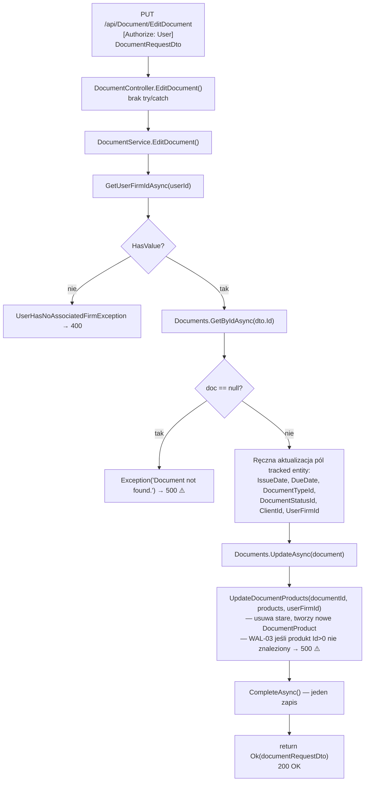

# EditDocument — Przegląd procesu

## Cel biznesowy

Proces `P-13` umożliwia edycję istniejącego dokumentu (faktury, proformy, storna) w ramach aktywnej firmy zalogowanego użytkownika. Użytkownik może zmienić: datę wystawienia, datę płatności, klienta, typ dokumentu, status dokumentu (np. oznaczenie jako zapłacona) oraz listę pozycji. Po edycji pozycje dokumentu są kompletnie zastępowane (delete + insert). Numer dokumentu nie jest modyfikowany.

## Aktorzy i wyzwalacz

| Element | Wartość |
|---|---|
| Aktor (rola) | `User` |
| Wyzwalacz | Zapis formularza edycji faktury w UI Angular |

---

## Diagram przepływu

---

## Warunki wejściowe

| Warunek | Źródło w kodzie | Skutek |
|---|---|---|
| Użytkownik ma aktywną firmę | `DocumentService.cs › DocumentService.EditDocument` | brak → 400 |
| Dokument o `Id` istnieje | `DocumentService.cs › DocumentService.EditDocument` — `GetByIdAsync` | brak → 500 ⚠️ |
| Produkty Id>0 znalezione po `Name+UserFirmId` | `DocumentService.cs › DocumentService.UpdateDocumentProducts` | brak → 500 ⚠️ |

---

## Reguły biznesowe

| Reguła | Podstawa w kodzie |
|---|---|
| `DocumentNumber` nie jest modyfikowany przy edycji | `DocumentService.cs › DocumentService.EditDocument` — brak `document.DocumentNumber = ...` |
| `BankAccountId` nie jest modyfikowany przy edycji | `DocumentService.cs › DocumentService.EditDocument` — brak `document.BankAccountId = ...` |
| Pozycje dokumentu zastępowane kompletnie (delete + insert) | `DocumentService.cs › DocumentService.UpdateDocumentProducts` — `RemoveRangeAsync` + `AddAsync` |
| Jeden `CompleteAsync()` — atomowy zapis | `DocumentService.cs › DocumentService.EditDocument` — jednorazowe wywołanie |

---

## Wynik procesu

| Wynik | Opis |
|---|---|
| Sukces | `200 OK` — oryginalny DTO żądania |
| Skutek w bazie | Zaktualizowany `Document`; stare `DocumentProduct` usunięte; nowe `DocumentProduct` wstawione |
| Błąd WAL-01 | `400` — `{ "message": "User has no associated firm." }` |
| Błąd WAL-02 | `500` ⚠️ — `{ "message": "Document not found." }` |
| Błąd WAL-03 | `500` ⚠️ — `{ "message": "Product not found." }` |

---

## Uwagi wynikające z kodu

- [UWAGA: `GetByIdAsync(Id)` bez ownership check — możliwa edycja dokumentów innego użytkownika. — WYMAGA WERYFIKACJI Z ZESPOŁEM]
- [UWAGA: WAL-02 i WAL-03 → `500` zamiast `404`/`400`. — WYMAGA WERYFIKACJI Z ZESPOŁEM]
- [UWAGA: Produkty `Id>0` szukane po `Name+UserFirmId`, nie po `Id`. — WYMAGA WERYFIKACJI Z ZESPOŁEM]
