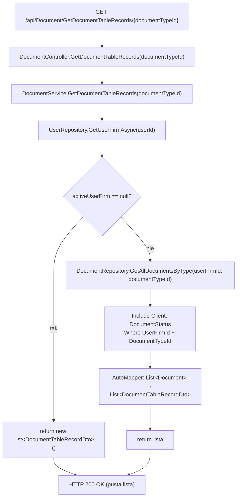
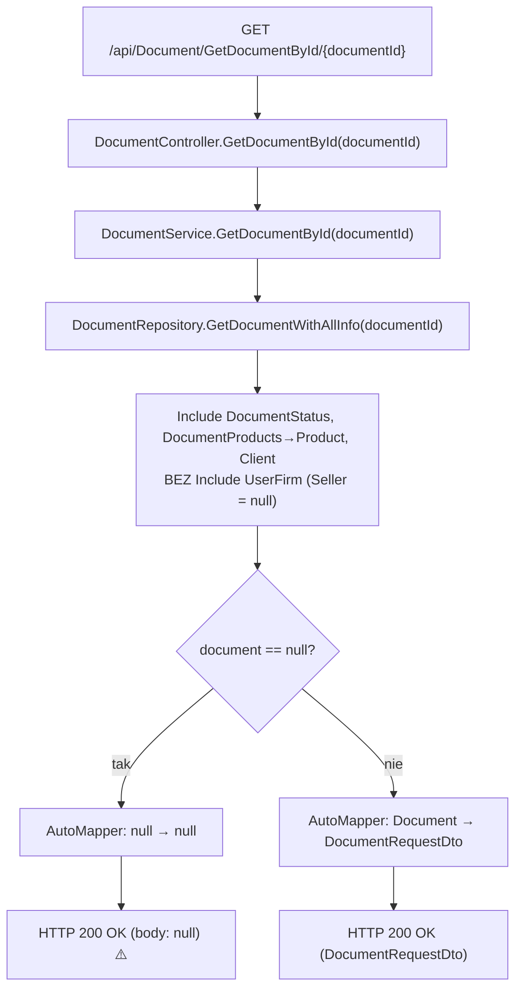

# GetDocuments — Przegląd procesu

## Cel biznesowy

Proces P-14 dostarcza dwa endpointy odczytu dokumentów: pierwszy zwraca listę dokumentów danego typu (faktura, proforma, storno) w formie skróconej tabeli (numer, klient, daty, wartość, status), drugi zwraca pełny obiekt dokumentu po jego Id (z pozycjami, klientem, statusem). Służą do wyświetlania listy dokumentów w interfejsie użytkownika oraz do załadowania danych istniejącego dokumentu przed edycją lub wystawieniem PDF.

## Aktorzy i wyzwalacz

| Element | Wartość |
|---|---|
| Aktor (rola) | `User` (JWT) |
| Wyzwalacz A | Otwarcie widoku listy dokumentów danego typu |
| Wyzwalacz B | Otwarcie widoku edycji / podglądu szczegółów dokumentu |

---

## Diagram przepływu — Endpoint A: GetDocumentTableRecords

---

## Diagram przepływu — Endpoint B: GetDocumentById

> ⚠️ Brak sprawdzenia `null` w serwisie — nieistniejący dokument zwraca `200 OK null` zamiast `404 Not Found`.

---

## Warunki wejściowe

| Warunek | Źródło w kodzie | Skutek |
|---|---|---|
| Użytkownik zalogowany (JWT) | `[Authorize(Roles = "User")]` na klasie | `401` / `403` bez tokenu/roli |
| `documentTypeId` dowolna wartość int | parametr trasy | Brak walidacji — filtrowanie po nieistniejącym typie → `[]` |
| `documentId` dowolna wartość int | parametr trasy | Brak walidacji — nieistniejące id → `200 null` |

---

## Reguły biznesowe

| Reguła | Podstawa w kodzie |
|---|---|
| Lista dokumentów filtrowana po `UserFirmId` — użytkownik widzi tylko swoje dokumenty | `DocumentRepository.cs › DocumentRepository.GetAllDocumentsByType` |
| Filtrowanie listy po `DocumentTypeId` (1=Faktura, 2=Proforma, 3=Storno) | `DocumentRepository.cs › DocumentRepository.GetAllDocumentsByType` |
| `DocumentTableRecordDto.ClientName` pochodzi z `Document.Client.Name` (Include Client) | `DocumentProfile.cs › DocumentProfile` (ctor) |
| `DocumentTableRecordDto.TotalValue` mapowane z `Document.TotalPrice` | `DocumentProfile.cs › DocumentProfile` (ctor) |
| `DocumentRequestDto.Seller` = `null` — `GetDocumentWithAllInfo` nie Include `UserFirm` | `DocumentRepository.cs › DocumentRepository.GetDocumentWithAllInfo` |
| `GetDocumentById` **nie filtruje** po `UserFirmId` — brak ownership check | `DocumentService.cs › DocumentService.GetDocumentById` |

---

## Wynik procesu

| Wynik | Opis |
|---|---|
| Sukces A | `200 OK` z `List<DocumentTableRecordDto>`; może być `[]` |
| Sukces B | `200 OK` z `DocumentRequestDto`; może być `null` gdy nieistniejące Id ⚠️ |
| Skutek w bazie | Brak — oba endpointy read-only |
| Błąd | `401 Unauthorized` (brak JWT); `403 Forbidden` (brak roli `User`) |

---

## Uwagi wynikające z kodu

- [UWAGA: `GetDocumentById` zwraca `200 OK null` dla nieistniejącego `documentId` zamiast `404 Not Found`. Kotwica: `DocumentService.cs › DocumentService.GetDocumentById`. — WYMAGA WERYFIKACJI Z ZESPOŁEM]

- [UWAGA: `GetDocumentById` nie weryfikuje własności dokumentu (`UserFirmId`). Możliwe odczytanie dokumentów innego użytkownika. Kotwica: `DocumentService.cs › DocumentService.GetDocumentById`. — WYMAGA WERYFIKACJI Z ZESPOŁEM]

- [UWAGA: `DocumentRequestDto.Seller` zawsze `null` w odpowiedzi z `GetDocumentById` — `GetDocumentWithAllInfo` nie Include `UserFirm`. Kotwica: `DocumentRepository.cs › DocumentRepository.GetDocumentWithAllInfo`. — UWAGA informacyjna]

- [UWAGA: `DocumentTableRecordDto.DocumentStatus` to encja domenowa `InvoiceJet.Domain.Models.DocumentStatus`, nie DTO — naruszenie separacji warstw. Kotwica: `DocumentTableRecordDto.cs`. — WYMAGA WERYFIKACJI Z ZESPOŁEM]
