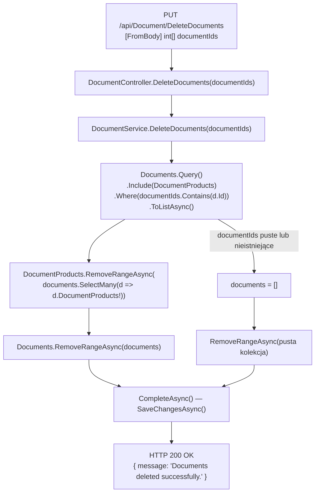

# DeleteDocuments — Przegląd procesu

## Cel biznesowy

Proces P-15 umożliwia zalogowanemu użytkownikowi usunięcie jednego lub wielu dokumentów (faktur, proform, storn) w ramach jednego żądania. Endpoint przyjmuje tablicę identyfikatorów dokumentów, usuwa powiązane pozycje produktów (`DocumentProduct`), a następnie usuwa same dokumenty — wszystko w ramach jednej transakcji EF (`SaveChangesAsync`).

## Aktorzy i wyzwalacz

| Element | Wartość |
|---|---|
| Aktor (rola) | `User` (JWT) |
| Wyzwalacz | Zaznaczenie dokumentów w interfejsie i naciśnięcie „Usuń" |

---

## Diagram przepływu

> ⚠️ Brak gałęzi błędu dla braku ownership — diagram przedstawia przepływ techniczny bez sprawdzenia `UserFirmId`.

---

## Warunki wejściowe

| Warunek | Źródło w kodzie | Skutek |
|---|---|---|
| Użytkownik zalogowany (JWT) | `[Authorize(Roles = "User")]` na klasie | `401` / `403` |
| `documentIds` jest tablicą `int[]` | `[FromBody]` framework | `400` gdy `null` (deserializacja) |
| Dokumenty pasujące do Id istnieją | `Where(documentIds.Contains(d.Id))` | Brak efektu gdy nieistniejące |

---

## Reguły biznesowe

| Reguła | Podstawa w kodzie |
|---|---|
| Pozycje dokumentów (`DocumentProduct`) są usuwane przed dokumentem | `DocumentService.cs › DocumentService.DeleteDocuments` — `RemoveRangeAsync(DocumentProducts)` poprzedza `RemoveRangeAsync(documents)` |
| Obie operacje usunięcia w jednym `SaveChangesAsync` | `UnitOfWork.CompleteAsync()` — jeden commit |
| Brak sprawdzenia własności — usuwane WSZYSTKIE dokumenty o podanych Id | `DocumentService.cs › DocumentService.DeleteDocuments` — brak filtra `UserFirmId` |

---

## Wynik procesu

| Wynik | Opis |
|---|---|
| Sukces | `200 OK` z `{ "message": "Documents deleted successfully." }` |
| Skutek w bazie | Rekordy `DocumentProduct` i `Document` dla podanych Id usunięte |
| Pusty input | `200 OK` — brak zmian, brak sygnału |
| Błąd | `401` (brak JWT), `403` (brak roli), `500` (wyjątek DB / NullRef) |

---

## Uwagi wynikające z kodu

- [UWAGA: Endpoint używa HTTP `PUT` zamiast `DELETE` dla operacji usuwania. Kotwica: `DocumentController.cs › DocumentController.DeleteDocuments`. — WYMAGA WERYFIKACJI Z ZESPOŁEM]

- [UWAGA: Brak ownership check — serwis usuwa dokumenty po samym `Id` bez weryfikacji `UserFirmId`. Kotwica: `DocumentService.cs › DocumentService.DeleteDocuments`. — WYMAGA WERYFIKACJI Z ZESPOŁEM]

- [UWAGA: Pusta tablica `[]` lub nieistniejące Id → `200 OK` bez żadnej informacji o braku zmian. — UWAGA informacyjna]

- [UWAGA: Null-forgiving `d.DocumentProducts!` w `SelectMany` — potencjalny `NullReferenceException → 500`. Kotwica: `DocumentService.cs › DocumentService.DeleteDocuments`. — WYMAGA WERYFIKACJI Z ZESPOŁEM]
