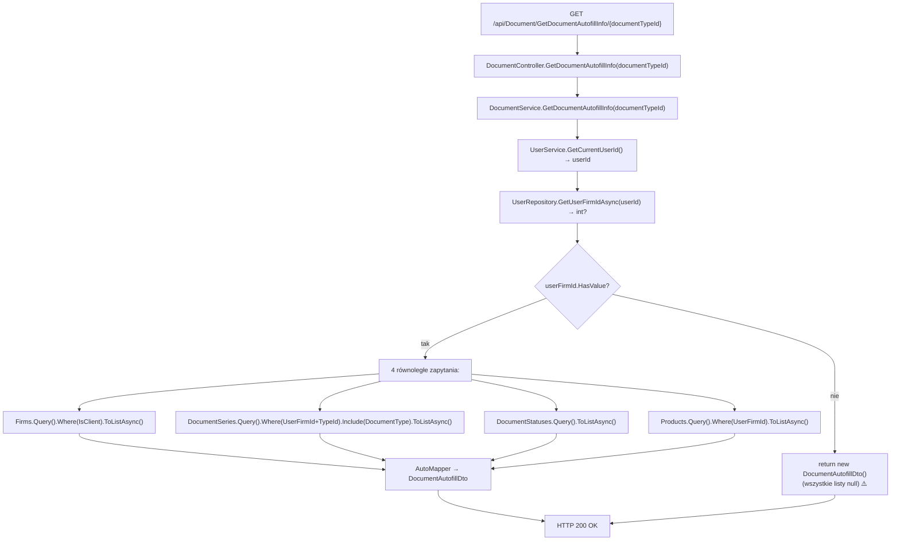

# GetDocumentAutofillInfo — Przegląd procesu

## Cel biznesowy

Proces P-16 dostarcza dane potrzebne do wstępnego wypełnienia formularza nowego lub edytowanego dokumentu. Zwraca w jednym żądaniu: listę klientów firmy, dostępne serie dokumentów danego typu, statusy dokumentów oraz produkty firmy. Umożliwia frontendowi wyświetlenie list rozwijanych bez konieczności wykonywania osobnych żądań.

## Aktorzy i wyzwalacz

| Element | Wartość |
|---|---|
| Aktor (rola) | `User` (JWT) |
| Wyzwalacz | Otwarcie formularza wystawiania / edycji dokumentu |

---

## Diagram przepływu

---

## Warunki wejściowe

| Warunek | Źródło w kodzie | Skutek |
|---|---|---|
| Użytkownik zalogowany (JWT) | `[Authorize(Roles = "User")]` na klasie | `401` / `403` |
| `documentTypeId` — dowolna wartość int | parametr trasy | Brak walidacji; nieistniejący typ → `documentSeries: []` |

---

## Reguły biznesowe

| Reguła | Podstawa w kodzie |
|---|---|
| Klienci filtrowane przez `UserFirms.IsClient=true` i `UserId` | `DocumentService.cs › DocumentService.GetDocumentAutofillInfo` |
| Serie dokumentów filtrowane przez `UserFirmId` i `DocumentTypeId` | `DocumentService.cs › DocumentService.GetDocumentAutofillInfo` |
| Statusy globalne (bez filtra firmy) — zawsze Unpaid+Paid | `DocumentService.cs › DocumentService.GetDocumentAutofillInfo` |
| Produkty filtrowane przez `UserFirmId` | `DocumentService.cs › DocumentService.GetDocumentAutofillInfo` |
| Brak firmy → `new DocumentAutofillDto()` z `null` polami (nie wyjątek) | `DocumentService.cs › DocumentService.GetDocumentAutofillInfo` |

---

## Wynik procesu

| Wynik | Opis |
|---|---|
| Sukces | `200 OK` z `DocumentAutofillDto` zawierającym 4 listy |
| Brak firmy | `200 OK` z `DocumentAutofillDto` — wszystkie listy `null` ⚠️ |
| Skutek w bazie | Brak — endpoint read-only |
| Błąd | `401` (brak JWT), `403` (brak roli `User`) |

---

## Uwagi wynikające z kodu

- [UWAGA: Gdy użytkownik nie ma firmy, serwis zwraca `new DocumentAutofillDto()` z polami zainicjowanymi `null!` — serializer wyśle `null` zamiast `[]`. Frontend może crashować przy iteracji. Kotwica: `DocumentService.cs › DocumentService.GetDocumentAutofillInfo`. — WYMAGA WERYFIKACJI Z ZESPOŁEM]

- [UWAGA: `DocumentStatuses` pobierane bez filtra firmy — są to dane globalne (seed). Niespójne z podejściem do pozostałych kolekcji. — UWAGA informacyjna]
