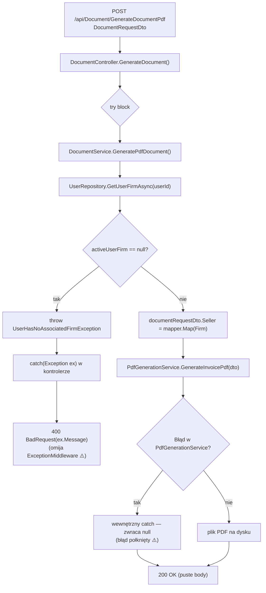
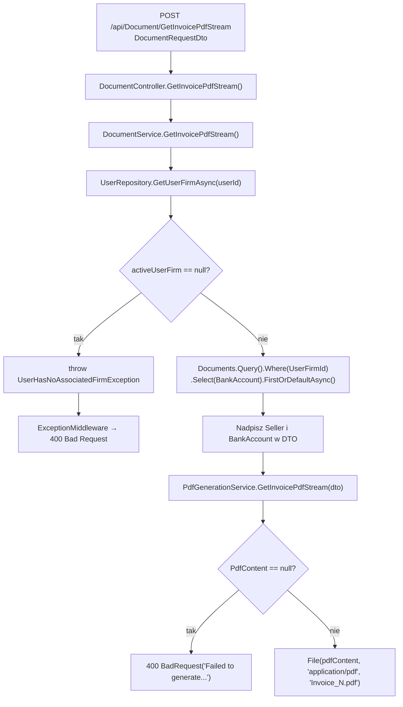

# ManageDocumentPdf — Przegląd procesu

## Cel biznesowy

Proces P-17 obsługuje dwa sposoby generowania PDF z dokumentu: zapis pliku PDF na dysku serwera (`GenerateDocumentPdf`, API-28) oraz zwrócenie PDF jako strumienia bajtów do przeglądarki (`GetInvoicePdfStream`, API-29). Oba endpointy przyjmują pełny obiekt `DocumentRequestDto` i uzupełniają dane sprzedawcy z aktywnej firmy użytkownika.

Podejście do generowania PDF różni się między endpointami: API-29 używa wzorca fabryki (`DocumentFactoryProvider`) i poprawnie wybiera szablon wg `DocumentType.Id`; API-28 zawsze tworzy `new InvoiceDocument(invoiceData)` niezależnie od typu dokumentu — błąd powodujący, że Proforma i Storno generują layout faktury zwykłej. ⚠️

## Aktorzy i wyzwalacz

| Element | Wartość |
|---|---|
| Aktor (rola) | `User` (JWT) |
| Wyzwalacz A | Kliknięcie „Generuj PDF" (zapis na serwer) |
| Wyzwalacz B | Kliknięcie „Pobierz PDF" (stream do przeglądarki) |

---

## Diagram przepływu — Endpoint A: GenerateDocumentPdf (API-28)

---

## Diagram przepływu — Endpoint B: GetInvoicePdfStream (API-29)

---

## Warunki wejściowe

| Warunek | Źródło w kodzie | Skutek |
|---|---|---|
| Użytkownik zalogowany (JWT) | `[Authorize(Roles = "User")]` | `401` / `403` |
| Użytkownik ma firmę | `GetUserFirmAsync` w serwisie | WAL-01A/WAL-01B → `400` |
| `DocumentType` podany w DTO | używany przez `PdfGenerationService` | bez `DocumentType` → błąd fabryki → `PdfContent=null` → `400` |

---

## Reguły biznesowe

| Reguła | Podstawa w kodzie |
|---|---|
| `Seller` w DTO nadpisywany przez serwis z danych firmy użytkownika (nie z requestu) | `DocumentService.cs › DocumentService.GeneratePdfDocument / GetInvoicePdfStream` |
| `BankAccount` w API-29 pobierany z pierwszego dokumentu firmy (nie z DTO) | `DocumentService.cs › DocumentService.GetInvoicePdfStream` |
| Wybór szablonu PDF przez fabrykę wg `DocumentType.Id` (tylko API-29) | `PdfGenerationService.cs › PdfGenerationService.GetInvoicePdfStream` |
| API-28 zawsze używa szablonu faktury zwykłej (`InvoiceDocument`) niezależnie od `DocumentType` — BUG ⚠️ | `PdfGenerationService.cs › PdfGenerationService.GenerateInvoicePdf` |
| Nazwa pliku: `Invoice_<DocumentNumber>.pdf` lub `Invoice_<CurrentNumber>.pdf` | `DocumentService.cs › DocumentService.GetInvoicePdfStream` |

---

## Wynik procesu

| Wynik | Opis |
|---|---|
| Sukces A | `200 OK` puste body; plik PDF na dysku serwera |
| Sukces B | `200 OK` binarny PDF; plik do pobrania |
| Brak firmy | `400` (inny format dla A i B ⚠️) |
| Błąd generowania | API-28: `200 OK` (połknięty) ⚠️; API-29: `400 BadRequest` |
| Skutek w bazie | Brak — oba endpointy read-only |

---

## Uwagi wynikające z kodu

- [UWAGA: API-28 łapie KAŻDY wyjątek w kontrolerze i zwraca `BadRequest(ex.Message)` — omija ExceptionMiddleware. Niespójna obsługa błędów z resztą API. Kotwica: `DocumentController.cs › DocumentController.GenerateDocument`. — WYMAGA WERYFIKACJI Z ZESPOŁEM]

- [UWAGA: `PdfGenerationService.GenerateInvoicePdf` połyka błąd generowania (wewnętrzny try/catch). API-28 zwraca `200 OK` nawet gdy PDF nie został zapisany. Kotwica: `PdfGenerationService.cs › PdfGenerationService.GenerateInvoicePdf`. — WYMAGA WERYFIKACJI Z ZESPOŁEM]

- [UWAGA: API-29 pobiera konto bankowe z PIERWSZEGO dokumentu firmy (nie z dokumentu w DTO). Kotwica: `DocumentService.cs › DocumentService.GetInvoicePdfStream`. — WYMAGA WERYFIKACJI Z ZESPOŁEM]

- [UWAGA: Null-forgiving `DocumentSeries!` w budowaniu `DocumentNumber` — `NullReferenceException → 500` gdy `DocumentNumber == null` i `DocumentSeries == null`. Kotwica: `DocumentService.cs › DocumentService.GetInvoicePdfStream`. — WYMAGA WERYFIKACJI Z ZESPOŁEM]

- [UWAGA: `PdfGenerationService.GenerateInvoicePdf` (API-28) hardcoduje `new InvoiceDocument(invoiceData)` zamiast korzystać z fabryki. Każde wywołanie API-28 wygeneruje layout **faktury zwykłej** niezależnie od faktycznego `DocumentType` (Proforma, Storno). API-29 działa poprawnie przez `DocumentFactoryProvider`. Kotwica: `PdfGenerationService.cs › PdfGenerationService.GenerateInvoicePdf`. — WYMAGA WERYFIKACJI Z ZESPOŁEM]
