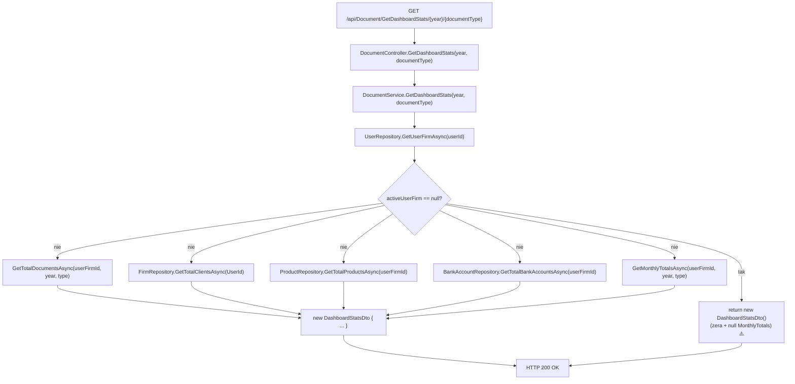

# GetDashboardStats — Przegląd procesu

## Cel biznesowy

Proces P-18 dostarcza zagregowane statystyki biznesowe dla aktywnej firmy zalogowanego użytkownika: łączną liczbę dokumentów danego roku i typu, liczbę klientów, produktów i kont bankowych, a także miesięczne zestawienie przychodów (suma wystawionych i suma opłaconych faktur). Służy do zasilania widoku dashboardu / tablicy kontrolnej w interfejsie użytkownika.

## Aktorzy i wyzwalacz

| Element | Wartość |
|---|---|
| Aktor (rola) | `User` (JWT) |
| Wyzwalacz | Otwarcie widoku dashboardu; zmiana roku lub typu dokumentu |

---

## Diagram przepływu

> ⚠️ Zapytania G1–G5 wykonywane sekwencyjnie (nie `Task.WhenAll`).

---

## Warunki wejściowe

| Warunek | Źródło w kodzie | Skutek |
|---|---|---|
| Użytkownik zalogowany (JWT) | `[Authorize(Roles = "User")]` | `401` / `403` |
| `year` — dowolna wartość int | parametr trasy | Brak walidacji; rok bez dokumentów → zera |
| `documentType` — dowolna wartość int | parametr trasy | Brak walidacji; nieistniejący typ → zera |

---

## Reguły biznesowe

| Reguła | Podstawa w kodzie |
|---|---|
| Dokumenty filtrowane po `UserFirmId`, `IssueDate.Year`, `DocumentTypeId` | `DocumentService.cs › DocumentService.GetTotalDocumentsAsync / GetMonthlyTotalsAsync` |
| `IncomeAmount` = suma `TotalPrice` dla dokumentów z `DocumentStatusId = 2` (Paid) | `DocumentService.cs › DocumentService.GetMonthlyTotalsAsync` |
| `MonthlyTotals` zawiera tylko miesiące z dokumentami (GroupBy) | `DocumentService.cs › DocumentService.GetMonthlyTotalsAsync` |
| Brak firmy → zerowy DTO (nie wyjątek) | `DocumentService.cs › DocumentService.GetDashboardStats` |

---

## Wynik procesu

| Wynik | Opis |
|---|---|
| Sukces | `200 OK` z `DashboardStatsDto` |
| Brak firmy | `200 OK` z zerami i `MonthlyTotals=null` ⚠️ |
| Skutek w bazie | Brak — endpoint read-only |
| Błąd | `401` (brak JWT), `403` (brak roli), `500` (EF error) |

---

## Uwagi wynikające z kodu

- [UWAGA: Zapytania do bazy wykonywane sekwencyjnie zamiast równolegle (`Task.WhenAll`). Dla firmy z dużą bazą danych może powodować zbędne opóźnienia. Kotwica: `DocumentService.cs › DocumentService.GetDashboardStats`. — WYMAGA WERYFIKACJI Z ZESPOŁEM]

- [UWAGA: `GetTotalClientsAsync(UserId)` — parametr to `UserId`, nie `UserFirmId`. Niespójność z innymi zapytaniami. Kotwica: `DocumentService.cs › DocumentService.GetDashboardStats`. — WYMAGA WERYFIKACJI Z ZESPOŁEM]

- [UWAGA: Null-forgiving `d.DocumentType!.Id` w zapytaniach LINQ. Kotwica: `DocumentService.cs › GetTotalDocumentsAsync / GetMonthlyTotalsAsync`. — WYMAGA WERYFIKACJI Z ZESPOŁEM]

- [UWAGA: Brak firmy → `MonthlyTotals = null` (nie `[]`). Frontend może crashować. Kotwica: `DashboardStatsDto.cs`. — WYMAGA WERYFIKACJI Z ZESPOŁEM]
