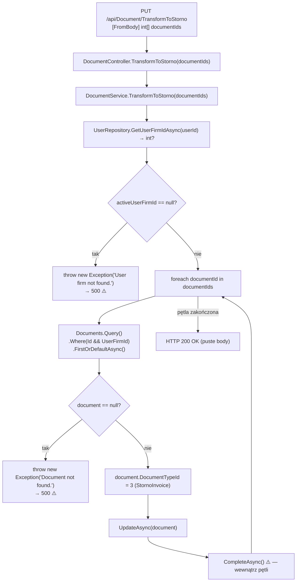

# TransformToStorno — Przegląd procesu

## Cel biznesowy

Proces P-19 umożliwia przekształcenie jednego lub wielu dokumentów (faktur, proform) w faktury storno. Operacja zmienia typ dokumentu na `StornoInvoice` (`DocumentTypeId=3`), zachowując wszystkie pozostałe dane dokumentu bez zmian. Służy do anulowania/korekty wystawionych dokumentów.

## Aktorzy i wyzwalacz

| Element | Wartość |
|---|---|
| Aktor (rola) | `User` (JWT) |
| Wyzwalacz | Wybranie dokumentów i naciśnięcie „Przekształć w Storno" |

---

## Diagram przepływu

> ⚠️ `CompleteAsync()` wewnątrz pętli = N osobnych transakcji. Brak atomowości dla wielu dokumentów.

---

## Warunki wejściowe

| Warunek | Źródło w kodzie | Skutek |
|---|---|---|
| Użytkownik zalogowany (JWT) | `[Authorize(Roles = "User")]` | `401` / `403` |
| Użytkownik ma firmę | `GetUserFirmIdAsync` | WAL-01 → `500` ⚠️ |
| Dokument istnieje i należy do firmy | `Query().Where(Id && UserFirmId)` | WAL-02 → `500` ⚠️ |
| `documentIds = []` | pętla foreach | `200 OK` bez zmian |

---

## Reguły biznesowe

| Reguła | Podstawa w kodzie |
|---|---|
| Zmiana `DocumentTypeId` na `3` (StornoInvoice) | `DocumentService.cs › DocumentService.TransformToStorno` — `document.DocumentTypeId = (int)DocumentTypeEnum.StornoInvoice` |
| Ownership check — filtr `UserFirmId` w zapytaniu | `DocumentService.cs › DocumentService.TransformToStorno` — `Where(d.UserFirmId == activeUserFirmId)` |
| Pozostałe pola dokumentu niezmienione | wyłącznie `DocumentTypeId` modyfikowane |
| Operacja idempotentna dla dokumentu już będącego Storno | ponowne ustawienie `DocumentTypeId=3` nie powoduje błędu |

---

## Wynik procesu

| Wynik | Opis |
|---|---|
| Sukces | `200 OK` puste body; `DocumentTypeId=3` dla każdego dokumentu |
| Skutek w bazie | Aktualizacja `Document.DocumentTypeId = 3` per każdy Id |
| Brak firmy | `500` (WAL-01) ⚠️ |
| Nieznaleziony dokument | `500` (WAL-02) ⚠️ |
| Częściowe wykonanie | Dokumenty przetworzone przed błędem WAL-02 **są już zapisane** ⚠️ |

---

## Uwagi wynikające z kodu

- [UWAGA: WAL-01 i WAL-02 używają `new Exception(...)` zamiast domenowych wyjątków → **500** zamiast `400`/`404`. Niespójne z P-12, P-13, P-17. Kotwica: `DocumentService.cs › DocumentService.TransformToStorno`. — WYMAGA WERYFIKACJI Z ZESPOŁEM]

- [UWAGA: `CompleteAsync()` wewnątrz pętli `foreach` — N transakcji zamiast jednej. Błąd w połowie listy powoduje częściowe storno (brak rollbacku dla wcześniej zapisanych). Kotwica: `DocumentService.cs › DocumentService.TransformToStorno`. — WYMAGA WERYFIKACJI Z ZESPOŁEM]

- [UWAGA: `GetUserFirmIdAsync` (zwraca `int?`) zamiast `GetUserFirmAsync` (zwraca encję). Niespójność z innymi metodami serwisu. — UWAGA informacyjna]
