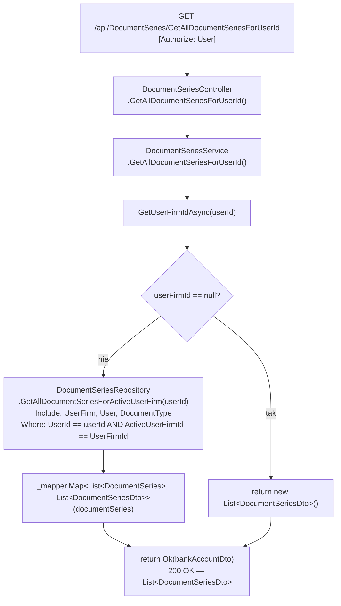
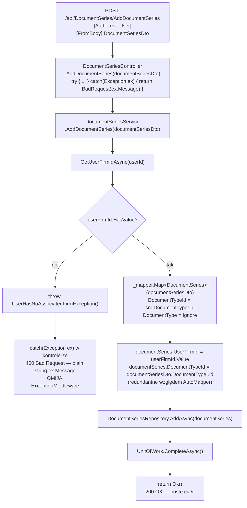
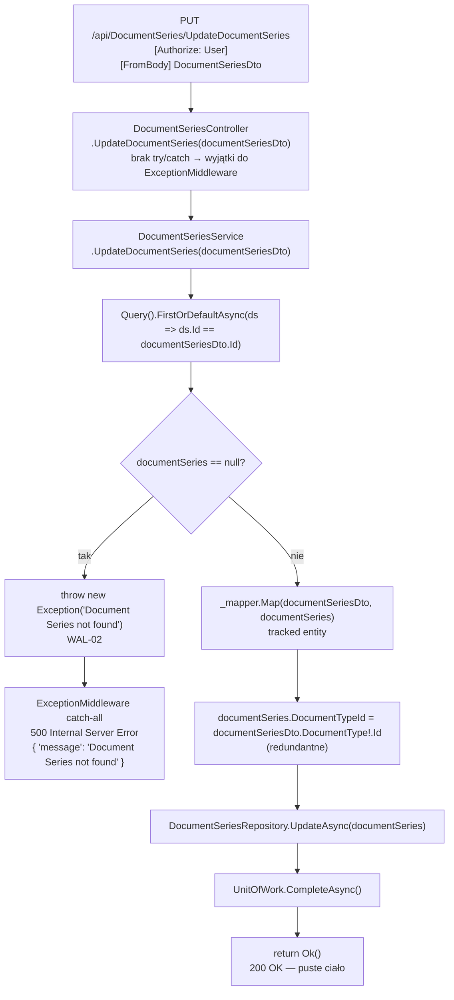
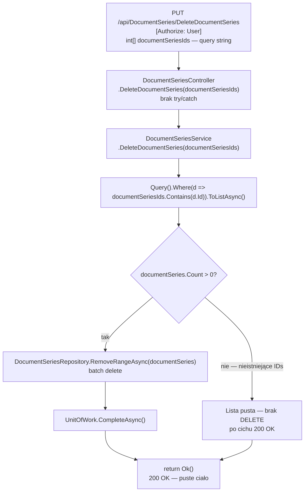

# ManageDocumentSeries — Przegląd procesu

## Cel biznesowy

Proces `P-11` zarządza seriami numeracyjnymi dokumentów (np. `"2026/Factura"`) w ramach aktywnej firmy zalogowanego użytkownika. Serie dokumentów umożliwiają automatyczne nadawanie kolejnych numerów wystawianym fakturom. Użytkownik może przeglądać istniejące serie, tworzyć nowe, edytować parametry istniejących (nazwę, numer bieżący) oraz usuwać serię zbiorowo. Każda seria jest powiązana z konkretnym typem dokumentu (`DocumentType`): Factura, Factura Proforma lub Factura Storno.

## Aktorzy i wyzwalacz

| Element | Wartość |
|---|---|
| Aktor (rola) | `User` (wymagane JWT z rolą `"User"`) |
| Wyzwalacz A (GET) | Otwarcie widoku konfiguracji serii w UI Angular |
| Wyzwalacz B (POST) | Zapis formularza tworzenia nowej serii |
| Wyzwalacz C (PUT Update) | Zapis formularza edycji istniejącej serii |
| Wyzwalacz D (PUT Delete) | Potwierdzenie usunięcia wybranych serii |

---

## Diagramy przepływu

### Endpoint A — `GET /api/DocumentSeries/GetAllDocumentSeriesForUserId`

---

### Endpoint B — `POST /api/DocumentSeries/AddDocumentSeries`

---

### Endpoint C — `PUT /api/DocumentSeries/UpdateDocumentSeries`

---

### Endpoint D — `PUT /api/DocumentSeries/DeleteDocumentSeries`

---

## Warunki wejściowe

| Warunek | Źródło w kodzie | Skutek |
|---|---|---|
| Użytkownik ma aktywny token JWT z rolą `"User"` | `[Authorize(Roles = "User")]` na klasie `DocumentSeriesController` | brak tokenu → `401`; błędna rola → `403` |
| Użytkownik ma aktywną firmę (dla AddDocumentSeries) | `DocumentSeriesService.cs › DocumentSeriesService.AddDocumentSeries` — `GetUserFirmIdAsync` | brak firmy → `UserHasNoAssociatedFirmException` → `400` (controller try/catch) |
| Seria o podanym `Id` istnieje (dla UpdateDocumentSeries) | `DocumentSeriesService.cs › DocumentSeriesService.UpdateDocumentSeries` — `Query().FirstOrDefaultAsync` | brak rekordu → `Exception("Document Series not found")` → `500` ⚠️ |

---

## Reguły biznesowe

| Reguła | Podstawa w kodzie |
|---|---|
| Seria jest przypisana do aktywnej firmy użytkownika (Add) | `DocumentSeriesService.cs › DocumentSeriesService.AddDocumentSeries` — `documentSeries.UserFirmId = userFirmId.Value` |
| `DocumentTypeId` pobierany z pola `DocumentType.Id` w DTO (nie bezpośrednio z `DocumentTypeId`) | `DocumentSeriesProfile.cs` — `MapFrom(src => src.DocumentType!.Id)`; redundantnie w serwisie |
| Nieistniejące `documentSeriesIds` w Delete ignorowane po cichu — brak wyjątku | `DocumentSeriesService.cs › DocumentSeriesService.DeleteDocumentSeries` — `Where(d => ids.Contains(d.Id))` → pusta lista |
| Brak indeksu unikalności — wiele serii tej samej nazwy i `DocumentTypeId` w tej samej firmie jest dozwolonych | `InvoiceJetDbContextModelSnapshot.cs` — brak `HasIndex(...).IsUnique()` dla `DocumentSeries` |
| Serie domyślne (3 typy) tworzone automatycznie przy dodaniu firmy (poza tym procesem) | `DocumentSeriesService.cs › DocumentSeriesService.AddInitialDocumentSeries` — wywoływane przez `FirmService` |

---

## Wynik procesu

| Wynik | Opis |
|---|---|
| Sukces GET | `200 OK` — `List<DocumentSeriesDto>` z zagnieżdżonym `DocumentType`; `[]` gdy brak firmy |
| Sukces Add | `200 OK` — puste ciało; nowy rekord `DocumentSeries` w DB; `Id` nowej serii nie jest zwracane |
| Sukces Update | `200 OK` — puste ciało; zaktualizowany rekord `DocumentSeries` w DB |
| Sukces Delete | `200 OK` — puste ciało; rekordy usunięte (lub lista pusta — brak zmian); klient nie wie, ile serii faktycznie usunięto |
| Błąd WAL-01 (Add) | `400 Bad Request` — plain string `"User has no associated firm."` (nie JSON) |
| Błąd WAL-02 (Update) | `500 Internal Server Error` — `{ "message": "Document Series not found" }` |

Szczegóły: `05_BLEDY_BEZPIECZENSTWO.md`.

---

## Uwagi wynikające z kodu

- [UWAGA: `AddDocumentSeries` posiada własny `try/catch (Exception ex)` w kontrolerze, który przechwytuje WSZYSTKIE wyjątki z serwisu i zwraca `BadRequest(ex.Message)`. Odpowiedź błędu to **plain string**, nie JSON. Omija `ExceptionMiddleware`. Kotwica: `DocumentSeriesController.cs › DocumentSeriesController.AddDocumentSeries`. — WYMAGA WERYFIKACJI Z ZESPOŁEM]
- [UWAGA: `WAL-02` w `UpdateDocumentSeries` rzuca generyczny `Exception("Document Series not found")` zamiast dedykowanego wyjątku (`DocumentSeriesNotFoundException`) — brak mapowania w ExceptionMiddleware → `500` zamiast `404`. Kotwica: `DocumentSeriesService.cs › DocumentSeriesService.UpdateDocumentSeries`. — WYMAGA WERYFIKACJI Z ZESPOŁEM]
- [UWAGA: `UpdateDocumentSeries` i `DeleteDocumentSeries` nie weryfikują ownership — `Query().FirstOrDefaultAsync(ds => ds.Id == id)` pobiera DOWOLNĄ serię z DB, bez sprawdzenia, czy należy do aktywnej firmy bieżącego użytkownika. Możliwa edycja/usunięcie serii innego użytkownika znając `Id`. — WYMAGA WERYFIKACJI Z ZESPOŁEM]
- [UWAGA: `DeleteDocumentSeries` używa metody HTTP `PUT` zamiast `DELETE`. Kotwica: `DocumentSeriesController.cs` — `[HttpPut("DeleteDocumentSeries")]`. — WYMAGA WERYFIKACJI Z ZESPOŁEM]
- [UWAGA: `DeleteDocumentSeries` nie sprawdza, czy usuwana seria jest powiązana z istniejącymi dokumentami (brak odpowiednika `BankAccountAssociatedWithDocumentsException`). Usunięcie serii może osierocić dokumenty. — WYMAGA WERYFIKACJI Z ZESPOŁEM]
- [UWAGA: `DeleteDocumentSeries` przyjmuje `int[] documentSeriesIds` z **query string** (brak `[FromBody]`). Różnica względem `BankAccountController.DeleteUserFirmBankAccounts` (body). Kotwica: `DocumentSeriesController.cs › DocumentSeriesController.DeleteDocumentSeries`. — WYMAGA WERYFIKACJI Z ZESPOŁEM]
- [UWAGA: `DocumentSeriesDto.DocumentType` jest typem `InvoiceJet.Domain.Models.DocumentType` (encja domenowa), nie dedykowanym DTO. Naruszenie separacji warstw. `documentSeriesDto.DocumentType!.Id` — null reference gdy `DocumentType = null`. Kotwica: `DocumentSeriesDto.cs`. — WYMAGA WERYFIKACJI Z ZESPOŁEM]
- [UWAGA: Ręczne przypisanie `documentSeries.DocumentTypeId = documentSeriesDto.DocumentType!.Id` w serwisie jest redundantne — AutoMapper już to robi przez `MapFrom(src => src.DocumentType!.Id)`. Kotwice: `DocumentSeriesService.cs › DocumentSeriesService.AddDocumentSeries` i `DocumentSeriesService.UpdateDocumentSeries`. — WYMAGA WERYFIKACJI Z ZESPOŁEM]
- [UWAGA: Zmienna lokalna `bankAccountDto` w kontrolerze `GetAllDocumentSeriesForUserId` — artefakt copy-paste; faktycznie zawiera `List<DocumentSeriesDto>`. Kotwica: `DocumentSeriesController.cs › DocumentSeriesController.GetAllDocumentSeriesForUserId`. — WYMAGA WERYFIKACJI Z ZESPOŁEM]
