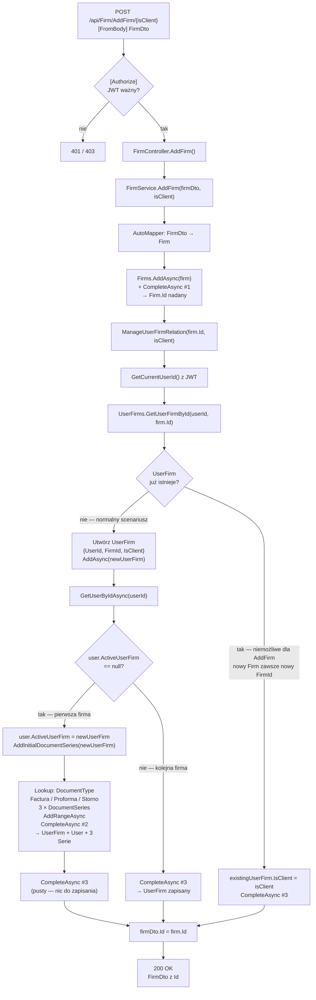

# AddFirm — Przegląd procesu

## Cel biznesowy

Proces umożliwia zalogowanemu użytkownikowi dodanie firmy do systemu. Firma może pełnić dwa role: własna firma użytkownika (wystawca faktur, `isClient=false`) lub firma klienta (odbiorca faktur, `isClient=true`). Jeżeli użytkownik dodaje firmę po raz pierwszy i nie ma jeszcze aktywnej firmy, system automatycznie ustawia ją jako aktywną oraz tworzy trzy inicjalne serie dokumentów (Factura, Factura Proforma, Factura Storno), co umożliwia natychmiastowe wystawianie faktur.

## Aktorzy i wyzwalacz

| Element | Wartość |
|---|---|
| Aktor (rola) | Zalogowany użytkownik z rolą `"User"` (JWT) |
| Wyzwalacz | Zapisanie formularza dodania firmy — własnej lub klienta |

## Diagram przepływu

## Warunki wejściowe

| Warunek | Źródło w kodzie | Skutek naruszenia |
|---|---|---|
| Ważny JWT z rolą `"User"` | `[Authorize(Roles = "User")]` na `FirmController` | `401` / `403` — obsługa poza `ExceptionMiddleware` |
| `FirmDto` z wypełnionymi polami NOT NULL (`Name`, `Cui`, `Address`, `County`, `City`, `RegCom`) | brak — nie jest jawnie sprawdzane w kodzie | `DbUpdateException` → `500` |
| `isClient` parsuje się na `bool` | ASP.NET Core route constraint | `400` ModelState error |

## Reguły biznesowe

| Reguła | Podstawa w kodzie |
|---|---|
| Firma zawsze jest zapisywana jako nowy rekord (brak upsert) | `FirmService.cs › FirmService.AddFirm` — `AddAsync(firm)` |
| Powiązanie User–Firm przechowuje flagę `IsClient` — rola firmy (własna vs klient) | `FirmService.cs › FirmService.ManageUserFirmRelation` — `UserFirm.IsClient = isClient` |
| Pierwsza firma bez `ActiveUserFirm` staje się aktywną firmą użytkownika niezależnie od `isClient` | `FirmService.cs › FirmService.ManageUserFirmRelation` — `if (user!.ActiveUserFirm == null)` |
| Przy pierwszej firmie tworzone są automatycznie 3 inicjalne serie dokumentów z `CurrentNumber=1`, `IsDefault=true`, `SeriesName=<bieżący rok>` | `DocumentSeriesService.cs › DocumentSeriesService.AddInitialDocumentSeries` |
| Zwracany DTO zawiera auto-generowane `Id` firmy z DB | `FirmService.cs › FirmService.AddFirm` — `firmDto.Id = firm.Id` |

## Wynik procesu

| Wynik | Opis |
|---|---|
| Sukces — pierwsza firma | `200 OK`, `FirmDto` z `Id`; nowe rekordy: `Firm`, `UserFirm`, aktualizacja `User.ActiveUserFirmId`, 3 × `DocumentSeries` |
| Sukces — kolejna firma | `200 OK`, `FirmDto` z `Id`; nowe rekordy: `Firm`, `UserFirm`; bez zmian w `User` i `DocumentSeries` |
| Błąd autoryzacji | `401 Unauthorized` lub `403 Forbidden` |
| Błąd DB (null pola, constraint) | `500 Internal Server Error`, `{ "message": "<szczegóły błędu DB>" }` |

## Uwagi wynikające z kodu

- [UWAGA: `isClient=true` przy pierwszej firmie (brak aktywnej) → firma klienta staje się aktywną firmą użytkownika. Firma klienta (odbiorca faktur) nie powinna pełnić roli nadawcy — WYMAGA WERYFIKACJI Z ZESPOŁEM]
- [UWAGA: brak sprawdzenia unikalności CUI — wielokrotne dodanie tej samej firmy tworzy duplikaty w tabeli `Firm` — WYMAGA WERYFIKACJI Z ZESPOŁEM]
- [UWAGA: `FirmDto.RegCom` jest nullable w DTO (`string?`) ale `Firm.RegCom` i kolumna DB są NOT NULL. Klient może wysłać `null` i dostać `500` zamiast `400` — WYMAGA WERYFIKACJI Z ZESPOŁEM]
- [UWAGA: 3 wywołania `CompleteAsync()` bez jawnej transakcji — awaria między `#1` a `#2` pozostawi w DB osierocony rekord `Firm` — WYMAGA WERYFIKACJI Z ZESPOŁEM]
- [UWAGA: `user!` (null-forgiving) w `ManageUserFirmRelation` — jeśli user usunięty z DB po wystawieniu JWT, `GetUserByIdAsync` zwróci `null` → `NullReferenceException` → `500` — WYMAGA WERYFIKACJI Z ZESPOŁEM]
