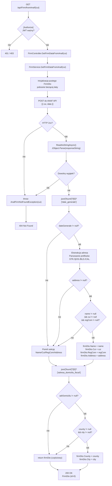

# GetFirmFromAnaf — Przegląd procesu

## Cel biznesowy

Proces umożliwia zalogowanemu użytkownikowi pobranie publicznych danych rejestrowych firmy rumuńskiej bezpośrednio z ANAF (Agenția Națională de Administrare Fiscală) na podstawie numeru CUI. Wynik służy do automatycznego wypełnienia formularza dodania firmy (autofill), eliminując ręczne wpisywanie nazwy, adresu, powiatu i miejscowości. Samo pobranie danych **nie tworzy żadnych rekordów** — zapis firmy do bazy następuje osobno przez P-03 (`AddFirm`).

## Aktorzy i wyzwalacz

| Element | Wartość |
|---|---|
| Aktor (rola) | Zalogowany użytkownik z rolą `"User"` (JWT) |
| Wyzwalacz | Wpisanie numeru CUI w formularzu dodania firmy i żądanie autofill |

## Diagram przepływu

## Warunki wejściowe

| Warunek | Źródło w kodzie | Skutek naruszenia |
|---|---|---|
| Ważny JWT z rolą `"User"` | `[Authorize(Roles = "User")]` na `FirmController` | `401` / `403` |
| `cui` — dowolny string w URL | parametr trasy `{cui}` (brak walidacji formatu) | Brak walidacji — przekazywany do ANAF bez sprawdzenia |

## Reguły biznesowe

| Reguła | Podstawa w kodzie |
|---|---|
| Adres ANAF jest przycinany do podciągu od pierwszego znalezionego prefiksu ulicy (`STR.`, `ŞOS.`, `BLD.`, `CAL.`) | `FirmService.cs:162–169` |
| Pola `Name`, `Cui`, `RegCom` są ustawiane **tylko** gdy wszystkie trzy są non-null | `FirmService.cs:172–177` |
| Pola `County`, `City` są ustawiane **tylko** gdy oba są non-null | `FirmService.cs:181–189` |
| `FirmDto.Id` zawsze wynosi `0` — brak zapisu do DB | brak `CompleteAsync()` w całym procesie |
| Każdy wyjątek (sieciowy, parsowania, null) jest przechwytywany i tłumaczony na `AnafFirmNotFoundException` | `FirmService.cs:193–196` |

## Wynik procesu

| Wynik | Opis |
|---|---|
| Sukces — pełne dane | `200 OK`, `FirmDto` z wypełnionymi Name, Cui, RegCom, Address, County, City (Id=0) |
| Sukces — częściowe dane | `200 OK`, `FirmDto` z częściowo null polami (ANAF nie zwrócił wszystkich sekcji) |
| CUI nieznaleziony w ANAF (ANAF HTTP non-2xx) | `404 Not Found`, `{ "message": "Firm with CUI {cui} not found in ANAF database." }` |
| CUI nieznaleziony (ANAF HTTP 200 z pustą tablicą `found`) | `200 OK` z pustym `FirmDto` (id=0, wszystkie pola null) — [UWAGA: powinien być 404] |
| Dowolny inny błąd (timeout, parsowanie) | `404 Not Found` (wyjątek pochłonięty przez catch-all w serwisie) |
| Błąd autoryzacji | `401 Unauthorized` lub `403 Forbidden` |

## Uwagi wynikające z kodu

- [UWAGA: ANAF zwraca HTTP 200 z pustą tablicą `found` dla nieistniejącego CUI. Klient dostaje `200 OK` z pustym FirmDto zamiast `404` — nie może odróżnić „nie znaleziono" od błędu parsowania — WYMAGA WERYFIKACJI Z ZESPOŁEM]
- [UWAGA: `catch (Exception)` w serwisie pochłania wszystkie wyjątki (timeout sieci, `JsonException`, `NullReferenceException`) i zwraca to samo `404`. Problem sieciowy z ANAF jest nieodróżnialny od nieistniejącego CUI — WYMAGA WERYFIKACJI Z ZESPOŁEM]
- [UWAGA: `new HttpClient()` w konstruktorze serwisu (Scoped) — nowa instancja przy każdym żądaniu; ryzyko socket exhaustion przy dużym ruchu — WYMAGA WERYFIKACJI Z ZESPOŁEM]
- [UWAGA: `ŞOS.` zawiera rumuńską literę Ş (U+015E). Adresy ANAF mogą używać `SOS.` lub `ȘOS.` (U+0218) — niedopasowanie Unicode spowoduje pominięcie prefiksu — WYMAGA WERYFIKACJI Z ZESPOŁEM]
- [UWAGA: jeśli `regCom == null` (podmioty bez wpisu w KRS, np. PFA), pola `Name` i `Cui` również nie są ustawiane mimo że są dostępne w odpowiedzi ANAF — WYMAGA WERYFIKACJI Z ZESPOŁEM]
