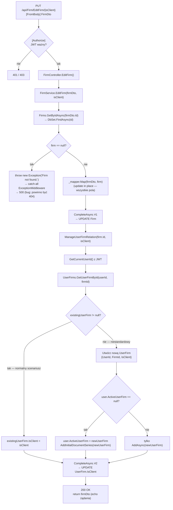

# EditFirm — Przegląd procesu

## Cel biznesowy

Proces umożliwia zalogowanemu użytkownikowi edycję danych istniejącej firmy (własnej lub klienta). Użytkownik może zmienić dowolne pole rejestrowe firmy (nazwę, CUI, adres, numer rejestru) oraz jej rolę w systemie (`isClient` — czy firma jest wystawcą czy odbiorcą faktur). Operacja aktualizuje pełny zestaw pól firmy (brak partial update — klient zawsze przesyła cały obiekt).

## Aktorzy i wyzwalacz

| Element | Wartość |
|---|---|
| Aktor (rola) | Zalogowany użytkownik z rolą `"User"` (JWT) |
| Wyzwalacz | Zapisanie formularza edycji danych firmy |

## Diagram przepływu

## Warunki wejściowe

| Warunek | Źródło w kodzie | Skutek naruszenia |
|---|---|---|
| Ważny JWT z rolą `"User"` | `[Authorize(Roles = "User")]` na `FirmController` | `401` / `403` |
| `firmDto.Id` wskazuje na istniejącą firmę w DB | `FirmService.EditFirm` — `GetByIdAsync(firmDto.Id)` + `if (firm == null)` | `500` (bug — powinno być `404`) |
| `isClient` parsuje się na `bool` | ASP.NET Core route constraint | `400 Bad Request` |
| Pola NOT NULL (`Name`, `Cui`, `Address`, `County`, `City`, `RegCom`) mają wartości non-null | brak jawnej walidacji — EF Core | `500` z `DbUpdateException` |

## Reguły biznesowe

| Reguła | Podstawa w kodzie |
|---|---|
| Aktualizacja wszystkich pól firmy jednocześnie (brak partial update) | `_mapper.Map(firmDto, firm)` — `ReverseMap()` bez konfiguracji pomijania pól |
| Flaga `isClient` zmienia rolę firmy w relacji `UserFirm`, nie w encji `Firm` | `FirmService.cs › ManageUserFirmRelation` — `existingUserFirm.IsClient = isClient` |
| Odpowiedź to echo żądania — nie ponowny odczyt z DB | `FirmService.EditFirm` — `return firmDto` |
| Edycja cudzej firmy (brak relacji UserFirm) tworzy nową relację zamiast blokować | `ManageUserFirmRelation` — gałąź `existingUserFirm == null` |

## Wynik procesu

| Wynik | Opis |
|---|---|
| Sukces | `200 OK`, `FirmDto` (echo żądania); zaktualizowane: rekord `Firm`, flaga `IsClient` w `UserFirm` |
| Firma nieistniejąca | `500 Internal Server Error`, `{ "message": "Firm not found." }` — [UWAGA: bug, powinien być `404`] |
| Błąd autoryzacji | `401 Unauthorized` lub `403 Forbidden` |
| `RegCom = null` lub inne null na NOT NULL polu | `500 Internal Server Error` — `DbUpdateException` |

## Uwagi wynikające z kodu

- [UWAGA: Brak weryfikacji własności firmy — użytkownik może edytować **dowolną firmę** w systemie znając jej `Id` — WYMAGA WERYFIKACJI Z ZESPOŁEM]
- [UWAGA: Nieistniejące `firmDto.Id` zwraca `500` zamiast `404` — `throw new Exception(...)` trafia do catch-all — WYMAGA WERYFIKACJI Z ZESPOŁEM]
- [UWAGA: Brak jawnej transakcji między `CompleteAsync()` #1 (Firm) i #2 (UserFirm) — możliwa częściowa awaria — WYMAGA WERYFIKACJI Z ZESPOŁEM]
- [UWAGA: `ManageUserFirmRelation` z gałęzią `existingUserFirm == null` może w kontekście EditFirm tworzyć duplikaty relacji `UserFirm` przy braku unikalnego indeksu złożonego na `(UserId, FirmId)` — WYMAGA WERYFIKACJI Z ZESPOŁEM]
