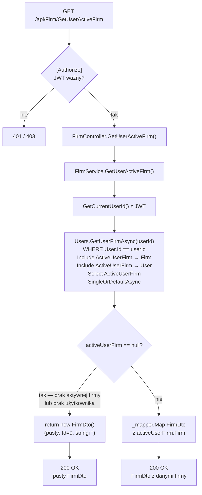

# GetUserActiveFirm — Przegląd procesu

## Cel biznesowy

Proces zwraca dane aktywnej firmy zalogowanego użytkownika — czyli firmy ustawionej jako bieżący kontekst pracy (`User.ActiveUserFirmId`). Aktywna firma jest wystawcą faktur i podstawą dla większości operacji w aplikacji (serie dokumentów, konta bankowe, produkty). Endpoint służy do wczytania danych aktywnej firmy przy starcie aplikacji lub odświeżeniu widoku. Gdy użytkownik nie ma jeszcze aktywnej firmy, proces zwraca pusty obiekt firmy.

## Aktorzy i wyzwalacz

| Element | Wartość |
|---|---|
| Aktor (rola) | Zalogowany użytkownik z rolą `"User"` (JWT) |
| Wyzwalacz | Wczytanie kontekstu aktywnej firmy (np. start aplikacji, odświeżenie nagłówka) |

## Diagram przepływu

## Warunki wejściowe

| Warunek | Źródło w kodzie | Skutek naruszenia |
|---|---|---|
| Ważny JWT z rolą `"User"` | `[Authorize(Roles = "User")]` na `FirmController` | `401` / `403` |

Brak innych warunków — endpoint bezparametrowy.

## Reguły biznesowe

| Reguła | Podstawa w kodzie |
|---|---|
| Zwracana jest wyłącznie firma aktywna danego użytkownika (`User.ActiveUserFirmId`) | `UserRepository.cs › GetUserFirmAsync` — `Select(uf => uf.ActiveUserFirm)` |
| Izolacja danych — filtr po `userId` z JWT | `GetUserFirmAsync` — `Where(u => u.Id == userId)` |
| Brak aktywnej firmy → pusty `FirmDto` (nie błąd) | `FirmService.cs › GetUserActiveFirm` — `activeUserFirm == null ? new FirmDto()` |
| Proces jest read-only — brak modyfikacji DB | brak `CompleteAsync()` |

## Wynik procesu

| Wynik | Opis |
|---|---|
| Sukces — aktywna firma istnieje | `200 OK`, `FirmDto` z danymi firmy |
| Sukces — brak aktywnej firmy | `200 OK`, pusty `FirmDto` (`Id=0`, stringi `""`, `RegCom=null`) |
| Błąd autoryzacji | `401 Unauthorized` lub `403 Forbidden` |

## Uwagi wynikające z kodu

- [UWAGA: Brak aktywnej firmy zwraca pusty `FirmDto` z `200 OK` zamiast `404`/`204`. Ta sama odpowiedź pojawia się gdy użytkownik nie istnieje w DB — brak rozróżnienia stanów — WYMAGA WERYFIKACJI Z ZESPOŁEM]
- [UWAGA: Redundantny `.ThenInclude(u => u.User)` w `GetUserFirmAsync` ładuje dane użytkownika nieużywane w mapowaniu — zbędny koszt zapytania — WYMAGA WERYFIKACJI Z ZESPOŁEM]
- [UWAGA: Proces zwraca aktywną firmę niezależnie od flagi `IsClient` — jeśli aktywną firmą jest firma-klient (możliwe wg uwag z P-03), zostanie zwrócona jako aktywna firma użytkownika — WYMAGA WERYFIKACJI Z ZESPOŁEM]
