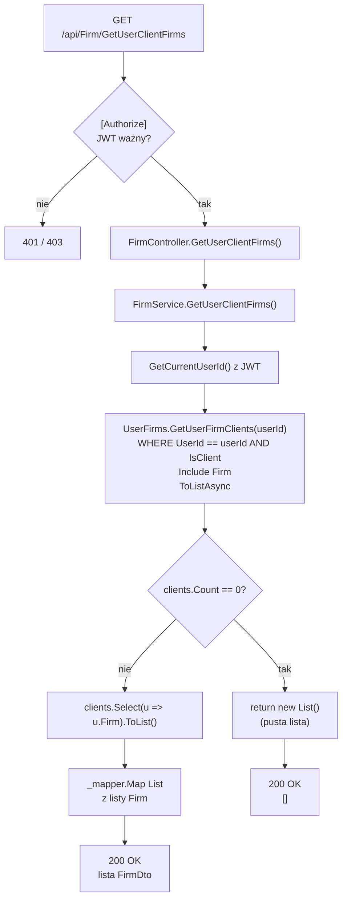

# GetUserClientFirms — Przegląd procesu

## Cel biznesowy

Proces zwraca listę firm-klientów zalogowanego użytkownika — czyli wszystkich firm, z którymi użytkownik ma relację oznaczoną jako klient (`UserFirm.IsClient == true`). Firmy-klienci są odbiorcami faktur wystawianych przez użytkownika. Endpoint służy do wczytania listy klientów (np. do wyboru odbiorcy przy wystawianiu faktury lub do widoku zarządzania klientami). Gdy użytkownik nie ma żadnych klientów, proces zwraca pustą listę.

## Aktorzy i wyzwalacz

| Element | Wartość |
|---|---|
| Aktor (rola) | Zalogowany użytkownik z rolą `"User"` (JWT) |
| Wyzwalacz | Wczytanie listy klientów (widok klientów, wybór odbiorcy faktury) |

## Diagram przepływu

## Warunki wejściowe

| Warunek | Źródło w kodzie | Skutek naruszenia |
|---|---|---|
| Ważny JWT z rolą `"User"` | `[Authorize(Roles = "User")]` na `FirmController` | `401` / `403` |

Brak innych warunków — endpoint bezparametrowy.

## Reguły biznesowe

| Reguła | Podstawa w kodzie |
|---|---|
| Zwracane są wyłącznie firmy z relacją `IsClient == true` | `UserFirmRepository.cs › GetUserFirmClients` — `Where(u => ... && u.IsClient)` |
| Zwracane są wyłącznie firmy-klienci danego użytkownika (izolacja danych) | `GetUserFirmClients` — `Where(u => u.UserId.Equals(userId))` |
| Brak klientów → pusta lista (nie błąd) | `FirmService.cs › GetUserClientFirms` — `if (clients.Count == 0) return new List<FirmDto>()` |
| Proces jest read-only — brak modyfikacji DB | brak `CompleteAsync()` |

## Wynik procesu

| Wynik | Opis |
|---|---|
| Sukces — użytkownik ma klientów | `200 OK`, `List<FirmDto>` z danymi firm |
| Sukces — brak klientów | `200 OK`, pusta lista `[]` |
| Błąd autoryzacji | `401 Unauthorized` lub `403 Forbidden` |

## Uwagi wynikające z kodu

- [UWAGA: Sprawdzenie `clients.Count == 0` jest redundantne — mapowanie pustej listy zwróciłoby pustą listę — WYMAGA WERYFIKACJI Z ZESPOŁEM]
- [UWAGA: Brak jawnego `OrderBy` — kolejność firm na liście jest niezdeterminowana — WYMAGA WERYFIKACJI Z ZESPOŁEM]
- [UWAGA: Brak paginacji/limitu — użytkownik z bardzo dużą liczbą klientów otrzyma wszystkie rekordy naraz — WYMAGA WERYFIKACJI Z ZESPOŁEM]
