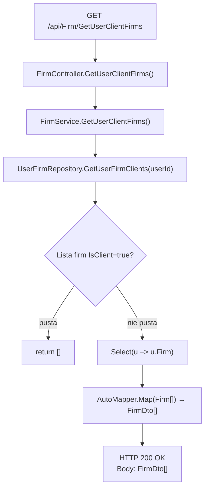
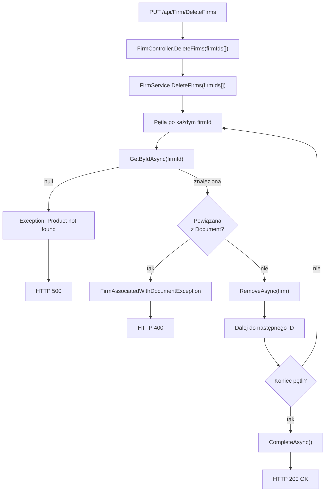

# ManageClientFirms — Przegląd procesu

## Cel biznesowy

Proces umożliwia zalogowanemu użytkownikowi zarządzanie swoimi firmami-klientami:
1. **GET** — pobranie listy firm-klientów zalogowanego użytkownika (firmy oznaczone flagą `IsClient=true`) do wyświetlenia/wyboru.
2. **DELETE** — usuwanie wybranych firm-klientów z systemu, z walidacją, że firma nie jest powiązana z dokumentami.

Procesy wspierają zarządzanie relacjami wielofirmowymi: użytkownik może mieć wiele firm-klientów (pracujących dla niego) oraz jedną firmę własną.

## Aktorzy i wyzwalacz

| Element | Wartość |
|---|---|
| Aktor (rola) | `User` (zalogowany użytkownik) |
| Wyzwalacz (GET) | Klik na listę firm-klientów (GET endpoint) |
| Wyzwalacz (DELETE) | Klik na usunięcie wybranych firm (DELETE endpoint) |

## Diagram przepływu

### GET `/api/Firm/GetUserClientFirms`

### PUT `/api/Firm/DeleteFirms`

## Warunki wejściowe

| Warunek | Źródło w kodzie | Skutek |
|---|---|---|
| Użytkownik zalogowany (JWT token valid) | ASP.NET Core middleware + `[Authorize]` | Brak dostępu bez tokenu → 401 Unauthorized |
| Rola użytkownika = "User" | `[Authorize(Roles = "User")]` na `FirmController` | Brak dostępu bez roli → 403 Forbidden |
| (GET) Relacje `UserFirm` dla użytkownika | `UserFirmRepository.GetUserFirmClients()` | Zwrot pustej listy, jeśli brak relacji |
| (DELETE) Każda firma istnieje | `FirmRepository.GetByIdAsync(firmId)` | Wyjątek `Exception` jeśli nie znaleziona |
| (DELETE) Firma bez powiązań do dokumentów | `DocumentRepository.Query().AnyAsync(d => d.ClientId == firmId)` | Wyjątek `FirmAssociatedWithDocumentException` jeśli istnieje powiązanie |

## Reguły biznesowe

| Reguła | Podstawa w kodzie |
|---|---|
| Firma-klient jest identyfikowana przez flagę `UserFirm.IsClient == true` | `FirmService.cs › FirmService.GetUserClientFirms`, linia 100 |
| GET zwraca pustą listę zamiast `null` jeśli użytkownik nie ma firm-klientów | `FirmService.cs › FirmService.GetUserClientFirms`, linie 101-104 |
| DELETE wymaga, aby firma nie była powiązana z żadnym dokumentem (`Document.ClientId`) | `FirmService.cs › FirmService.DeleteFirms`, linie 117-123 |
| DELETE usuwana wszystkie firmy w pętli lub brak żadnej (atomowość pętli, ale brak jawnej transakcji) | `FirmService.cs › FirmService.DeleteFirms`, linia 128 |

## Wynik procesu

### GET Powodzenie

| Wynik | Opis |
|---|---|
| Status | `200 OK` |
| Odpowiedź | Tablica `FirmDto[]` (może być pusta) |
| Skutek w bazie | Brak zmian (read-only) |

### GET Błędy

| Błąd | Status | Przyczyna |
|---|---|---|
| Brak tokenu JWT | `401 Unauthorized` | JWT middleware |
| Brak roli "User" | `403 Forbidden` | ASP.NET Core authorization |

### DELETE Powodzenie

| Wynik | Opis |
|---|---|
| Status | `200 OK` |
| Odpowiedź | Puste ciało |
| Skutek w bazie | Usunięte wszystkie podane firmy (`Firm` + kaskadowe usunięcie `UserFirm`) |

### DELETE Błędy

| Błąd | Status | Przyczyna |
|---|---|---|
| Firma nie znaleziona | `500` (powinno `400`) | Wyjątek `Exception` — WAL-01 [UWAGA] |
| Firma powiązana z dokumentem | `400 Bad Request` | Wyjątek `FirmAssociatedWithDocumentException` — WAL-02 |
| Brak tokenu JWT | `401 Unauthorized` | JWT middleware |
| Brak roli "User" | `403 Forbidden` | ASP.NET Core authorization |

## Uwagi wynikające z kodu

- [UWAGA: Wyjątek `Exception("Product not found.")` w WAL-01 zwraca `500` zamiast `400`. Powinien być dedykowany `FirmNotFoundException` i `400 Bad Request`. Ponadto komunikat mówi "Product" zamiast "Firm" — WYMAGA POPRAWY]
- [UWAGA: DELETE nie obejmuje jawnej transakcji. Jeśli `CompleteAsync()` się nie powiedzie, część firm będzie usunięta, a część nie — WYMAGA WERYFIKACJI Z ZESPOŁEM]
- [UWAGA: P-07 (GetUserClientFirms) i P-08 (ManageClientFirms) współdzielą endpoint GET `/api/Firm/GetUserClientFirms` — WYMAGA WERYFIKACJI Z ZESPOŁEM]
- Kod spójny z opisem biznesowym w pozostałych aspektach.
