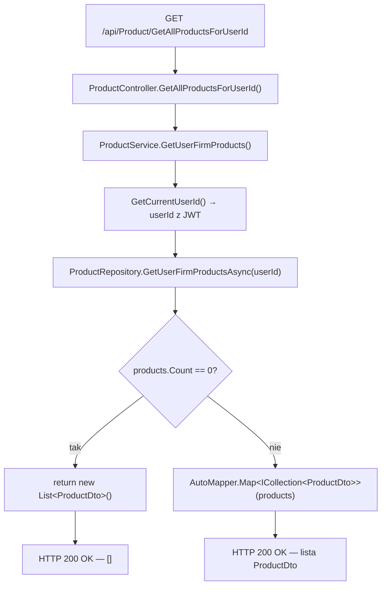
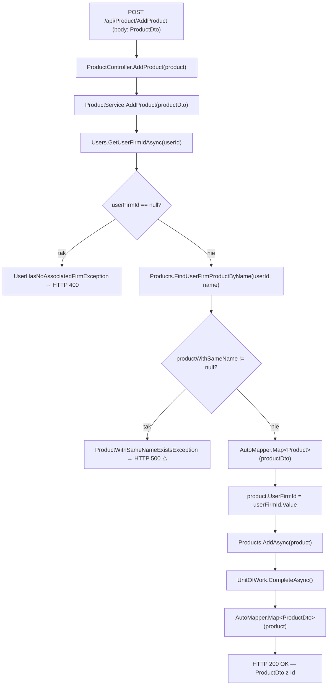
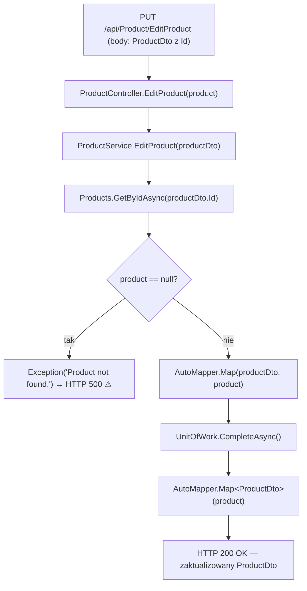
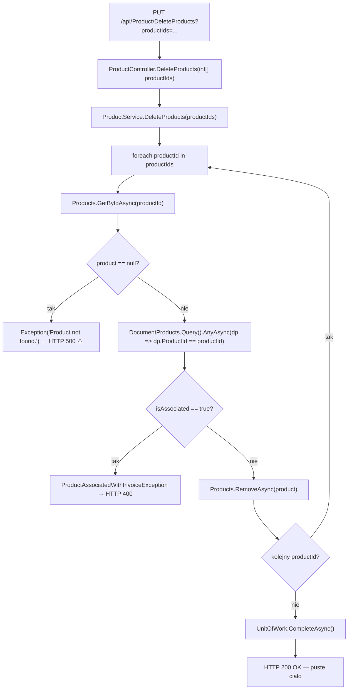

# ManageProducts — Przegląd procesu

## Cel biznesowy

Proces `P-09` umożliwia zalogowanemu użytkownikowi zarządzanie katalogiem produktów i usług przypisanych do jego aktywnej firmy. Obejmuje cztery operacje: odczyt listy produktów, dodanie nowego produktu z walidacją unikalności nazwy, edycję danych istniejącego produktu oraz usunięcie jednego lub wielu produktów z weryfikacją powiązań z dokumentami sprzedaży. Produkty są izolowane per firma — użytkownik widzi i modyfikuje wyłącznie produkty aktywnej firmy identyfikowanej przez `User.ActiveUserFirmId`.

---

## Aktorzy i wyzwalacz

| Element | Wartość |
|---|---|
| Aktor (rola) | `"User"` (rola z JWT claim `role`) |
| Wyzwalacz | Akcja użytkownika w widoku zarządzania produktami (żądanie HTTP do API) |
| Tożsamość | `IUserService.GetCurrentUserId()` — odczyt `userId` z JWT claim z `HttpContext` |

---

## Diagram przepływu

### Endpoint A — GET /api/Product/GetAllProductsForUserId

### Endpoint B — POST /api/Product/AddProduct

### Endpoint C — PUT /api/Product/EditProduct

### Endpoint D — PUT /api/Product/DeleteProducts

---

## Warunki wejściowe

| Warunek | Źródło w kodzie | Skutek |
|---|---|---|
| Ważny token JWT z rolą `"User"` | `[Authorize(Roles = "User")]` na klasie `ProductController` | Brak → `401 Unauthorized`; zła rola → `403 Forbidden` |
| Użytkownik musi mieć aktywną firmę (AddProduct) | `ProductService.cs › ProductService.AddProduct` — `GetUserFirmIdAsync(userId) != null` | Brak → `UserHasNoAssociatedFirmException` → `400` |
| Produkt o danym `Id` musi istnieć w bazie (EditProduct) | `ProductService.cs › ProductService.EditProduct` — `GetByIdAsync(productDto.Id) != null` | Brak → `Exception("Product not found.")` → `500` |
| Każdy produkt z tablicy musi istnieć w bazie (DeleteProducts) | `ProductService.cs › ProductService.DeleteProducts` — `GetByIdAsync(productId) != null` (per iteracja) | Brak → `Exception("Product not found.")` → `500` |
| Produkt nie powiązany z fakturą (DeleteProducts) | `ProductService.cs › ProductService.DeleteProducts` — `DocumentProducts.Query().AnyAsync(dp => dp.ProductId == productId)` | Powiązany → `ProductAssociatedWithInvoiceException` → `400` |

---

## Reguły biznesowe

| Reguła | Podstawa w kodzie |
|---|---|
| Produkty widoczne i modyfikowalne tylko w obrębie aktywnej firmy użytkownika | `ProductRepository.cs › ProductRepository.GetUserFirmProductsAsync` — filtr: `p.UserFirm!.UserId == userId && p.UserFirm.User.ActiveUserFirmId == p.UserFirmId` |
| Nazwa produktu musi być unikalna w aktywnej firmie użytkownika przy dodawaniu | `ProductService.cs › ProductService.AddProduct` — `FindUserFirmProductByName(userId, productDto.Name)` rzuca `ProductWithSameNameExistsException` |
| Produkt nie może być usunięty, jeśli był użyty na co najmniej jednej fakturze | `ProductService.cs › ProductService.DeleteProducts` — `DocumentProducts.Query().AnyAsync(dp => dp.ProductId == productId)` |
| `UserFirmId` produktu ustawiany przez serwis — pole nie istnieje w `ProductDto` | `ProductService.cs › ProductService.AddProduct` — `product.UserFirmId = userFirmId.Value` (ręczne ustawienie po mapowaniu) |
| Usunięcie wielu produktów jest atomowe — `CompleteAsync()` raz po całej pętli | `ProductService.cs › ProductService.DeleteProducts` — `CompleteAsync()` poza pętlą `foreach` |
| `EditProduct` nie sprawdza unikalności nowej nazwy produktu | `ProductService.cs › ProductService.EditProduct` — brak wywołania `FindUserFirmProductByName` |

---

## Wynik procesu

| Endpoint | Wynik sukcesu | Skutek w bazie | Główne błędy |
|---|---|---|---|
| GET GetAllProductsForUserId | `200 OK` — `ICollection<ProductDto>` (lub `[]`) | brak zmian (read-only) | `401`, `403` |
| POST AddProduct | `200 OK` — `ProductDto` z nadanym `Id` | nowy rekord `Product` z `UserFirmId` aktywnej firmy | `400` (WAL-01), `500` (WAL-02 ⚠️), `401`, `403` |
| PUT EditProduct | `200 OK` — zaktualizowany `ProductDto` | UPDATE rekordu `Product` (Name, Price, ContainsTva, TvaValue, UnitOfMeasurement); `UserFirmId` bez zmian | `500` (WAL-03 ⚠️), `401`, `403` |
| PUT DeleteProducts | `200 OK` — puste ciało | DELETE rekordów `Product` po ID (batch atomowy) | `400` (WAL-05), `500` (WAL-04 ⚠️), `401`, `403` |

---

## Uwagi wynikające z kodu

- [UWAGA: `ProductWithSameNameExistsException` (WAL-02, AddProduct) nie jest jawnie mapowany w `ExceptionMiddleware.cs` — trafia do catch-all → `500 Internal Server Error` zamiast `400 Bad Request`. — WYMAGA WERYFIKACJI Z ZESPOŁEM]
- [UWAGA: Generyczny `Exception("Product not found.")` (WAL-03 EditProduct, WAL-04 DeleteProducts) trafia do catch-all → `500 Internal Server Error` zamiast `400`/`404`. Brak dedykowanego `ProductNotFoundException` z jawnym mapowaniem w middleware. — WYMAGA WERYFIKACJI Z ZESPOŁEM]
- [UWAGA: `EditProduct` nie waliduje unikalności nowej nazwy produktu w aktywnej firmie. Po edycji możliwy duplikat nazwy per firma. Kotwica: `ProductService.cs › ProductService.EditProduct` (brak wywołania `FindUserFirmProductByName`). — WYMAGA WERYFIKACJI Z ZESPOŁEM]
- [UWAGA: Indeks unikalny na `Product.Name` jest **globalny** (wszystkie firmy) — `HasIndex(p => p.Name).IsUnique()` w snapshosie. Walidacja w serwisie sprawdza unikalność tylko per aktywna firma. Dwie firmy z produktem o tej samej nazwie spowodują `DbUpdateException` → `500`. Kotwica: `InvoiceJetDbContextModelSnapshot.cs`. — WYMAGA WERYFIKACJI Z ZESPOŁEM]
- [UWAGA: Endpoint `PUT /api/Product/DeleteProducts` używa metody HTTP `PUT` do usuwania zasobów — niezgodność z konwencją REST (powinna być metoda `DELETE`). Kotwica: `ProductController.cs › ProductController.DeleteProducts` — `[HttpPut("DeleteProducts")]`. — WYMAGA WERYFIKACJI Z ZESPOŁEM]
