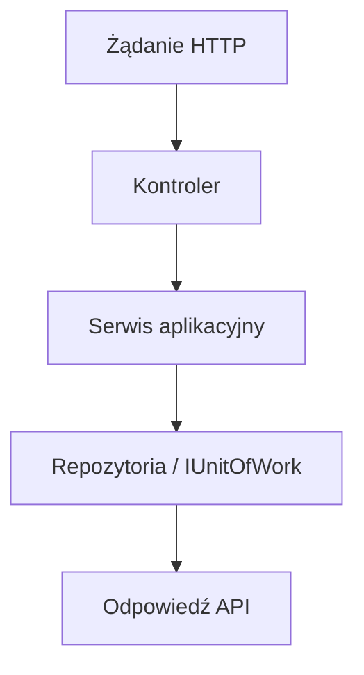

# [NAZWA PROCESU] — Przegląd procesu

## Cel

[Opis celu procesu.]

## Diagram

## Warunki wejściowe

| Warunek | Źródło |
|---|---|
| [Warunek] | [Kod] |

## Wynik procesu

| Wynik | Opis |
|---|---|
| Sukces | [Opis] |
| Błąd | [Opis] |
