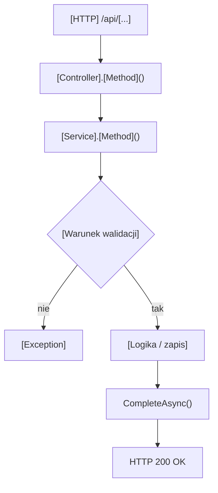

<!--
SZABLON 01 — PRZEGLĄD PROCESU (wymiar biznesowy + przepływ)
Odbiorca priorytetowy: ANALITYK. Pisz cel po polsku, zrozumiale, ale bez interpretacji ponad kod.
Definicja ukończenia: 03_MARKERY_I_WERYFIKACJA.md → sekcja 3.
-->

# [NAZWA PROCESU] — Przegląd procesu

## Cel biznesowy
<!-- Co ten proces robi z punktu widzenia użytkownika/biznesu i po co. 2–5 zdań. -->

[Opis celu biznesowego.]

## Aktorzy i wyzwalacz
<!-- Kto uruchamia proces (rola z JWT) i co jest wyzwalaczem (akcja użytkownika / inny proces). -->

| Element | Wartość |
|---|---|
| Aktor (rola) | `[User / brak autoryzacji]` |
| Wyzwalacz | [np. zapis formularza faktury] |

## Diagram przepływu
<!-- Odwzoruj RZECZYWISTY przepływ z kodu, w tym gałęzie błędów (rzucane wyjątki). -->

## Warunki wejściowe

| Warunek | Źródło w kodzie | Skutek |
|---|---|---|
| [Warunek] | `[Plik.cs › Klasa.Metoda]` | [Skutek] |

## Reguły biznesowe
<!-- Co proces gwarantuje lub wymusza (np. numer dokumentu z serii, status początkowy, unikalność nazwy). -->

| Reguła | Podstawa w kodzie |
|---|---|
| [Reguła] | `[kotwica]` |

## Wynik procesu

| Wynik | Opis |
|---|---|
| Sukces | [Co zwraca API i z jakim statusem] |
| Skutek w bazie | [Jakie rekordy powstają/zmieniają się] |
| Błąd | [Jakie błędy i statusy — szczegóły w pliku 05] |

## Uwagi wynikające z kodu
<!-- Niespójności, nieoczywistości — KAŻDA z markerem [UWAGA: ... — WYMAGA WERYFIKACJI Z ZESPOŁEM]. -->

- [Uwaga lub: „Brak uwag — kod spójny z opisem."]

---
<!-- ===== PRZYKŁAD (P-01, fragment) — usuń przed oddaniem =====
Cel biznesowy: Proces zapisuje nową fakturę dla aktywnej firmy zalogowanego użytkownika: tworzy rekord
Document, zapisuje pozycje jako DocumentProduct, tworzy brakujące produkty i zwiększa numer serii.
Reguła biznesowa: „Numer dokumentu = SeriesName + CurrentNumber.ToString("D4")" — źródło: DocumentService.cs › DocumentService.AddDocument.
Uwaga: Proces nie otacza dwóch wywołań CompleteAsync() jawną transakcją. [UWAGA: ... — WYMAGA WERYFIKACJI Z ZESPOŁEM]
===== KONIEC PRZYKŁADU ===== -->
