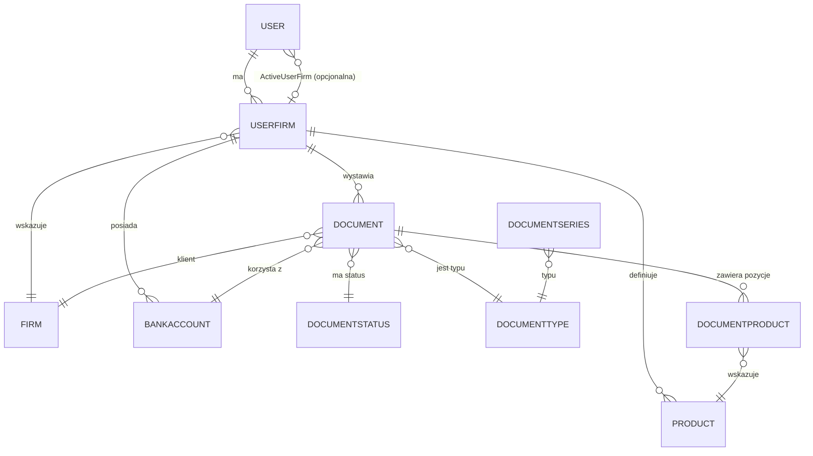

<!--
SZABLON MODEL_DOMENY — diagram ER i mapa zależności encji.
Plik docelowy: docs/aos/backend/MODEL_DOMENY.md
ŹRÓDŁA: Domain/Models, InvoiceJetDbContext.cs (jawne konfiguracje), snapshot migracji.
-->

# Model domeny — InvoiceJetAPI

**Data aktualizacji:** RRRR-MM-DD

---

## 1. Diagram ER

> Diagram należy odświeżyć przy każdej migracji.

---

## 2. Encje — krótkie opisy

| Encja | Rola w domenie | Główne relacje |
|---|---|---|
| `[Entity]` | [opis 1 zdanie] | [relacje] |

---

## 3. Jawne konfiguracje EF Core
<!-- Z OnModelCreating + atrybuty na encjach. Reszta to konwencje EF. -->

| Konfiguracja | Źródło |
|---|---|
| `User.ActiveUserFirm` — opcjonalny FK (`IsRequired(false)`) | `InvoiceJetDbContext.cs › OnModelCreating` |
| `Product.Name` — indeks unikalny | `InvoiceJetDbContext.cs › OnModelCreating` |

---

## 4. Uwagi
<!-- Niespójności modelowe, brakujące ograniczenia, dziwne nullability — z markerami. -->

- [uwaga lub: „Brak uwag."]
