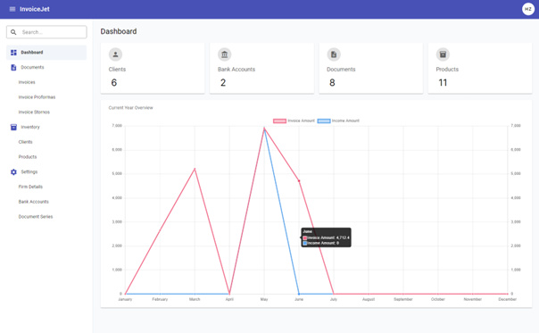

# AppShell — Dane i Operacje

---

## Zrzut ekranu

---

## 1. Zakres elementów widocznych w makiecie

`AppShell` prezentuje wspólne elementy aplikacji: pasek nawigacyjny, menu boczne, wyszukiwarkę menu, drzewo nawigacji, menu profilu i obszar `router-outlet`.

Screen pokazuje `DashboardComponent` załadowany do obszaru roboczego. Ten ekran pełni funkcję przykładu dla wspólnej makiety.

---

## 2. Pasek nawigacyjny

### 2.1 Elementy paska

| # | Element | Typ | Warunek widoczności | Handler / routing | Opis |
|---|---|---|---|---|---|
| 1 | Przycisk menu | `button mat-icon-button` | `*ngIf="isLoginOrRegister"` | `(click)="toggleSidebar()"` | Przełącza widoczność menu bocznego. |
| 2 | Tytuł aplikacji | `h1` | Zawsze | N/D | Wyświetla tekst `InvoiceJet`. |
| 3 | Link Login | `button mat-button` | `*ngIf="!isLoginOrRegister"` | `[routerLink]="'/login'"` | Nawiguje do ekranu Login. |
| 4 | Link Register | `button mat-button` | `*ngIf="!isLoginOrRegister"` | `[routerLink]="'/register'"` | Nawiguje do ekranu Register. |
| 5 | Przycisk profilu | `button mat-button` | `*ngIf="isLoginOrRegister"` | `[matMenuTriggerFor]="userMenu"` | Wyświetla inicjały z `AuthService.userInfo`. |

### 2.2 Menu profilu

| Element | Typ | Handler | Dane źródłowe | Opis |
|---|---|---|---|---|
| Imię i nazwisko | `span.fullName` | N/D | `userInfo.fullName` | Wartość pochodzi z dekodowanego tokenu JWT. |
| Email | `p` | N/D | `userInfo.email` | Wartość pochodzi z dekodowanego tokenu JWT. |
| Toggle Dark Mode | `button mat-menu-item` | `toggleTheme()` | N/D | Przełącza klasę `dark-mode` na `document.body`. |
| Logout | `button mat-menu-item` | `logout()` | N/D | Usuwa token i przechodzi do `/login`. |

---

## 3. Menu boczne

### 3.1 Pole Search

| Atrybut | Wartość |
|---|---|
| **Nazwa elementu** | Pole Search menu bocznego |
| **Typ elementu** | `input matInput` w `mat-form-field` |
| **Tekst podpowiedzi** | `Search...` |
| **Binding** | `[(ngModel)]="searchQuery"` |
| **Event** | `(keyup)="filterTree($event)"` |
| **Handler** | `filterTree(event: Event)` |
| **Mechanizm filtrowania** | Filtrowanie po `node.name.toLowerCase().includes(searchText)`. |
| **Widoczność przycisku Clear** | `*ngIf="searchQuery"` |

### 3.2 Przycisk Clear

| Atrybut | Wartość |
|---|---|
| **Typ elementu** | `button mat-icon-button` |
| **Ikona** | `close` |
| **Event** | `(click)="clearSearch()"` |
| **Skutek** | Czyści `searchQuery`, przywraca pełne `TREE_DATA` i rozwija wszystkie węzły drzewa. |

### 3.3 Drzewo menu

| Atrybut | Wartość |
|---|---|
| **Komponent Angular** | `mat-tree` |
| **Źródło danych** | `dataSource: MatTreeFlatDataSource<FileNode, FlatNode>` |
| **Kontrola drzewa** | `treeControl: FlatTreeControl<FlatNode>` |
| **Transformacja danych** | `MatTreeFlattener<FileNode, FlatNode>` |
| **Dane bazowe** | `TREE_DATA` ustawiane w `loadData()` |
| **Aktywna trasa** | `[class.active-link]="isActiveRoute(node.route)"` |
| **Kliknięcie pozycji końcowej** | `[routerLink]="node.route"` i `(click)="closeSidebar()"` |
| **Kliknięcie grupy** | `(click)="toggleNode(node); $event.stopPropagation()"` |

### 3.4 Pozycje drzewa menu

| Poziom | Nazwa | Ikona | Trasa |
|---|---|---|---|
| 0 | Dashboard | `dashboard` | `/dashboard` |
| 0 | Documents | `description` | N/D |
| 1 | Invoices | N/D | `/dashboard/invoices` |
| 1 | Invoice Proformas | N/D | `/dashboard/invoice-proformas` |
| 1 | Invoice Stornos | N/D | `/dashboard/invoice-stornos` |
| 0 | Inventory | `inventory` | N/D |
| 1 | Clients | N/D | `/dashboard/clients` |
| 1 | Products | N/D | `/dashboard/products` |
| 0 | Settings | `settings` | N/D |
| 1 | Firm Details | N/D | `/dashboard/firm-details` |
| 1 | Bank Accounts | N/D | `/dashboard/bank-accounts` |
| 1 | Document Series | N/D | `/dashboard/document-series` |

---

## 4. Obszar roboczy

| Atrybut | Wartość |
|---|---|
| **Element renderujący ekran** | `router-outlet` |
| **Kontener** | `div.pages` |
| **Kontener z menu bocznym** | `div.content` dodawany przez `[ngClass]="{ content: isLoginOrRegister }"` |
| **Warunek renderowania menu bocznego** | `<app-sidebar *ngIf="isLoginOrRegister">` |
| **Źródło trasy** | `app-routing.module.ts` |

---

## 5. Operacje

### 5.1 Tabela operacji

| # | Nazwa operacji | Typ elementu | Lokalizacja | Event | Handler | Warunek aktywności |
|---|---|---|---|---|---|---|
| 1 | Przełączenie menu bocznego | `button mat-icon-button` | Pasek nawigacyjny | `(click)` | `NavbarComponent.toggleSidebar()` | Widoczne na ekranach chronionych. |
| 2 | Otwarcie menu profilu | `button mat-button` | Pasek nawigacyjny | `[matMenuTriggerFor]` | N/D | Widoczne na ekranach chronionych. |
| 3 | Przełączenie trybu ciemnego | `button mat-menu-item` | Menu profilu | `(click)` | `NavbarComponent.toggleTheme()` | Widoczne w menu profilu. |
| 4 | Wylogowanie | `button mat-menu-item` | Menu profilu | `(click)` | `NavbarComponent.logout()` | Widoczne w menu profilu. |
| 5 | Filtrowanie menu | `input matInput` | Menu boczne | `(keyup)` | `SidebarComponent.filterTree($event)` | Aktywne gdy menu boczne jest renderowane. |
| 6 | Czyszczenie filtra menu | `button mat-icon-button` | Menu boczne | `(click)` | `SidebarComponent.clearSearch()` | Widoczne gdy `searchQuery` nie jest puste. |
| 7 | Nawigacja do ekranu | `mat-tree-node` | Menu boczne | `[routerLink]` | Angular Router | Aktywne dla pozycji posiadających `route`. |
| 8 | Rozwinięcie lub zwinięcie grupy | `button mat-icon-button` | Menu boczne | `(click)` | `SidebarComponent.toggleNode(node)` | Aktywne dla węzłów z `children`. |

### 5.2 Wywołania HTTP z frontendu

`AppShell` nie wykonuje własnych żądań HTTP. Żądania są wykonywane przez ekrany załadowane w `router-outlet`.

`AuthInterceptor` i `ErrorInterceptor` wpływają na żądania HTTP wykonywane przez komponenty ekranów.

---

## 6. Zależności techniczne

| Typ | Nazwa | Plik |
|---|---|---|
| Komponent | `AppComponent` | `src/app/app.component.ts` |
| Komponent | `NavbarComponent` | `src/app/components/navbar/navbar.component.ts` |
| Komponent | `SidebarComponent` | `src/app/components/sidebar/sidebar.component.ts` |
| Serwis | `SidebarService` | `src/app/services/sidebar.service.ts` |
| Serwis | `AuthService` | `src/app/services/auth.service.ts` |
| Guard | `AuthGuard` | `src/app/guards/auth.guard.ts` |
| Interceptor | `AuthInterceptor` | `src/app/services/interceptor/auth.interceptor.ts` |
| Interceptor | `ErrorInterceptor` | `src/app/services/interceptor/error.interceptor.ts` |
| Routing | `AppRoutingModule` | `src/app/app-routing.module.ts` |

---

## 7. Znane uwagi wynikające z kodu

- `SidebarComponent` importuje `HostListener`, `Injectable`, `ViewChild`, `BehaviorSubject`, `Observable` i `MatInput`, ale pokazany kod ich nie używa.
- `SidebarService` ustala widoczność początkową menu bocznego w konstruktorze. Kod nie zawiera reakcji na późniejszą zmianę szerokości okna.
- `filterTree()` przy pustym tekście wywołuje `treeControl.collapseAll()`, a `clearSearch()` po nim wywołuje `treeControl.expandAll()`. Te dwie ścieżki resetu mają różny stan rozwinięcia drzewa.
- Publiczna nazwa zmiennej `isLoginOrRegister` w `AppComponent` i `NavbarComponent` oznacza faktycznie ekran inny niż Login/Register.
