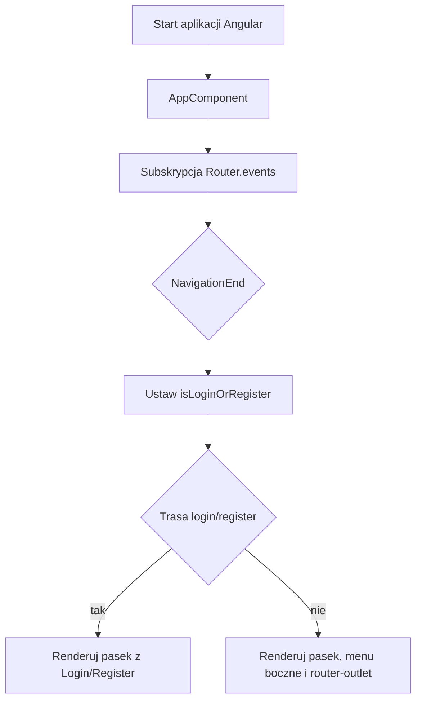
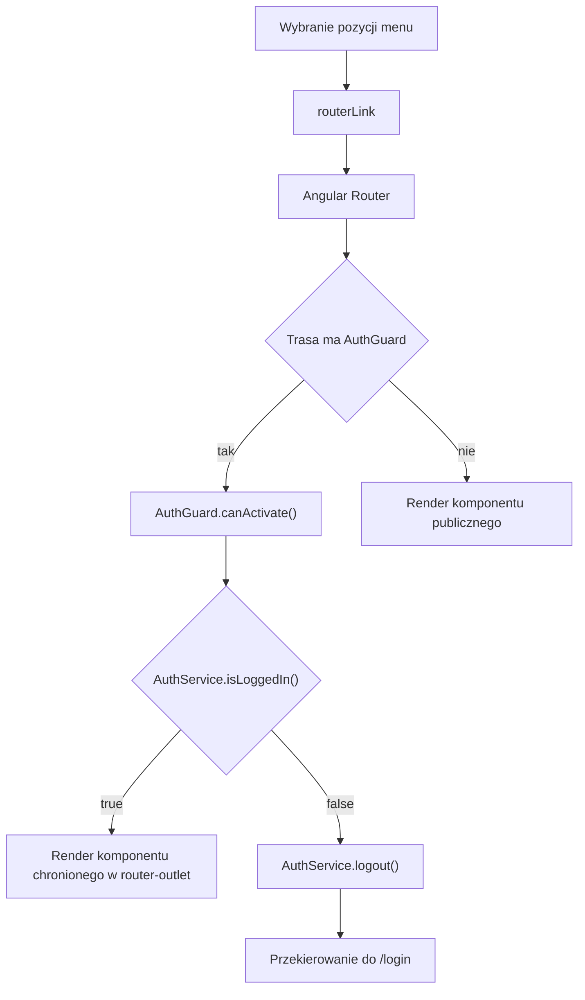
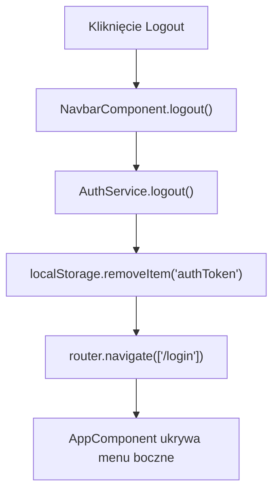

# AppShell — Logika frontendowa

---

## 1. Zakres dokumentu

Dokument opisuje logikę wykonywaną przez frontend wspólnej makiety aplikacji InvoiceJet. Dokument nie opisuje implementacji backendu, reguł bazy danych ani przetwarzania po stronie API.

---

## 2. Inicjalizacja makiety

### 2.1 Przepływ inicjalizacji



### 2.2 Opis przepływu

`AppComponent` nasłuchuje `Router.events`. Po zdarzeniu `NavigationEnd` sprawdza, czy adres zawiera tekst `login` albo `register`.

Jeżeli adres zawiera `login` albo `register`, menu boczne nie jest renderowane. Jeżeli adres nie zawiera tych tekstów, aplikacja renderuje menu boczne i kontener obszaru roboczego.

---

## 3. Przepływ routingu ekranów



Trasy `/login` i `/register` nie używają `AuthGuard`. Trasy `/dashboard` i podścieżki dashboardu używają `AuthGuard`.

---

## 4. Przepływ menu bocznego

### 4.1 Widoczność menu bocznego

`SidebarService` przechowuje stan widoczności menu w `BehaviorSubject<boolean>`. Wartość początkowa zależy od `window.innerWidth > 1500`.

`NavbarComponent.toggleSidebar()` wywołuje `SidebarService.toggleSidebar()`. `SidebarComponent` subskrybuje `sidebarVisible` i przypisuje wynik do `sidebarVisible`.

### 4.2 Zamykanie po wyborze pozycji

Po kliknięciu pozycji końcowej `SidebarComponent.closeSidebar()` sprawdza szerokość okna. Jeżeli `window.innerWidth < 1500`, metoda przełącza widoczność menu przez `SidebarService.toggleSidebar()`.

---

## 5. Przepływ filtrowania drzewa menu

### 5.1 Wyzwalacz

Filtrowanie jest wyzwalane przez zdarzenie `(keyup)` pola Search w menu bocznym.

### 5.2 Kroki frontendowe

1. `filterTree(event)` odczytuje tekst z `event.target`.
2. Tekst jest przycinany przez `trim()`.
3. Tekst jest zamieniany na małe litery przez `toLowerCase()`.
4. Pusty tekst wywołuje `loadData()` i `treeControl.collapseAll()`.
5. Niepusty tekst wywołuje `filterNodes(this.TREE_DATA, filterText)`.
6. Wynik filtrowania trafia do `dataSource.data`.
7. Drzewo jest rozwijane przez `treeControl.expandAll()`.

### 5.3 Reguła filtrowania

`filterNodes()` zachowuje węzeł, jeżeli nazwa węzła zawiera wyszukiwany tekst albo dowolne dziecko węzła spełnia ten warunek.

---

## 6. Przepływ profilu użytkownika

`NavbarComponent.userInfo` zwraca `AuthService.userInfo`. `AuthService.userInfo` dekoduje token JWT i buduje obiekt z polami `fullName`, `email` i `initials`.

Jeżeli token nie jest dostępny do dekodowania, getter zwraca:

```typescript
{
  fullName: "",
  email: "",
  initials: "N/A"
}
```

---

## 7. Przepływ wylogowania



Wylogowanie usuwa token `authToken` z `localStorage`. Po usunięciu tokenu aplikacja nawiguje do `/login`.

---

## 8. Przepływ trybu ciemnego

`NavbarComponent.toggleTheme()` pobiera `document.body` i przełącza klasę CSS `dark-mode`.

Kod nie zapisuje wybranego trybu do `localStorage`. Po odświeżeniu aplikacji stan klasy zależy od aktualnego DOM, nie od trwałej konfiguracji.

---

## 9. Obsługa błędów i autoryzacji HTTP

`AppShell` nie wykonuje własnych żądań HTTP. Dla ekranów załadowanych w `router-outlet` aktywne są interceptory HTTP:

| Interceptor | Zachowanie |
|---|---|
| `AuthInterceptor` | Dodaje nagłówek `Authorization` z tokenem JWT, jeżeli token istnieje. |
| `AuthInterceptor` | Dla statusu `401` wykonuje przekierowanie do `/login` i wywołuje `AuthService.logout()`. |
| `ErrorInterceptor` | Dla statusów `400`, `401`, `404`, `500` pokazuje komunikaty przez `ToastrService.error(...)`. |

---

## 10. Ograniczenia opisu

- Dokument nie opisuje logiki poszczególnych ekranów ładowanych w `router-outlet`.
- Dokument nie opisuje implementacji API.
- Dokument nie opisuje stylów CSS poza skutkiem klasy `dark-mode`.
- Dokument nie opisuje walidacji formularzy ekranów biznesowych.
