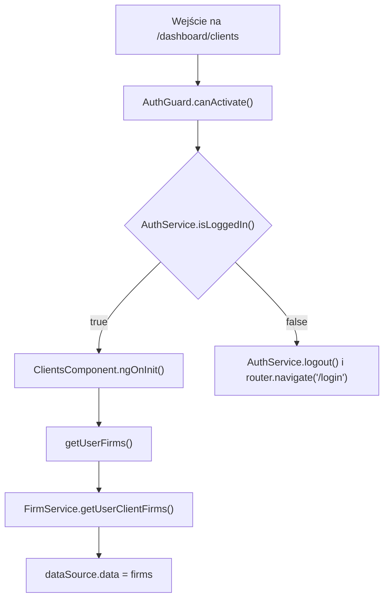
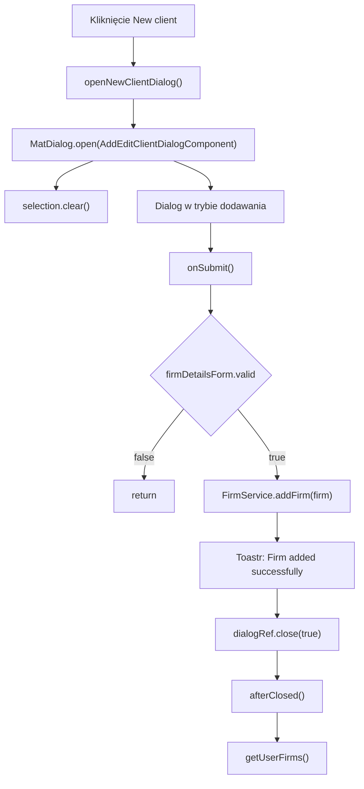
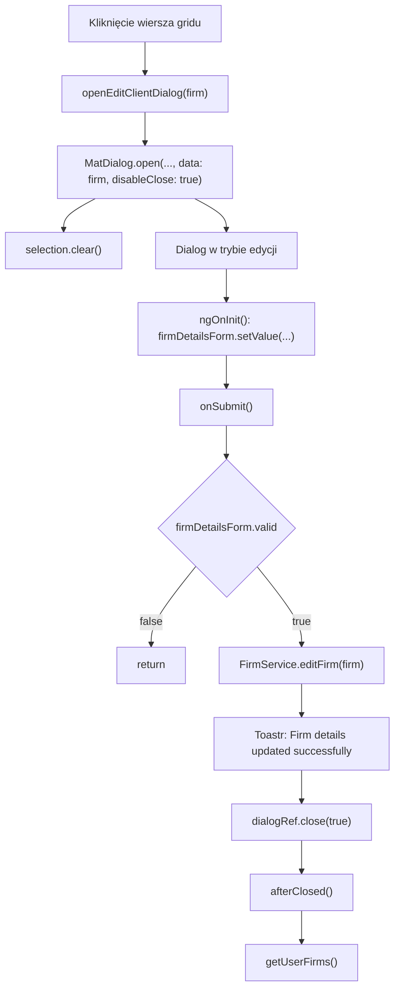

# Clients — Logika frontendowa

---

## 1. Zakres dokumentu

Dokument opisuje logikę wykonywaną przez frontend ekranu Clients. Dokument nie opisuje implementacji backendu, reguł bazy danych ani wewnętrznego przetwarzania po stronie API.

---

## 2. Inicjalizacja ekranu

### 2.1 Przepływ inicjalizacji

### 2.2 Opis przepływu

`AuthGuard` kontroluje dostęp do trasy `/dashboard/clients`. Jeżeli użytkownik jest zalogowany, komponent wywołuje `getUserFirms()` podczas `ngOnInit()`.

Metoda `getUserFirms()` pobiera tablicę `IFirm[]` przez `FirmService.getUserClientFirms()`. Po otrzymaniu odpowiedzi komponent kopiuje dane do `firms` i `dataSource.data`.

---

## 3. Przepływ filtrowania

### 3.1 Wyzwalacz

Filtrowanie jest wyzwalane przez zdarzenie `(keyup)` pola Search.

### 3.2 Kroki frontendowe

1. `applyFilter(event)` odczytuje wartość z `event.target`.
2. Wartość jest przycinana przez `trim()`.
3. Wartość jest zamieniana na małe litery przez `toLowerCase()`.
4. Wynik jest przypisywany do `dataSource.filter`.
5. Jeżeli istnieje paginator, wykonywane jest `dataSource.paginator.firstPage()`.

### 3.3 Czyszczenie filtra

`clearSearch(input)` ustawia `input.value` na pusty tekst. Metoda ustawia `dataSource.filter` na pusty tekst i resetuje paginator do pierwszej strony.

---

## 4. Przepływ sortowania

Sortowanie jest realizowane przez `MatSort`. Po inicjalizacji widoku `ngAfterViewInit()` przypisuje `this.sort` do `dataSource.sort`.

Zmiana sortowania wywołuje `announceSortChange(sortState)`. Jeżeli `sortState.direction` ma wartość, `LiveAnnouncer` ogłasza kierunek sortowania. Jeżeli kierunek jest pusty, ogłaszany jest komunikat `Sorting cleared`.

---

## 5. Przepływ paginacji

Paginacja jest realizowana przez `MatPaginator`. Po inicjalizacji widoku `ngAfterViewInit()` przypisuje `this.paginator` do `dataSource.paginator`.

Paginacja działa po stronie frontendu na danych dostępnych w `MatTableDataSource`.

---

## 6. Przepływ zaznaczania wierszy

### 6.1 Zaznaczenie pojedynczego wiersza

Checkbox wiersza wywołuje `selection.toggle(row)`. Kliknięcie checkboxa zatrzymuje propagację zdarzenia, dlatego nie otwiera dialogu Edycja klienta.

### 6.2 Zaznaczenie wszystkich wierszy

Checkbox nagłówka wywołuje `masterToggle()`. Metoda sprawdza `isAllSelected()`.

Jeżeli wszystkie wiersze są zaznaczone, `selection.clear()` usuwa zaznaczenie. Jeżeli nie wszystkie wiersze są zaznaczone, każdy wiersz z `dataSource.data` jest dodawany do `selection`.

---

## 7. Przepływ dodawania klienta

`openNewClientDialog()` otwiera dialog bez danych wejściowych. Dialog inicjalizuje formularz pustymi wartościami. Po udanym zapisie dialog zwraca `true`, a ekran odświeża grid przez `getUserFirms()`.

---

## 8. Przepływ edycji klienta

`openEditClientDialog(firm)` przekazuje do dialogu obiekt `IFirm`. Dialog ustawia `isEditMode = true` i wypełnia formularz wartościami z obiektu `data`.

---

## 9. Przepływ usuwania zaznaczonych klientów

`deleteSelected()` tworzy tablicę identyfikatorów przez `this.selection.selected.map((s) => s.id)`.

Jeżeli tablica zawiera co najmniej jeden identyfikator, metoda wywołuje `FirmService.deleteFirms(selectedIds)`. Po sukcesie ekran odświeża grid przez `getUserFirms()` i wyświetla komunikat `Firms deleted successfully`.

Po wykonaniu warunku metoda czyści zaznaczenie przez `selection.clear()`.

---

## 10. Przepływ pobierania danych z ANAF

Przycisk `cloud_download` przy polu CUI wywołuje `onCloudIconClick()`. Metoda przekazuje wartość `firmDetailsForm.value.cuiValue` do `FirmService.getFirmFromAnaf(cuiValue)`.

Po otrzymaniu odpowiedzi typu `IFirm` formularz jest aktualizowany przez `patchValue()`:

| Pole odpowiedzi | Pole formularza |
|---|---|
| `firm.name` | `firmName` |
| `firm.regCom` | `regCom` |
| `firm.address` | `address` |
| `firm.county` | `county` |
| `firm.city` | `city` |

Po aktualizacji pól wyświetlany jest komunikat `Firm details fetched from ANAF`.

---

## 11. Reguły walidacji frontendowej

Formularz dialogu blokuje zapis, jeżeli `firmDetailsForm.invalid` ma wartość `true`. Wszystkie pola formularza mają walidator `Validators.required`.

`onSubmit()` kończy działanie przez `return`, gdy formularz jest niepoprawny. Żądanie HTTP nie jest wtedy wykonywane.

---

## 12. Obsługa sukcesu i błędów

Sukces operacji dodawania, edycji, usuwania i pobierania danych z ANAF jest obsługiwany lokalnie przez `ToastrService.success(...)`.

Błędy HTTP są obsługiwane przez interceptory:

- `AuthInterceptor` obsługuje status `401` przekierowaniem do `/login`.
- `ErrorInterceptor` wyświetla komunikaty błędów przez `ToastrService.error(...)`.

---

## 13. Ograniczenia opisu

- Dokument nie opisuje walidacji backendowej.
- Dokument nie opisuje struktury tabel bazy danych.
- Dokument nie opisuje sposobu usuwania rekordów po stronie API.
- Dokument nie opisuje implementacji integracji ANAF po stronie backendu.
