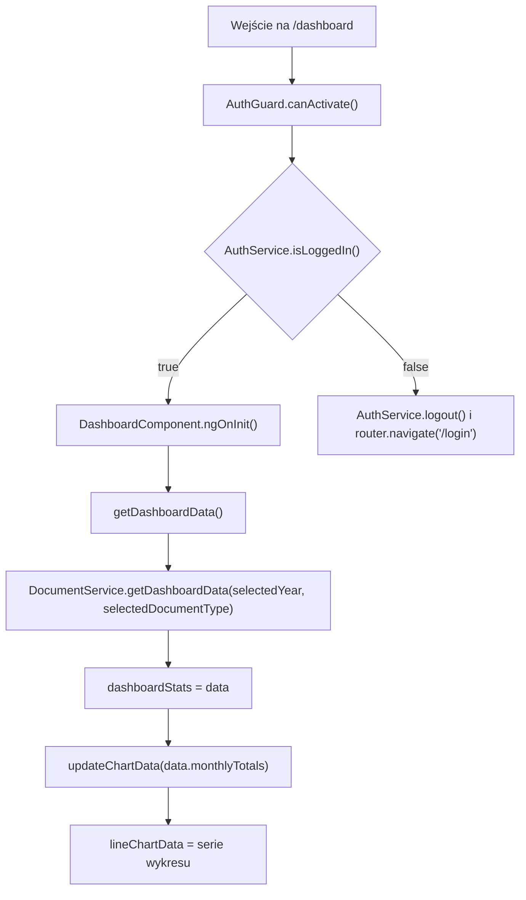
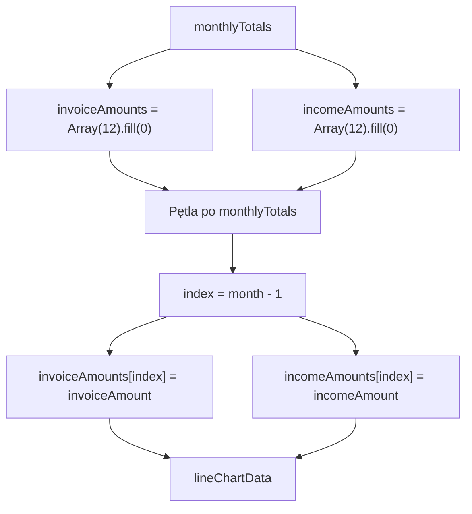

# Dashboard — Logika frontendowa

---

## 1. Zakres dokumentu

Dokument opisuje logikę wykonywaną przez frontend ekranu Dashboard. Dokument nie opisuje implementacji backendu, reguł bazy danych ani wewnętrznego przetwarzania po stronie API.

---

## 2. Inicjalizacja ekranu

### 2.1 Przepływ inicjalizacji

### 2.2 Opis przepływu

`DashboardComponent` inicjalizuje `selectedYear` aktualnym rokiem, a `selectedDocumentType` wartością `1`. Metoda `ngOnInit()` wywołuje `getDashboardData()`.

Po otrzymaniu odpowiedzi `IDashboardStats` komponent przypisuje dane do `dashboardStats` i aktualizuje wykres przez `updateChartData(...)`.

---

## 3. Przepływ zmiany filtrów

### 3.1 Zmiana roku

Lista `Year` ma binding `[(value)]="selectedYear"`. Zmiana wyboru wywołuje `onSelectionChange()`, a ta metoda wywołuje `getDashboardData()`.

### 3.2 Zmiana typu dokumentu

Lista `Document Type` ma binding `[(value)]="selectedDocumentType"`. Zmiana wyboru wywołuje `onSelectionChange()`, a ta metoda wywołuje `getDashboardData()`.

### 3.3 Wywołanie API

`getDashboardData()` przekazuje aktualne wartości `selectedYear` i `selectedDocumentType` do `DocumentService.getDashboardData(year, documentType)`.

---

## 4. Przepływ przygotowania wykresu

`updateChartData(monthlyTotals)` przygotowuje dwie serie danych. Miesiące bez rekordu z API pozostają z wartością `0`.

---

## 5. Reguły wartości domyślnych

| Element | Wartość domyślna | Źródło |
|---|---|---|
| `selectedYear` | Aktualny rok | `new Date().getFullYear()` |
| `selectedDocumentType` | `1` | Inicjalizacja pola klasy |
| `dashboardStats.totalDocuments` | `0` | Inicjalizacja pola klasy |
| `dashboardStats.totalClients` | `0` | Inicjalizacja pola klasy |
| `dashboardStats.totalProducts` | `0` | Inicjalizacja pola klasy |
| `dashboardStats.totalBankAccounts` | `0` | Inicjalizacja pola klasy |
| `dashboardStats.monthlyTotals` | `[]` | Inicjalizacja pola klasy |

---

## 6. Reguły typów dokumentów

Lista typów dokumentów jest zdefiniowana lokalnie w komponencie:

| Id | Nazwa |
|---|---|
| `1` | `Factura` |
| `2` | `Factura Proforma` |
| `3` | `Factura Storno` |

Wybór wartości wpływa na parametr `documentType` w wywołaniu `DocumentService.getDashboardData(...)`.

---

## 7. Obsługa sukcesu i błędów

Sukces pobrania danych jest obsługiwany przez przypisanie odpowiedzi do `dashboardStats` i aktualizację `lineChartData`.

Błędy HTTP są obsługiwane przez interceptory:

- `AuthInterceptor` obsługuje status `401` przekierowaniem do `/login`.
- `ErrorInterceptor` wyświetla komunikaty błędów przez `ToastrService.error(...)`.

---

## 8. Ograniczenia opisu

- Dokument nie opisuje sposobu wyliczania statystyk po stronie API.
- Dokument nie opisuje definicji biznesowej kwot `invoiceAmount` i `incomeAmount`.
- Dokument nie opisuje implementacji biblioteki Chart.js poza konfiguracją widoczną w komponencie.
