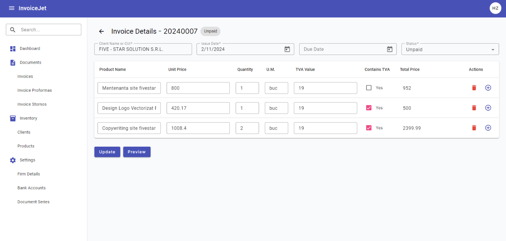

# Invoice Details — Dane i Operacje

---

## Zrzut ekranu



## Zrzut ekranu — podgląd PDF


---

## 1. Formularz dokumentu

### 1.1 Struktura formularza

Formularz dokumentu jest formularzem reaktywnym `invoiceForm: FormGroup`. Formularz zawiera pola nagłówka dokumentu i `FormArray` pozycji dokumentu.

```typescript
this.invoiceForm = this.fb.group({
  id: 0,
  client: [null, Validators.required],
  issueDate: [new Date(), Validators.required],
  dueDate: [null, dueDateValidator],
  documentSeries: [null],
  documentStatus: [null],
  products: this.fb.array([this.createProductGroup()]),
});
```

### 1.2 Pola nagłówka dokumentu

| # | Nazwa pola | Etykieta UI | Typ elementu | `formControlName` | Wymagane | Walidatory | Widoczność |
|---|---|---|---|---|---|---|---|
| 1 | Pole Klient | `Client Name or CUI` | `input matInput` z `mat-autocomplete` | `client` | Tak | `Validators.required` | Zawsze |
| 2 | Pole Data wystawienia | `Issue Date` | `input matInput` z `mat-datepicker` | `issueDate` | Tak | `Validators.required` | Zawsze |
| 3 | Pole Termin płatności | `Due Date` | `input matInput` z `mat-datepicker` | `dueDate` | Nie | `dueDateValidator` | Zawsze |
| 4 | Pole Seria dokumentu | `Document Series` | `mat-select` | `documentSeries` | Nie w `FormGroup`; `required` w HTML | Brak walidatora w `FormGroup` | Tylko tryb dodawania |
| 5 | Pole Status dokumentu | `Status` | `mat-select` | `documentStatus` | Nie w `FormGroup`; `required` w HTML | Brak walidatora w `FormGroup` | Tylko tryb edycji |

### 1.3 Uwagi walidacyjne pól nagłówka

| Pole | Uwagi |
|---|---|
| `client` | Pole jest wymagane w `FormGroup`. Szablon wyświetla `mat-error` dla `invoiceForm.get('cuiValue')`, który nie istnieje w tym formularzu. [UWAGA: komunikat `CUI Value is required` nie jest powiązany z właściwym `FormControl`] |
| `issueDate` | Pole jest wymagane. Brak wartości blokuje zapis formularza i wywołuje komunikat `Issue Date is required`. |
| `dueDate` | Pole jest opcjonalne. Walidator zwraca błąd `dueDateBeforeIssueDate`, gdy termin płatności jest wcześniejszy niż data wystawienia. Szablon nie zawiera `mat-error` dla tego błędu. |
| `documentSeries` | Pole ma atrybut `required` w HTML, ale nie ma walidatora `Validators.required` w `FormGroup`. |
| `documentStatus` | Pole ma atrybut `required` w HTML, ale nie ma walidatora `Validators.required` w `FormGroup`. |

---

## 2. Grid pozycji dokumentu

### 2.1 Opis gridu

| Atrybut | Wartość |
|---|---|
| **Komponent Angular** | `table mat-table` |
| **Źródło danych** | `dataSource` |
| **Źródło formularza** | `products: FormArray` |
| **Aktualizacja gridu** | `updateTableData()` ustawia `dataSource.data = getControls()`. |
| **Kolumny** | `displayedColumns` w `BaseInvoiceComponent` |
| **Paginacja** | Nie |
| **Sortowanie** | Nie |
| **Dodawanie wiersza** | `addProduct()` |
| **Usuwanie wiersza** | `deleteProduct(index)` |

### 2.2 Definicja kolumn

| # | `matColumnDef` | Nagłówek | Pole formularza | Typ | Edytowalne | Uwagi |
|---|---|---|---|---|---|---|
| 1 | `name` | `Product Name` | `name` | `input matInput` z `mat-autocomplete` | Tak | Wybór produktu wywołuje `onProductSelected($event, i)`. |
| 2 | `unitPrice` | `Unit Price` | `unitPrice` | `input type="number"` | Tak | Zmiana wywołuje `calculateTotalPrice(i)`. |
| 3 | `quantity` | `Quantity` | `quantity` | `input type="number"` | Tak | Zmiana wywołuje `calculateTotalPrice(i)`. |
| 4 | `unitOfMeasurement` | `U.M.` | `unitOfMeasurement` | `input matInput` | Warunkowo | Pole jest tylko do odczytu w trybie edycji. |
| 5 | `tvaValue` | `TVA Value` | `tvaValue` | `input type="number"` | Warunkowo | Pole jest tylko do odczytu w trybie edycji. |
| 6 | `containsTva` | `Contains TVA` | `containsTva` | `mat-checkbox` | Tak | Zmiana wywołuje `calculatePriceWithoutTVA(i, checked)`. |
| 7 | `totalPrice` | `Total Price` | `totalPrice` | `input type="number"` | Nie | Pole jest zawsze tylko do odczytu. |
| 8 | `actions` | `Actions` | N/D | Przyciski ikonowe | Tak | `Remove` i `Add`. |

### 2.3 Formularz pozycji dokumentu

Każda pozycja dokumentu jest tworzona przez `createProductGroup()`.

| Pole | Wartość domyślna | Walidatory | Uwagi |
|---|---|---|---|
| `id` | `0` | Brak | Identyfikator pozycji. |
| `name` | `null` | `Validators.required` | Nazwa produktu. |
| `unitPrice` | `null` | `Validators.required`, `Validators.min(0)` | Cena jednostkowa. |
| `totalPrice` | `null` | `Validators.required`, `Validators.min(0)` | Cena całkowita. |
| `quantity` | `1` | `Validators.required`, `Validators.min(1)` | Ilość. |
| `unitOfMeasurement` | `buc` | `Validators.required` | Jednostka miary. |
| `tvaValue` | `19` | `Validators.required`, `Validators.min(0)` | Wartość TVA w procentach. |
| `containsTva` | `false` | Brak | Flaga ceny zawierającej TVA. |

---

## 3. Autouzupełnianie

### 3.1 Autouzupełnianie klienta

| Atrybut | Wartość |
|---|---|
| **Pole** | `client` |
| **Źródło danych** | `invoiceAutofillData.clients` |
| **Observable** | `filteredFirms` |
| **Filtrowanie** | Po `firm.name` albo `firm.cui`. |
| **Wyświetlanie wartości w polu** | `displayFn(firm)` zwraca `firm.name`. |
| **Opcja na liście** | `{{ firm.name }} ({{ firm.cui }})` |

### 3.2 Autouzupełnianie produktu

| Atrybut | Wartość |
|---|---|
| **Pole** | `products[i].name` |
| **Źródło danych** | `invoiceAutofillData.products` |
| **Observable** | `filteredProducts` |
| **Filtrowanie** | Po `product.name`. |
| **Opcja na liście** | `{{ product.name }} ({{ product.price }} RON)` |
| **Po wyborze** | `onProductSelected($event, i)` uzupełnia cenę, jednostkę, TVA i flagę `containsTva`. |

---

## 4. Operacje ekranu

### 4.1 Tabela operacji

| # | Nazwa operacji | Typ elementu | Event | Handler | Warunek aktywności |
|---|---|---|---|---|---|
| 1 | Powrót do listy faktur | `button mat-icon-button` | `(click)` | `goBack()` | Zawsze aktywna. |
| 2 | Wybór klienta | `mat-autocomplete` | Wybór opcji | Binding formularza | Aktywna po załadowaniu danych autouzupełniania. |
| 3 | Wybór produktu | `mat-autocomplete` | `(optionSelected)` | `onProductSelected($event, i)` | Aktywna dla każdego wiersza pozycji. |
| 4 | Dodanie pozycji | `button mat-icon-button` | `(click)` | `addProduct()` | Zawsze aktywna. |
| 5 | Usunięcie pozycji | `button mat-icon-button` | `(click)` | `deleteProduct(i)` | Widoczna tylko gdy liczba pozycji jest większa niż `1`. |
| 6 | Przeliczenie ceny całkowitej | Pola liczbowe | `(change)` | `calculateTotalPrice(i)` | Aktywna dla pól `unitPrice`, `quantity`, `tvaValue`. |
| 7 | Przeliczenie ceny z flagą TVA | `mat-checkbox` | `(change)` | `calculatePriceWithoutTVA(i, checked)` | Aktywna dla pola `containsTva`. |
| 8 | Dodanie faktury | `button mat-raised-button` | `(ngSubmit)` | `onSubmit()` -> `addDocument()` | Tryb dodawania i poprawny formularz. |
| 9 | Edycja faktury | `button mat-raised-button` | `(ngSubmit)` | `onSubmit()` -> `updateDocument()` | Tryb edycji i poprawny formularz. |
| 10 | Podgląd PDF | `button mat-raised-button` | `(click)` | `getInvoicePdfStream()` | Widoczna tylko w trybie edycji. |

### 4.2 Wywołania HTTP z frontendu

| Operacja | Metoda serwisu | Wywołanie HTTP z `DocumentService` | Typ danych |
|---|---|---|---|
| Dane autouzupełniania | `getDocumentAutofillInfo(1)` | `GET {apiUrl}/Document/GetDocumentAutofillInfo/1` | `IDocumentAutofill` |
| Pobranie dokumentu | `getDocumentById(documentId)` | `GET {apiUrl}/Document/GetDocumentById/{documentId}` | `IDocumentRequest` |
| Dodanie dokumentu | `addDocument(documentData)` | `POST {apiUrl}/Document/AddDocument` | `IDocumentRequest` |
| Edycja dokumentu | `updateDocument(documentData)` | `PUT {apiUrl}/Document/EditDocument` | `IDocumentRequest` |
| Podgląd PDF | `getGeneratedDocumentPdf(documentData)` | `POST {apiUrl}/Document/GetInvoicePdfStream/` | `Blob` |

> Tabela opisuje wyłącznie wywołania wykonywane z poziomu frontendu. Nie opisuje implementacji endpointów.

---

## 5. Dialog Podgląd PDF

### 5.1 Metadane dialogu

| Atrybut | Wartość |
|---|---|
| **Komponent** | `PdfViewerComponent` |
| **Otwierany przez** | `getInvoicePdfStream()` |
| **Dane wejściowe** | `{ pdfUrl: url }` |
| **Szerokość** | `100vw` |
| **Wysokość** | `90vh` |
| **Zamykanie poza dialogiem** | Zablokowane przez `disableClose: true`. |

### 5.2 Elementy dialogu

| Element | Typ | Funkcja |
|---|---|---|
| Przycisk Close | `button mat-icon-button` | Wywołuje `onClose()` i zamyka dialog. |
| Podgląd PDF | `iframe` | Wyświetla `safeUrl` utworzony przez `DomSanitizer.bypassSecurityTrustResourceUrl(data.pdfUrl)`. |

---

## 6. Komunikaty i obsługa błędów

### 6.1 Komunikaty sukcesu

| Operacja | Komunikat | Mechanizm |
|---|---|---|
| Dodanie dokumentu | `Document added successfully` | `ToastrService.success(...)` |
| Edycja dokumentu | `Document updated successfully` | `ToastrService.success(...)` |

### 6.2 Komunikaty walidacyjne w szablonie

| Pole | Warunek | Komunikat |
|---|---|---|
| `issueDate` | `required` | `Issue Date is required` |
| `documentSeries` | `required` w HTML | `This field is required` |
| `documentStatus` | `required` w HTML | `This field is required` |
| `client` | `required` w `FormGroup` | Szablon odwołuje się do nieistniejącego `cuiValue`. [UWAGA] |

### 6.3 Obsługa błędów

| Źródło | Zachowanie frontendowe |
|---|---|
| `loadDocument()` | Błąd lokalnie trafia do `console.error("Error loading document data", err)`. |
| `getInvoicePdfStream()` | Błąd lokalnie trafia do `console.error("Error getting invoice pdf stream", err)`. |
| `AuthInterceptor` dla statusu `401` | Przekierowuje do `/login` i wywołuje `AuthService.logout()`. |
| `ErrorInterceptor` | Wyświetla komunikaty błędów HTTP przez `ToastrService.error(...)`. |

---

## 7. Znane uwagi wynikające z kodu

- Pole `client` ma walidator `Validators.required`, ale komunikat błędu w HTML sprawdza `invoiceForm.get('cuiValue')`, którego nie ma w formularzu.
- Pole `dueDate` ma walidator `dueDateValidator`, ale szablon nie wyświetla komunikatu `mat-error` dla błędu `dueDateBeforeIssueDate`.
- Pola `documentSeries` i `documentStatus` mają `required` w HTML, ale nie mają `Validators.required` w `FormGroup`.
- `getInvoicePdfStream()` ma zakomentowaną walidację formularza. Operacja Preview nie blokuje się na `invoiceForm.invalid`.
- `generateInvoicePdf()` istnieje w klasie bazowej, ale nie jest podpięta w szablonie ekranu Invoice Details.
