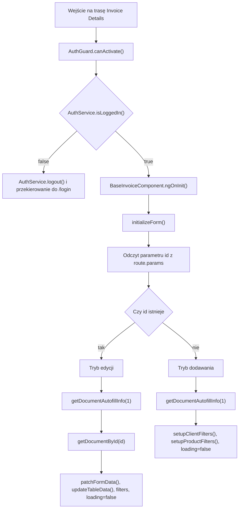

# Invoice Details — Logika frontendowa

---

## 1. Zakres dokumentu

Dokument opisuje logikę wykonywaną przez frontend ekranu Invoice Details. Dokument nie opisuje implementacji backendu, reguł bazy danych ani wewnętrznego przetwarzania po stronie API.

---

## 2. Inicjalizacja ekranu



`AddOrEditInvoiceComponent` ustawia typ dokumentu przez `getDocumentTypeId()` zwracające `1`. Klasa bazowa używa tej wartości przy pobieraniu danych autouzupełniania i przy zapisie formularza.

---

## 3. Tryb dodawania faktury

Tryb dodawania jest aktywny, gdy w parametrach trasy nie ma `id`. Formularz startuje z jednym wierszem pozycji dokumentu.

Widoczne jest pole `Document Series`. Przyciskiem zapisu jest `Issue`. Po poprawnym zapisie `addDocument(documentData)` wyświetla komunikat `Document added successfully` i nawiguje do `/dashboard/invoices`.

---

## 4. Tryb edycji faktury

Tryb edycji jest aktywny, gdy parametr trasy zawiera `id`. Komponent pobiera dokument przez `DocumentService.getDocumentById(id)`.

`patchFormData()` wypełnia formularz danymi `currentDocument`. Lista pozycji dokumentu jest ustawiana przez `setControl("products", FormArray)`. Status dokumentu jest dopasowywany do obiektu z `invoiceAutofillData.documentStatuses`.

Widoczne jest pole `Status`, chip statusu i przycisk `Preview`. Przyciskiem zapisu jest `Update`. Po poprawnym zapisie `updateDocument(documentData)` wyświetla komunikat `Document updated successfully` i nawiguje do `/dashboard/invoices`.

---

## 5. Autouzupełnianie klienta

`setupClientFilters()` podłącza `valueChanges` pola `client`. Każda zmiana wartości pola wywołuje `filterClients(value)`.

`filterClients(value)` obsługuje dwa typy wartości:

| Typ wartości | Zachowanie |
|---|---|
| `string` | Filtrowanie po wpisanym tekście. |
| `object` z polem `name` | Filtrowanie po nazwie wybranego klienta. |

Filtrowanie sprawdza `firm.name` i `firm.cui`. Funkcja `displayFn(firm)` wyświetla w polu nazwę klienta.

---

## 6. Autouzupełnianie produktu

`setupProductFilters()` tworzy strumienie `valueChanges` dla pola `name` każdego wiersza w `products`. Strumienie są łączone przez `merge(...)`.

`filterProducts(value)` filtruje `invoiceAutofillData.products` po `product.name`.

Po wyborze opcji produktu `onProductSelected(event, index)` znajduje produkt po nazwie i aktualizuje wiersz formularza:

| Pole produktu | Pole pozycji dokumentu |
|---|---|
| `selectedProduct.id` | `id` |
| `selectedProduct.price` | `unitPrice` |
| `selectedProduct.unitOfMeasurement` | `unitOfMeasurement` |
| `selectedProduct.tvaValue` | `tvaValue` |
| `selectedProduct.containsTva` | `containsTva` |

Po uzupełnieniu pól wykonywane jest `calculateTotalPrice(index)`.

---

## 7. Dodawanie i usuwanie pozycji dokumentu

`addProduct()` dodaje do `productsFormArray` nową grupę utworzoną przez `createProductGroup()`. Następnie metoda aktualizuje dane gridu przez `updateTableData()` i ponownie konfiguruje filtry produktów.

`deleteProduct(index)` usuwa grupę z `productsFormArray` i aktualizuje dane gridu. Przycisk usunięcia jest widoczny tylko wtedy, gdy liczba pozycji jest większa niż `1`.

---

## 8. Przeliczanie wartości pozycji

### 8.1 `calculateTotalPrice(index)`

Metoda odczytuje `unitPrice`, `quantity` i `tvaValue`. Następnie oblicza:

```text
totalPrice = unitPrice * quantity
tva = totalPrice * (tvaValue / 100)
finalPrice = totalPrice + tva
```

Wartość `finalPrice` jest zaokrąglana do dwóch miejsc po przecinku i zapisywana w polu `totalPrice`.

### 8.2 `calculatePriceWithoutTVA(index, isChecked)`

Jeżeli `isChecked` ma wartość `true`, metoda traktuje wartość ceny jako zawierającą TVA i przelicza `unitPrice` na wartość netto.

Jeżeli `isChecked` ma wartość `false`, metoda przelicza `unitPrice` i `totalPrice` według gałęzi `else` zaimplementowanej w kodzie.

---

## 9. Zapis formularza

`onSubmit()` kończy działanie, jeżeli `invoiceForm.invalid` ma wartość `true`.

Jeżeli formularz jest poprawny, metoda pobiera `IDocumentRequest` z `invoiceForm.value` i ustawia:

```typescript
documentData.documentType = { id: this.getDocumentTypeId(), name: "" };
```

Następnie wykonywana jest jedna z operacji:

| Tryb | Metoda |
|---|---|
| Dodawanie | `addDocument(documentData)` |
| Edycja | `updateDocument(documentData)` |

Po sukcesie użytkownik jest przekierowywany do `/dashboard/invoices`.

---

## 10. Podgląd PDF

`getInvoicePdfStream()` pobiera dane z `invoiceForm.value`, ustawia `documentType`, `documentNumber` i `documentStatus`, a następnie wywołuje `DocumentService.getGeneratedDocumentPdf(documentData)`.

Po otrzymaniu danych binarnych frontend tworzy `Blob` typu `application/pdf` i URL przez `window.URL.createObjectURL(blob)`. Następnie otwierany jest dialog `PdfViewerComponent` z parametrem `pdfUrl`.

`PdfViewerComponent` sanitizuje URL przez `DomSanitizer.bypassSecurityTrustResourceUrl(data.pdfUrl)` i wyświetla PDF w `iframe`.

---

## 11. Powrót do listy faktur

`goBack()` wywołuje `router.navigateByUrl(this.getNavigationUrl())`. Dla ekranu faktury `getNavigationUrl()` zwraca `/dashboard/invoices`.

Ta sama ścieżka jest używana po sukcesie dodania i edycji dokumentu.

---

## 12. Ograniczenia opisu

- Dokument nie opisuje generowania numeru dokumentu po stronie API.
- Dokument nie opisuje walidacji backendowej dokumentu.
- Dokument nie opisuje struktury bazy danych.
- Dokument nie opisuje sposobu generowania PDF po stronie backendu.
