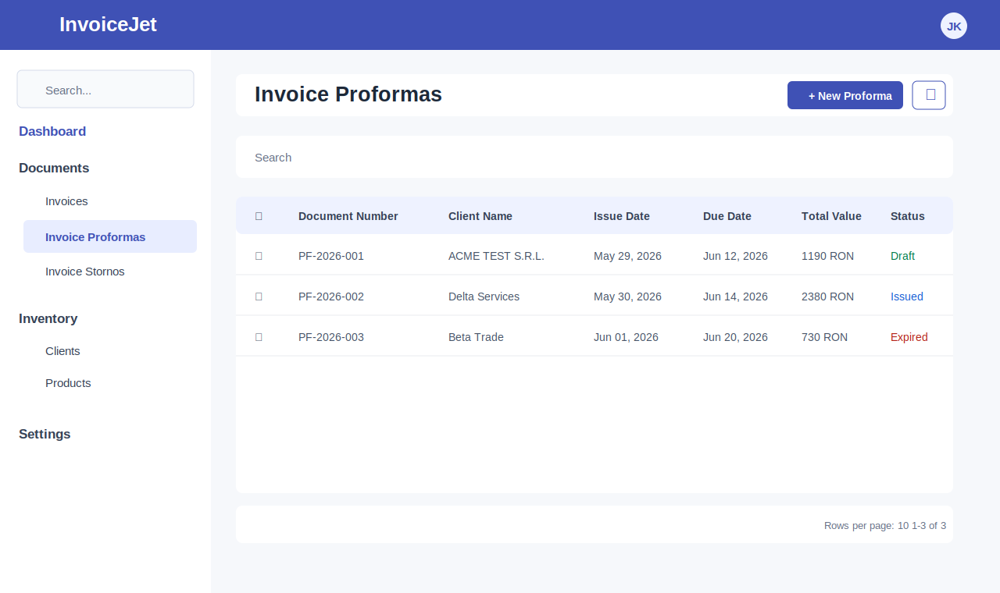

# Invoice Proformas — Dane i Operacje

---

## Makieta ekranu

Makieta jest wizualizacją techniczną wykonaną na podstawie `invoice-proformas.component.html`, `invoice-proformas.component.ts` i wspólnego układu `AppShell`.

---

## 1. Zakres danych widocznych na ekranie

Ekran prezentuje listę proform w gridzie Angular Material. Dane gridu pochodzą ze zmiennej `dataSource`, której typ to `MatTableDataSource<IDocumentTableRecord>`.

Ekran nie zawiera formularza edycji. Dodawanie i edycja proformy są realizowane przez nawigację do ekranów powiązanych z komponentem `AddOrEditInvoiceProformaComponent`.

---

## 2. Sekcja filtrów

| Atrybut | Wartość |
|---|---|
| **Nazwa elementu** | Pole Search |
| **Typ elementu** | `input matInput` w `mat-form-field` |
| **Etykieta** | `Search` |
| **Tekst podpowiedzi** | `Search` |
| **Event** | `(keyup)="applyFilter($event)"` |
| **Handler** | `applyFilter(event: Event)` |
| **Mechanizm filtrowania** | `this.dataSource.filter = filterValue.trim().toLowerCase()` |
| **Skutek dodatkowy** | Jeżeli istnieje paginator, wykonywane jest `this.dataSource.paginator.firstPage()`. |

### 2.1 Przycisk Clear

| Atrybut | Wartość |
|---|---|
| **Typ elementu** | `button mat-icon-button` |
| **Widoczność** | Przycisk jest widoczny wyłącznie gdy `searchInput.value` nie jest puste. |
| **Ikona** | `clear` |
| **Event** | `(click)="clearSearch(searchInput)"` |
| **Skutek** | Czyści pole Search, ustawia `dataSource.filter` na pusty tekst i resetuje paginator do pierwszej strony wyników. |

---

## 3. Grid proform

### 3.1 Opis gridu

| Atrybut | Wartość |
|---|---|
| **Komponent Angular** | `table mat-table` |
| **Źródło danych** | `dataSource` |
| **Typ źródła danych** | `MatTableDataSource<IDocumentTableRecord>` |
| **Zmienna pomocnicza** | `invoices: IDocumentTableRecord[]` |
| **Kolumny** | `displayedColumns` |
| **Sortowanie** | Tak, przez `matSort` i `MatSort`. |
| **Paginacja** | Tak, przez `mat-paginator` i `MatPaginator`. |
| **Zaznaczanie wierszy** | Tak, przez `SelectionModel<IDocumentTableRecord>(true, [])`. |
| **Kliknięcie wiersza** | Nawiguje do edycji przez `openEditInvoiceProformaDialog(row)`. |

### 3.2 Definicja kolumn

| # | `matColumnDef` | Nagłówek | Zawartość komórki | Typ | Sortowalna | Uwagi |
|---|---|---|---|---|---|---|
| 1 | `select` | Checkbox | `mat-checkbox` dla zaznaczenia wiersza | pole wyboru | Nie | Checkbox nagłówka obsługuje zaznaczanie wszystkich wierszy. |
| 2 | `documentNumber` | `Document Number` | `{{ record.documentNumber }}` | tekst | Tak | Numer proformy. |
| 3 | `clientName` | `Client Name` | `{{ record.clientName }}` | tekst | Tak | Nazwa klienta. |
| 4 | `issueDate` | `Issue Date` | `{{ record.issueDate | date : "mediumDate" }}` | data | Tak | Data wystawienia. |
| 5 | `dueDate` | `Due Date` | `{{ record.dueDate | date : "mediumDate" }}` | data | Tak | Termin płatności. |
| 6 | `totalValue` | `Total Value` | `{{ record.totalValue }} RON` | liczba | Tak | Wartość dokumentu z sufiksem `RON`. |
| 7 | `documentStatus` | `Status` | `mat-chip` z `record.documentStatus?.status` | status | Tak | Status renderowany jako chip. |

---

## 4. Operacje ekranu

| # | Nazwa operacji | Typ elementu | Lokalizacja | Event | Handler | Warunek aktywności |
|---|---|---|---|---|---|---|
| 1 | Pobranie proform | N/D | Inicjalizacja komponentu | `ngOnInit()` | `loadInvoices()` | Wejście na ekran. |
| 2 | Nowa proforma | `button mat-raised-button` | Pasek tytułu | `(click)` | `openNewInvoiceProformaDialog()` | Zawsze aktywna. |
| 3 | Edycja proformy | `tr mat-row` | Wiersz gridu | `(click)` | `openEditInvoiceProformaDialog(row)` | Aktywna dla każdego wiersza. |
| 4 | Filtrowanie proform | `input matInput` | Sekcja Search | `(keyup)` | `applyFilter($event)` | Aktywna gdy ekran jest załadowany. |
| 5 | Czyszczenie filtra | `button mat-icon-button` | Pole Search | `(click)` | `clearSearch(searchInput)` | Widoczna gdy pole Search ma wartość. |
| 6 | Zaznaczanie wszystkich wierszy | `mat-checkbox` | Nagłówek gridu | `(change)` | `masterToggle()` | Aktywna gdy grid jest wyrenderowany. |
| 7 | Zaznaczanie wiersza | `mat-checkbox` | Wiersz gridu | `(change)` | `selection.toggle(row)` | Aktywna dla każdego wiersza. |
| 8 | Usuwanie zaznaczonych | `button mat-menu-item` | Menu kontekstowe | `(click)` | `deleteSelected()` | Kod wykonuje żądanie także dla pustej tablicy identyfikatorów. |

### 4.1 Nawigacje

| Operacja | Handler | Trasa docelowa | Dane przekazywane |
|---|---|---|---|
| Nowa proforma | `openNewInvoiceProformaDialog()` | `dashboard/add-invoice-proforma` | Brak |
| Edycja proformy | `openEditInvoiceProformaDialog(row)` | `/dashboard/edit-invoice-proforma/{row.id}` | `row.id` |

### 4.2 Wywołania HTTP z frontendu

| Operacja | Metoda serwisu | Wywołanie HTTP z `DocumentService` | Typ danych |
|---|---|---|---|
| Pobranie proform | `getDocuments(2)` | `GET {apiUrl}/Document/GetDocumentTableRecords/2` | `IDocumentTableRecord[]` |
| Usunięcie zaznaczonych | `deleteDocuments(documentIds)` | `PUT {apiUrl}/Document/DeleteDocuments` | `number[]` |

---

## 5. Komunikaty i obsługa błędów

Ekran Invoice Proformas nie wyświetla lokalnych komunikatów sukcesu po usunięciu.

| Źródło | Zachowanie frontendowe |
|---|---|
| `deleteSelected()` | Błąd trafia do `console.error("Error deleting documents", err)`. |
| `AuthInterceptor` dla statusu `401` | Przekierowuje do `/login` i wywołuje `AuthService.logout()`. |
| `ErrorInterceptor` | Wyświetla komunikaty błędów przez `ToastrService.error(...)`. |

---

## 6. Znane uwagi wynikające z kodu

- `deleteSelected()` nie sprawdza liczby zaznaczonych dokumentów przed wywołaniem serwisu.
- `deleteSelected()` nie czyści `selection` po sukcesie.
- `loadInvoices()` i `deleteSelected()` wykonują `console.log(...)`.
- Ekran nie pokazuje lokalnego stanu ładowania danych.
- Ekran nie wyświetla lokalnego komunikatu sukcesu po usunięciu.
