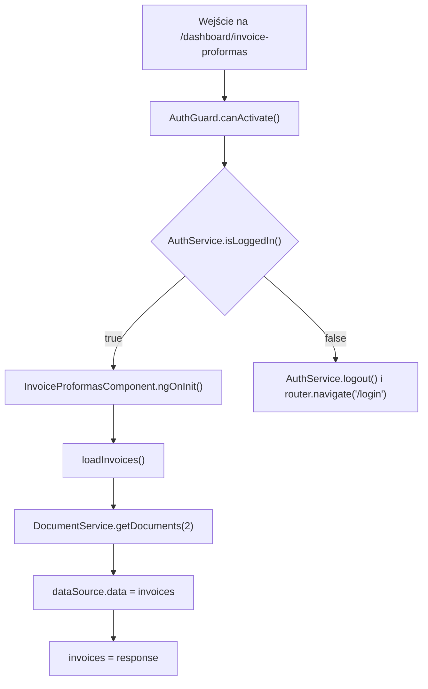
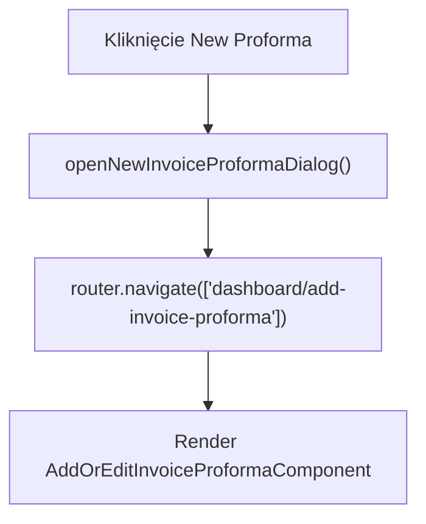
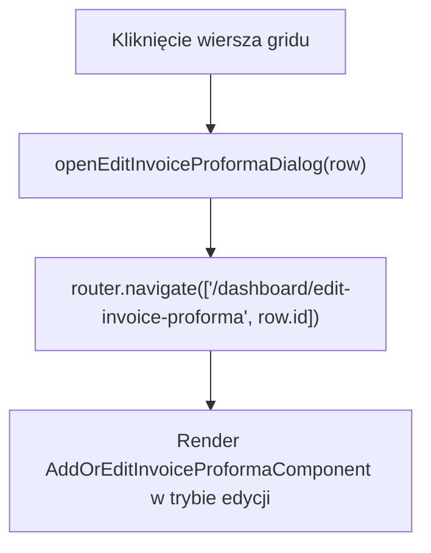
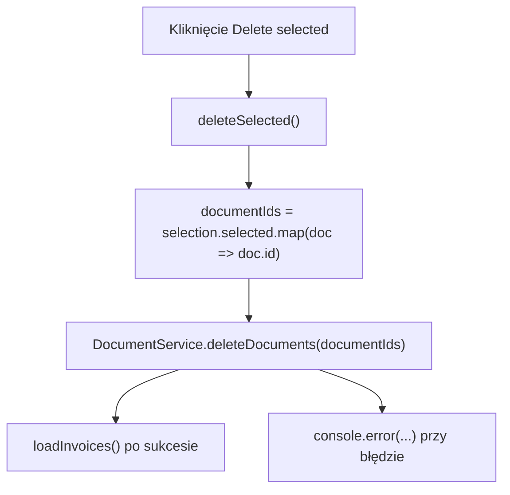

# Invoice Proformas — Logika frontendowa

---

## 1. Zakres dokumentu

Dokument opisuje logikę wykonywaną przez frontend ekranu Invoice Proformas. Dokument nie opisuje implementacji backendu, reguł bazy danych ani wewnętrznego przetwarzania po stronie API.

---

## 2. Inicjalizacja ekranu

`loadInvoices()` pobiera dokumenty przez `DocumentService.getDocuments(2)`. Parametr `2` oznacza typ dokumentu używany przez listę Invoice Proformas.

---

## 3. Przepływ filtrowania, sortowania i paginacji

Filtrowanie działa przez `MatTableDataSource.filter`. Wartość z pola Search jest przycinana, zamieniana na małe litery i przypisywana do `dataSource.filter`.

Sortowanie działa przez `MatSort`. Po inicjalizacji widoku `ngAfterViewInit()` przypisuje `this.sort` do `dataSource.sort`.

Paginacja działa przez `MatPaginator`. Po inicjalizacji widoku `ngAfterViewInit()` przypisuje `this.paginator` do `dataSource.paginator`.

---

## 4. Przepływ zaznaczania wierszy

Checkbox wiersza wywołuje `selection.toggle(row)`. Kliknięcie checkboxa zatrzymuje propagację zdarzenia, dlatego nie uruchamia nawigacji do edycji.

Checkbox nagłówka wywołuje `masterToggle()`. Jeżeli wszystkie wiersze są zaznaczone, `selection.clear()` usuwa zaznaczenie. Jeżeli nie wszystkie wiersze są zaznaczone, każdy wiersz z `dataSource.data` jest dodawany do `selection`.

---

## 5. Przepływ dodawania proformy

Operacja wykonuje nawigację do trasy dodawania proformy.

---

## 6. Przepływ edycji proformy

`openEditInvoiceProformaDialog(row)` przekazuje identyfikator proformy jako parametr trasy.

---

## 7. Przepływ usuwania zaznaczonych dokumentów

Metoda nie wykonuje lokalnej walidacji liczby zaznaczonych dokumentów. Po sukcesie lista jest pobierana ponownie przez `loadInvoices()`.

---

## 8. Obsługa sukcesu i błędów

Sukces pobrania danych jest obsługiwany przez przypisanie odpowiedzi do `dataSource.data` i `invoices`.

Sukces usunięcia powoduje ponowne wywołanie `loadInvoices()`. Komponent nie pokazuje lokalnego komunikatu sukcesu.

Błędy HTTP są obsługiwane przez interceptory:

- `AuthInterceptor` obsługuje status `401` przekierowaniem do `/login`.
- `ErrorInterceptor` wyświetla komunikaty błędów przez `ToastrService.error(...)`.

---

## 9. Ograniczenia opisu

- Dokument nie opisuje formularza dodawania ani edycji proformy.
- Dokument nie opisuje sposobu usuwania dokumentów po stronie API.
- Dokument nie opisuje różnic biznesowych między fakturą i proformą po stronie API.
