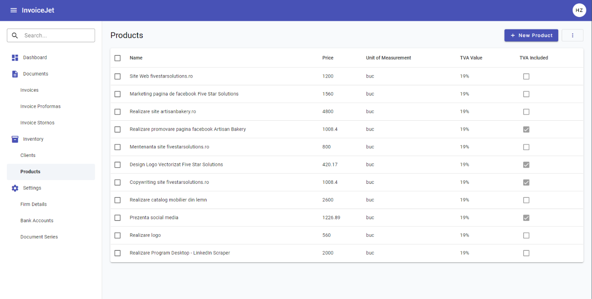

# Products — Dane i Operacje

---

## Zrzut ekranu

---

## 1. Zakres danych widocznych na ekranie

Ekran prezentuje listę produktów w gridzie Angular Material. Dane gridu pochodzą ze zmiennej `dataSource`, której typ to `MatTableDataSource<IProduct>`.

Dialog Dodawanie/Edycja produktu prezentuje formularz reaktywny `productForm`. Formularz obsługuje dane produktu w modelu `IProduct`.

---

## 2. Sekcja filtrów

### 2.1 Pole Search

| Atrybut | Wartość |
|---|---|
| **Nazwa elementu** | Pole Search |
| **Typ elementu** | `input matInput` w `mat-form-field` |
| **Etykieta** | `Search` |
| **Tekst podpowiedzi** | `Search` |
| **Binding** | Brak `formControlName`; wartość odczytywana ze zdarzenia DOM. |
| **Event** | `(keyup)="applyFilter($event)"` |
| **Handler** | `applyFilter(event: Event)` |
| **Mechanizm filtrowania** | `this.dataSource.filter = filterValue.trim().toLowerCase()` |
| **Skutek dodatkowy** | Jeżeli istnieje paginator, wykonywane jest `this.dataSource.paginator.firstPage()`. |
| **Walidatory** | Brak |
| **Wartość domyślna** | Pusty tekst |

### 2.2 Przycisk Clear

| Atrybut | Wartość |
|---|---|
| **Nazwa elementu** | Przycisk Clear |
| **Typ elementu** | `button mat-icon-button` |
| **Widoczność** | Przycisk jest widoczny wyłącznie gdy `searchInput.value` nie jest puste. |
| **Ikona** | `clear` |
| **Event** | `(click)="clearSearch(searchInput)"` |
| **Handler** | `clearSearch(input: HTMLInputElement)` |
| **Skutek** | Czyści wartość pola Search, ustawia `dataSource.filter` na pusty tekst i resetuje paginator do pierwszej strony. |

---

## 3. Grid produktów

### 3.1 Opis gridu

| Atrybut | Wartość |
|---|---|
| **Komponent Angular** | `table mat-table` |
| **Źródło danych** | `dataSource` |
| **Typ źródła danych** | `MatTableDataSource<IProduct>` |
| **Zmienna pomocnicza** | `products: IProduct[]` |
| **Kolumny** | `displayedColumns` |
| **Sortowanie** | Tak, przez `matSort` i `MatSort`. |
| **Paginacja** | Tak, przez `mat-paginator` i `MatPaginator`. |
| **Zaznaczanie wierszy** | Tak, przez `SelectionModel<IProduct>(true, [])`. |
| **Kliknięcie wiersza** | Otwiera dialog Edycja produktu przez `openEditProductDialog(row)`. |
| **Klasa CSS** | `mat-elevation-z2` |

### 3.2 Definicja kolumn

| # | `matColumnDef` | Nagłówek | Zawartość komórki | Typ | Sortowalna | Uwagi |
|---|---|---|---|---|---|---|
| 1 | `select` | Checkbox | `mat-checkbox` dla zaznaczenia wiersza | pole wyboru | Nie | Checkbox nagłówka obsługuje zaznaczanie wszystkich wierszy. |
| 2 | `name` | `Name` | `{{ product.name }}` | tekst | Tak | Kolumna sortowana przez `mat-sort-header`. |
| 3 | `price` | `Price` | `{{ product.price }}` | liczba | Tak | Brak pipe formatowania waluty. |
| 4 | `unitOfMeasurement` | `Unit of Measurement` | `{{ product.unitOfMeasurement }}` | tekst | Tak | Jednostka miary produktu. |
| 5 | `tvaValue` | `TVA Value` | `{{ product.tvaValue }}%` | liczba | Tak | Wartość wyświetlana z sufiksem `%`. |
| 6 | `containsTva` | `TVA Included` | `mat-checkbox` z `[checked]="product.containsTva"` | pole wyboru | Tak | Checkbox jest zablokowany przez `disabled`. |

### 3.3 Paginacja

| Atrybut | Wartość |
|---|---|
| **Komponent** | `mat-paginator` |
| **Opcje rozmiaru strony wyników** | `[10, 20, 30]` |
| **Przyciski pierwszej i ostatniej strony wyników** | Tak, `showFirstLastButtons`. |
| **Powiązanie z gridem** | `this.dataSource.paginator = this.paginator` w `ngAfterViewInit()`. |
| **Typ paginacji** | Frontendowa paginacja danych znajdujących się w `MatTableDataSource`. |

### 3.4 Sortowanie

| Atrybut | Wartość |
|---|---|
| **Komponent** | `matSort` |
| **Powiązanie z gridem** | `this.dataSource.sort = this.sort` w `ngAfterViewInit()`. |
| **Handler zmiany sortowania** | `announceSortChange(sortState: any)` |
| **Komunikat dostępności** | `LiveAnnouncer.announce(...)` |
| **Opis sortowania** | Kolumny danych posiadają `mat-sort-header`. |

### 3.5 Zaznaczanie wierszy

| Atrybut | Wartość |
|---|---|
| **Model zaznaczenia** | `selection = new SelectionModel<IProduct>(true, [])` |
| **Zaznaczanie wielu wierszy** | Tak |
| **Checkbox nagłówka** | Wywołuje `masterToggle()`. |
| **Checkbox wiersza** | Wywołuje `selection.toggle(row)`. |
| **Zatrzymanie propagacji** | Checkbox wiersza używa `(click)="$event.stopPropagation()"`, aby kliknięcie checkboxa nie otwierało dialogu edycji. |
| **Sprawdzenie pełnego zaznaczenia** | `isAllSelected()` porównuje liczbę zaznaczonych wierszy z liczbą wierszy w `dataSource.data`. |

---

## 4. Dialog Dodawanie/Edycja produktu

### 4.1 Metadane dialogu

| Atrybut | Wartość |
|---|---|
| **Komponent** | `AddOrEditProductDialogComponent` |
| **Plik komponentu** | `src/app/components/products/add-or-edit-product-dialog/add-or-edit-product-dialog.component.ts` |
| **Plik szablonu** | `src/app/components/products/add-or-edit-product-dialog/add-or-edit-product-dialog.component.html` |
| **Formularz** | `productForm: FormGroup` |
| **Tryb dodawania** | Dialog otwierany przez `openNewProductDialog()` bez danych wejściowych. |
| **Tryb edycji** | Dialog otwierany przez `openEditProductDialog(product)` z obiektem `IProduct`. |
| **Blokada zamknięcia poza dialogiem** | Tylko tryb edycji: `disableClose: true`. |
| **Tytuł dialogu** | `Edit Product` albo `New Product`. |

### 4.2 Pola formularza dialogu

| # | Nazwa pola | Etykieta UI | Typ elementu | `formControlName` | Wymagane | Walidatory | Komunikat błędu |
|---|---|---|---|---|---|---|---|
| 1 | Pole Nazwa | `Name` | `input matInput` | `name` | Tak | `Validators.required` | `Name is required` |
| 2 | Pole Cena | `Price` | `input type="number"` | `price` | Tak | `Validators.required` | `Price is required` |
| 3 | Pole Jednostka miary | `Unit of Measurement` | `input matInput` | `unitOfMeasurement` | Nie | Brak | Brak |
| 4 | Pole TVA | `TVA Value (%)` | `input type="number"` | `tvaValue` | Tak w `FormGroup` | `Validators.required` | Brak `mat-error` w HTML |
| 5 | Pole Contains TVA | `Contains TVA` | `mat-checkbox` | `containsTva` | Nie | Brak | Brak |

### 4.3 Wartości początkowe formularza

| Tryb | Wartości początkowe |
|---|---|
| Dodawanie produktu | `name = ""`, `price = ""`, `containsTva = false`, `tvaValue = 19`, `unitOfMeasurement = ""`. |
| Edycja produktu | `ngOnInit()` ustawia formularz na podstawie `data: IProduct`. |

### 4.4 Mapowanie formularza do modelu `IProduct`

| Pole formularza | Pole w modelu `IProduct` | Uwagi |
|---|---|---|
| `id` | `id` | W trybie dodawania ustawiane na `0`. |
| `name` | `name` | Nazwa produktu. |
| `price` | `price` | Cena produktu. |
| `containsTva` | `containsTva` | Flaga ceny zawierającej TVA. |
| `tvaValue` | `tvaValue` | Wartość TVA produktu. |
| `unitOfMeasurement` | `unitOfMeasurement` | Jednostka miary produktu. |

---

## 5. Operacje ekranu

### 5.1 Tabela operacji

| # | Nazwa operacji | Typ elementu | Lokalizacja | Event | Handler | Warunek aktywności |
|---|---|---|---|---|---|---|
| 1 | Dodawanie produktu | `button mat-raised-button` | Pasek tytułu | `(click)` | `openNewProductDialog()` | Zawsze aktywna. |
| 2 | Edycja produktu | `tr mat-row` | Wiersz gridu | `(click)` | `openEditProductDialog(row)` | Aktywna dla każdego wiersza. |
| 3 | Filtrowanie produktów | `input matInput` | Sekcja Search | `(keyup)` | `applyFilter($event)` | Aktywna gdy ekran jest załadowany. |
| 4 | Czyszczenie filtra | `button mat-icon-button` | Pole Search | `(click)` | `clearSearch(searchInput)` | Widoczna gdy pole Search ma wartość. |
| 5 | Zaznaczanie wszystkich wierszy | `mat-checkbox` | Nagłówek gridu | `(change)` | `masterToggle()` | Aktywna gdy grid jest wyrenderowany. |
| 6 | Zaznaczanie wiersza | `mat-checkbox` | Wiersz gridu | `(change)` | `selection.toggle(row)` | Aktywna dla każdego wiersza. |
| 7 | Usuwanie zaznaczonych | `button mat-menu-item` | Menu kontekstowe | `(click)` | `deleteSelected()` | Kod wykonuje żądanie także dla pustej tablicy identyfikatorów. |
| 8 | Zapis formularza produktu | `button mat-raised-button` | Dialog | `(ngSubmit)` | `onSubmit()` | Wykonuje zapis tylko gdy `productForm.valid`. |
| 9 | Anulowanie edycji | `button mat-stroked-button` | Dialog | `(click)` | `closeDialog()` | Widoczne tylko w trybie edycji. |

### 5.2 Szczegóły operacji HTTP wywoływanych z frontendu

| Operacja | Metoda serwisu | Wywołanie HTTP z `ProductService` | Typ danych |
|---|---|---|---|
| Pobranie produktów | `getProductsForUserId()` | `GET {apiUrl}/Product/GetAllProductsForUserId/` | `IProduct[]` |
| Dodanie produktu | `addProduct(product)` | `POST {apiUrl}/Product/AddProduct/` | `IProduct` |
| Edycja produktu | `editProduct(product)` | `PUT {apiUrl}/Product/EditProduct/` | `IProduct` |
| Usunięcie zaznaczonych | `deleteProducts(productIds)` | `PUT {apiUrl}/Product/DeleteProducts/` | `number[]` |

> Tabela opisuje wyłącznie wywołania wykonywane z poziomu frontendu. Nie opisuje implementacji endpointów.

---

## 6. Komunikaty i obsługa błędów

### 6.1 Komunikaty sukcesu

| Operacja | Komunikat | Mechanizm |
|---|---|---|
| Dodanie produktu | `Product added successfully!` | `ToastrService.success(...)` |
| Edycja produktu | `Product updated successfully!` | `ToastrService.success(...)` |
| Usunięcie zaznaczonych | `Products deleted successfully!` | `ToastrService.success(...)` |

### 6.2 Komunikaty walidacyjne

| Pole | Warunek | Komunikat |
|---|---|---|
| `name` | `required` | `Name is required` |
| `price` | `required` | `Price is required` |
| `tvaValue` | `required` | Brak komunikatu `mat-error` w HTML. |

### 6.3 Obsługa błędów HTTP

| Źródło | Zachowanie frontendowe |
|---|---|
| `AuthInterceptor` dla statusu `401` | Przekierowuje do `/login` i wywołuje `AuthService.logout()`. |
| `ErrorInterceptor` dla statusu `400` | Wyświetla `ToastrService.error(message, "Error")`. |
| `ErrorInterceptor` dla statusu `401` | Wyświetla `ToastrService.error("Session has expired", "Unauthorized")`. |
| `ErrorInterceptor` dla statusu `404` | Wyświetla `ToastrService.error(message, "Not Found")`. |
| `ErrorInterceptor` dla statusu `500` | Wyświetla `ToastrService.error(message, "Error")`. |
| `ErrorInterceptor` dla innych statusów | Wyświetla `ToastrService.error("An unexpected error has occurred.", "Unexpected Error")`. |

---

## 7. Zależności techniczne ekranu

| Typ | Nazwa | Plik |
|---|---|---|
| Komponent | `ProductsComponent` | `src/app/components/products/products.component.ts` |
| Dialog | `AddOrEditProductDialogComponent` | `src/app/components/products/add-or-edit-product-dialog/add-or-edit-product-dialog.component.ts` |
| Serwis | `ProductService` | `src/app/services/product.service.ts` |
| Model danych | `IProduct` | `src/app/models/IProduct.ts` |
| Guard | `AuthGuard` | `src/app/guards/auth.guard.ts` |
| Interceptor | `AuthInterceptor` | `src/app/services/interceptor/auth.interceptor.ts` |
| Interceptor | `ErrorInterceptor` | `src/app/services/interceptor/error.interceptor.ts` |

---

## 8. Znane uwagi wynikające z kodu

- `mat-progress-bar` jest widoczny tylko gdy `!products`. Zmienna `products` jest inicjalizowana jako pusta tablica, dlatego warunek jest fałszywy od początku działania komponentu.
- `deleteSelected()` nie sprawdza liczby zaznaczonych produktów przed wywołaniem `ProductService.deleteProducts(selectedIds)`.
- Pole `tvaValue` ma `Validators.required`, ale szablon nie zawiera komunikatu `mat-error` dla tego pola.
- Pole `price` nie ma walidatora minimalnej wartości.
- Przycisk `Cancel` w dialogu jest widoczny tylko w trybie edycji.
